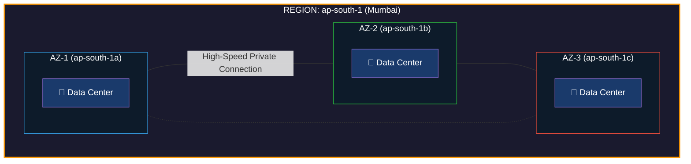
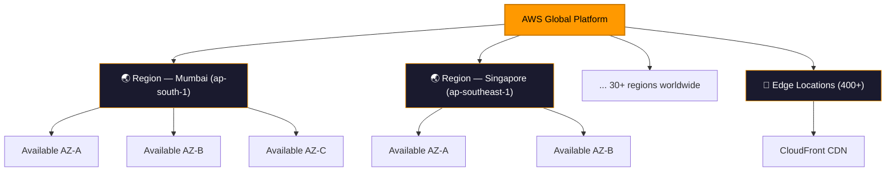

## Regions & Availability Zones

---

## 📖 Story First

Our school has grown. It is no longer just one school in one city. It is now a **global school system** called **AWS High School — International**.

This school system has campuses in different countries and cities around the world. Each campus is large and independent. If there is an earthquake in one city and that campus is damaged, students in other cities are not affected.

Now within each campus, there are multiple buildings. These buildings are physically separate from each other. If one building catches fire, the other buildings keep running. Students can still go to class in the other buildings.

This design was not accidental. It was specifically designed to make sure that **no single disaster can stop the entire school from functioning.**

This is exactly how AWS designs its global infrastructure.

---

## 🎯 Learning Objectives

By the end of this chapter, you will be able to:

- ✅ Explain what an AWS Region is
- ✅ Explain what an Availability Zone is
- ✅ Understand why multiple AZs exist
- ✅ Know how to choose the right Region
- ✅ Understand the concept of High Availability

---

## 🏫 School Analogy → AWS Mapping

```
┌─────────────────────────────────────────────────────────┐
│              SCHOOL  ←→  AWS MAPPING                   │
├──────────────────────────┬──────────────────────────────┤
│    SCHOOL CONCEPT        │      AWS CONCEPT             │
├──────────────────────────┼──────────────────────────────┤
│ The entire school system │ AWS (the whole platform)     │
│ A city campus            │ Region                       │
│ A building in campus     │ Availability Zone (AZ)       │
│ A classroom in building  │ Data Center                  │
│ School campus rules      │ Region-specific services     │
└──────────────────────────┴──────────────────────────────┘
```

---

## ☁️ AWS Regions — Explained

An **AWS Region** is a physical location in the world where AWS has multiple data centers.

Think of it as a **city where AWS has built its infrastructure**.

```
┌─────────────────────────────────────────────────────────────┐
│                    AWS REGIONS (Selected)                   │
├─────────────────────────────────────────────────────────────┤
│                                                             │
│   🌎 NORTH AMERICA          🌍 EUROPE                       │
│   • us-east-1 (N.Virginia)  • eu-west-1 (Ireland)          │
│   • us-east-2 (Ohio)        • eu-central-1 (Frankfurt)     │
│   • us-west-1 (N.California)• eu-west-2 (London)           │
│   • us-west-2 (Oregon)      • eu-north-1 (Stockholm)       │
│                                                             │
│   🌏 ASIA PACIFIC           🌍 MIDDLE EAST & AFRICA         │
│   • ap-south-1 (Mumbai)     • me-south-1 (Bahrain)         │
│   • ap-southeast-1 (Singapore)• af-south-1 (Cape Town)     │
│   • ap-northeast-1 (Tokyo)                                 │
│   • ap-southeast-2 (Sydney)                                │
│                                                             │
│   Total: 33+ Regions worldwide (growing)                   │
└─────────────────────────────────────────────────────────────┘
```

---

## ☁️ Availability Zones — Explained

An **Availability Zone (AZ)** is one or more physical data centers within a Region.

Each Region has **at least 2 AZs**, usually 3.

The AZs in a Region are:
- Physically separate buildings (often miles apart)
- Connected with ultra-fast private fiber cables
- Designed so that a disaster in one AZ does not affect others



---

## 🏫 The School Disaster Story

Imagine the school campus in Mumbai.

This campus has three separate buildings — Building A, Building B, and Building C. They are physically in different parts of the city.

One day, there is a flood near Building A. Building A is damaged and temporarily closed.

But students and teachers in Building B and Building C are completely fine. Classes continue. Exams continue. No student loses their data or progress.

The school was designed this way on purpose — so that no single disaster can shut down the entire campus.

**This is exactly why AWS has multiple Availability Zones in each Region.**

If AZ-1 goes down (flood, fire, power failure), your application running in AZ-2 and AZ-3 continues without interruption.

This design is called **High Availability**.

---

## 🌐 How to Choose a Region?

Not all companies use the same Region. How do you decide?

```
┌─────────────────────────────────────────────────────────┐
│             HOW TO CHOOSE AN AWS REGION                 │
├─────────────────────────────────────────────────────────┤
│                                                         │
│  1. 📍 PROXIMITY TO YOUR USERS                         │
│     → Put your app closer to your customers            │
│     → Indian users? Use Mumbai (ap-south-1)            │
│     → US users? Use N.Virginia (us-east-1)             │
│                                                         │
│  2. ⚖️  COMPLIANCE & DATA LAWS                          │
│     → Some countries require data to stay local        │
│     → Example: European GDPR laws                      │
│     → Indian government rules for financial data       │
│                                                         │
│  3. 💰 COST                                             │
│     → Prices differ between Regions                    │
│     → us-east-1 is often cheapest                      │
│                                                         │
│  4. 🔧 SERVICE AVAILABILITY                             │
│     → Not all services launch in all Regions at once   │
│     → New services often start in us-east-1 first      │
│                                                         │
└─────────────────────────────────────────────────────────┘
```

---

## 🌍 Edge Locations — The Bonus Concept

Beyond Regions and AZs, AWS also has **Edge Locations**.

Think of Edge Locations like the school's **satellite resource centers** placed in small towns near students' homes. Students can get quick access to materials without traveling to the main campus.

Edge Locations are used by **CloudFront (AWS's CDN service)** to deliver content to users at very high speed from a location closest to them.



---

## ❓ Quick Quiz

import Quiz from '@site/src/components/Quiz';

<Quiz questions={[
    {
        "id": 1,
        "question": "What is an AWS Region?",
        "options": [
            "A single server in a data center",
            "A physical location in the world with AWS infrastructure",
            "A virtual machine",
            "A storage bucket"
        ],
        "correct": 1,
        "explanation": ""
    },
    {
        "id": 2,
        "question": "Why does AWS have multiple Availability Zones in each Region?",
        "options": [
            "To make AWS more expensive",
            "To confuse beginners",
            "To ensure that a failure in one location does not",
            "To reduce the number of servers needed"
        ],
        "correct": 2,
        "explanation": ""
    },
    {
        "id": 3,
        "question": "Your application serves users in India. Which Region should you use?",
        "options": [
            "us-east-1 (N.Virginia)",
            "eu-west-1 (Ireland)",
            "ap-south-1 (Mumbai)",
            "ap-northeast-1 (Tokyo)"
        ],
        "correct": 2,
        "explanation": "Mumbai is closest to Indian users, giving the lowest latency."
    }
]} />

---

## 🎤 Interview Questions

**Q: What is the difference between a Region and an Availability Zone?**

> A Region is a geographic location (like Mumbai or Singapore) where AWS has infrastructure. Each Region contains multiple Availability Zones. An Availability Zone is one or more physically separate data centers within that Region. Regions are separated by thousands of miles. AZs within a Region are separated by a few miles but connected with fast private fiber.

**Q: What is High Availability and how do AZs help achieve it?**

> High Availability means your application continues running even when one component fails. By deploying your application across multiple Availability Zones, you ensure that if one AZ experiences an outage due to power failure, flooding, or hardware issues, your application continues serving users from the other AZs.

**Q: How would you choose an AWS Region for a new application?**

> I would consider four factors: proximity to users for low latency, compliance requirements like data residency laws, cost differences between regions, and availability of required AWS services in that region.

---

## 📝 Chapter Summary

```
┌─────────────────────────────────────────────────────────┐
│                   CHAPTER 3 SUMMARY                     │
├─────────────────────────────────────────────────────────┤
│                                                         │
│  ✅ Region = Geographic location (city/country)         │
│  ✅ Each Region has 2-6 Availability Zones              │
│  ✅ AZ = Physically separate data center                │
│  ✅ AZs protect against localized disasters             │
│  ✅ Choose Region based on users, laws, cost, services  │
│  ✅ Edge Locations used for fast content delivery       │
│  ✅ High Availability = App runs even if one AZ fails   │
│                                                         │
│  SCHOOL ANALOGY:                                        │
│  School System  = AWS                                   │
│  City Campus    = Region                                │
│  Building       = Availability Zone                     │
│                                                         │
└─────────────────────────────────────────────────────────┘
```

---

---
