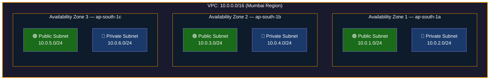

## 📖 Story First

Now that the school campus has a boundary (our VPC), let us look inside the campus.

Inside the campus, everything is not just one big open space. The campus is divided into different sections for different purposes.

There is the **Science Wing** — only science students go there.
There is the **Arts Wing** — only arts students go there.
There is the **Administrative Block** — where school records and staff offices are. Students generally do not go here.
There is the **Sports Ground** — open to everyone during break time.

Each section has its own access rules. You cannot walk from the Arts Wing into the Administrative Block without permission. The Administrative Block is more restricted. The Sports Ground is more open.

This division of the campus into sections is exactly what **Subnets** are in AWS.

---

## 🎯 Learning Objectives

By the end of this chapter, you will be able to:

- ✅ Explain what a Subnet is
- ✅ Understand the difference between Public and Private Subnets
- ✅ Know how subnets relate to Availability Zones
- ✅ Design a basic subnet layout for an application

---

## 🏫 School Analogy

```
┌─────────────────────────────────────────────────────────┐
│              SCHOOL  ←→  SUBNET MAPPING                │
├──────────────────────────┬──────────────────────────────┤
│    SCHOOL CONCEPT        │      AWS CONCEPT             │
├──────────────────────────┼──────────────────────────────┤
│ Science Wing             │ Public Subnet                │
│ (Students can enter      │ (Resources can reach        │
│  from outside)           │  the internet)              │
│                          │                             │
│ Administrative Block     │ Private Subnet               │
│ (Restricted, internal    │ (No direct internet         │
│  only)                   │  access, more secure)       │
│                          │                             │
│ One wing per building    │ One subnet per AZ            │
└──────────────────────────┴──────────────────────────────┘
```

---

## ☁️ The Actual Concept

A **Subnet (Sub-network)** is a smaller network carved out of your VPC.

Just like a VPC is a section of the AWS cloud, a Subnet is a section of your VPC.

You divide your VPC into Subnets for two main reasons:
1. **Organization** — Group resources logically
2. **Security** — Apply different rules to different groups

```
┌─────────────────────────────────────────────────────────────┐
│                        YOUR VPC                             │
│                    10.0.0.0/16                              │
│                                                             │
│  ┌───────────────────────┐  ┌───────────────────────────┐  │
│  │    PUBLIC SUBNET      │  │     PRIVATE SUBNET        │  │
│  │    10.0.1.0/24        │  │     10.0.2.0/24           │  │
│  │                       │  │                           │  │
│  │  🌐 Web Servers       │  │  🔒 Database Servers      │  │
│  │  🌐 Load Balancers    │  │  🔒 Application Servers   │  │
│  │                       │  │  🔒 Internal Services     │  │
│  │  Can reach Internet   │  │  Cannot reach Internet    │  │
│  │  Internet can         │  │  directly                 │  │
│  │  reach them           │  │                           │  │
│  └───────────────────────┘  └───────────────────────────┘  │
│                                                             │
└─────────────────────────────────────────────────────────────┘
```

---

## 🔓 Public Subnet vs 🔒 Private Subnet

This is one of the most important concepts in AWS networking.

```
┌─────────────────────────────────────────────────────────┐
│              PUBLIC vs PRIVATE SUBNET                   │
├──────────────────────────┬──────────────────────────────┤
│     PUBLIC SUBNET        │     PRIVATE SUBNET           │
├──────────────────────────┼──────────────────────────────┤
│ Connected to the internet│ NOT connected to internet    │
│ directly                 │ directly                     │
│                          │                             │
│ Resources have public    │ Resources have only         │
│ IP addresses             │ private IP addresses         │
│                          │                             │
│ Internet can reach       │ Internet CANNOT reach       │
│ resources directly       │ resources directly           │
│                          │                             │
│ Used for: Web servers,   │ Used for: Databases,        │
│ Load balancers, Bastion  │ App servers, Caches,        │
│ hosts                    │ Internal services            │
│                          │                             │
│ School: Science wing     │ School: Principal's office  │
│ with a public entrance   │ (students cannot just walk  │
│                          │  in from outside)           │
└──────────────────────────┴──────────────────────────────┘
```

---

## 🏗️ Subnets Span Availability Zones

One very important rule:

**Each Subnet lives in exactly ONE Availability Zone. It cannot span multiple AZs.**

This is like saying each section of the school campus is in one specific building. The Science Wing is in Building A. It is not split across Building A and Building B.



This design ensures High Availability — if AZ-1 goes down, your application continues in AZ-2 and AZ-3.

---

## 🧪 Hands-On Lab — Create Subnets

```
STEP 1: Go to VPC Console
        VPC → Subnets → Create Subnet

STEP 2: Create PUBLIC Subnet
        VPC: Select MyFirstVPC
        Subnet Name: PublicSubnet-1
        Availability Zone: ap-south-1a (or your Region's AZ)
        IPv4 CIDR block: 10.0.1.0/24
        Click "Create Subnet"

STEP 3: Create PRIVATE Subnet
        VPC: Select MyFirstVPC
        Subnet Name: PrivateSubnet-1
        Availability Zone: ap-south-1a
        IPv4 CIDR block: 10.0.2.0/24
        Click "Create Subnet"

STEP 4: Make Public Subnet actually public
        Select PublicSubnet-1
        Actions → Edit Subnet Settings
        Enable "Auto-assign public IPv4 address"
        Save
        
✅ You now have a Public and Private subnet!
   (The Public Subnet is not truly public yet — 
    we need an Internet Gateway from Chapter 8)
```

---

## 💡 Pro Tips

> 💡 **Tip 1:** Always create subnets in multiple AZs. At minimum, create a public and private subnet in 2 AZs for high availability.

> 💡 **Tip 2:** Your databases should ALWAYS be in private subnets. Never put a database in a public subnet.

> 💡 **Tip 3:** A common naming pattern is: `prod-public-1a`, `prod-private-1a`, `prod-public-1b`, `prod-private-1b` — making it clear which subnet is in which AZ.

---

## ❓ Quick Quiz

import Quiz from '@site/src/components/Quiz';

<Quiz questions={[
    {
        "id": 1,
        "question": "Where does a Subnet exist?",
        "options": [
            "Across multiple Regions",
            "Across multiple Availability Zones",
            "In exactly one Availability Zone",
            "In exactly one data center rack"
        ],
        "correct": 2,
        "explanation": "A subnet lives in exactly one AZ."
    },
    {
        "id": 2,
        "question": "You have a database with sensitive customer data. Should it be in a Public or Private Subnet?",
        "options": [
            "Public Subnet \u2014 so customers can access it",
            "Private Subnet \u2014 so it is not directly accessible from internet",
            "It does not matter",
            "A database does not need a subnet"
        ],
        "correct": 1,
        "explanation": ""
    }
]} />

---

## 🎤 Interview Questions

**Q: What is a Subnet and how is it different from a VPC?**

> A VPC is the entire private network in AWS, like the entire school campus. A Subnet is a smaller division within that VPC, like a specific wing or section of the campus. While a VPC spans an entire Region, each Subnet exists in a single Availability Zone. A VPC can have multiple Subnets, each with its own IP range and access rules.

**Q: What is the difference between a Public and Private Subnet?**

> A Public Subnet has a route to an Internet Gateway, meaning resources inside it can communicate with the internet. A Private Subnet does not have a direct route to the internet, making resources inside it only accessible internally. Web servers typically go in public subnets, while databases and application servers go in private subnets for security.

---

## 📝 Chapter Summary

```
┌─────────────────────────────────────────────────────────┐
│                   CHAPTER 5 SUMMARY                     │
├─────────────────────────────────────────────────────────┤
│                                                         │
│  ✅ Subnet = A smaller network within a VPC             │
│  ✅ Like sections (wings) within a school campus        │
│  ✅ Each Subnet is in exactly ONE Availability Zone     │
│  ✅ Public Subnet = Internet accessible                 │
│  ✅ Private Subnet = Not directly internet accessible   │
│  ✅ Databases → Always in Private Subnets               │
│  ✅ Web servers → Public Subnets                        │
│  ✅ Create subnets in multiple AZs for High Availability│
│                                                         │
└─────────────────────────────────────────────────────────┘
```

---

---
