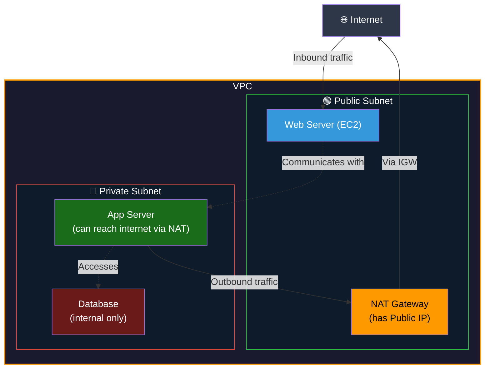
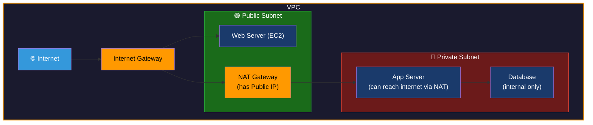

## 📖 Story First

The school has a main gate for public visitors.

But here is a situation.

The Administrative Block staff need to sometimes go out and get things from the city — supplies, documents, deliveries. However, we do NOT want outsiders to be able to walk directly into the Administrative Block from the main gate.

The solution?

The Administrative Block staff have a **side door** that only opens from the inside. They can walk out of the side door, go to the city, get what they need, and come back. But nobody from outside can use that door to enter the Administrative Block.

This is a **one-way exit** — staff can go out to the world, but the world cannot come in directly through this door.

In AWS, this side door is called a **NAT Gateway**.

---

## 🎯 Learning Objectives

By the end of this chapter, you will be able to:

- ✅ Explain what a NAT Gateway is
- ✅ Understand why Private Subnets need NAT Gateway
- ✅ Know where a NAT Gateway is placed
- ✅ Understand the traffic flow through a NAT Gateway

---

## 🏫 School Analogy

```
┌─────────────────────────────────────────────────────────┐
│          SCHOOL  ←→  NAT GATEWAY MAPPING               │
├──────────────────────────┬──────────────────────────────┤
│    SCHOOL CONCEPT        │      AWS CONCEPT             │
├──────────────────────────┼──────────────────────────────┤
│ Side door (one-way exit) │ NAT Gateway                  │
│ Admin staff can exit     │ Private resources can reach  │
│ and return               │ internet (outbound only)     │
│ Outsiders cannot enter   │ Internet cannot initiate     │
│ through side door        │ connection to private        │
│                          │ resources                    │
│ Side door is in the      │ NAT Gateway lives in Public  │
│ boundary wall            │ Subnet                       │
└──────────────────────────┴──────────────────────────────┘
```

---

## ☁️ Why Do Private Resources Need Internet Access?

Wait — if a server is in a Private Subnet, why would it need internet access at all?

Great question. There are valid reasons:



---

## ☁️ How NAT Gateway Works

```
PRIVATE SERVER (10.0.2.50) wants to download updates
from the internet.

STEP 1: Private server sends request
        Source IP: 10.0.2.50
        Destination: 1.2.3.4 (external update server)

STEP 2: Request goes to NAT Gateway
        (Route Table says: 0.0.0.0/0 → NAT Gateway)

STEP 3: NAT Gateway replaces private IP with its
        own Public IP
        Source IP changes to: 54.23.100.50 (NAT GW IP)
        Destination: 1.2.3.4

STEP 4: Request goes to internet
        Internet sees it coming from: 54.23.100.50
        (It has NO IDEA about 10.0.2.50)

STEP 5: Response comes back to NAT Gateway
        NAT Gateway forwards it back to 10.0.2.50

RESULT: Private server got its update.
        Internet never knew private server existed.
```

This is called **Network Address Translation (NAT)**.

---

## 📊 Internet Gateway vs NAT Gateway

```
┌─────────────────────────────────────────────────────────┐
│         INTERNET GATEWAY vs NAT GATEWAY                 │
├──────────────────────────┬──────────────────────────────┤
│   INTERNET GATEWAY       │     NAT GATEWAY              │
├──────────────────────────┼──────────────────────────────┤
│ For PUBLIC Subnets       │ For PRIVATE Subnets          │
│                          │                             │
│ Two-way traffic          │ One-way (outbound only)     │
│ (In and Out)             │                             │
│                          │                             │
│ Internet CAN initiate    │ Internet CANNOT initiate    │
│ connections to servers   │ connections to servers       │
│                          │                             │
│ Resources need Public IP │ Resources keep Private IP   │
│                          │                             │
│ Used by: Web servers,    │ Used by: Databases,         │
│ load balancers           │ app servers, backend        │
│                          │                             │
│ School: Main Gate        │ School: Side Exit Door      │
└──────────────────────────┴──────────────────────────────┘
```

---

## 🗺️ Full VPC Architecture with NAT Gateway



---

## 💰 Important: NAT Gateway Costs Money

```
⚠️ COST ALERT:
NAT Gateway is NOT free — not even in Free Tier.

You pay:
• Per hour the NAT Gateway exists (~$0.045/hour)
• Per GB of data processed

To avoid unnecessary charges during practice:
→ Delete NAT Gateway when not using it
→ Or use a NAT Instance (free tier eligible) for learning
```

---

## 🧪 Hands-On Lab — Create a NAT Gateway

```
STEP 1: First, create an Elastic IP
        Go to VPC Console → Elastic IPs
        Click "Allocate Elastic IP address"
        Click "Allocate"
        Note the IP address

STEP 2: Create NAT Gateway
        Go to VPC → NAT Gateways
        Click "Create NAT Gateway"
        
STEP 3: Fill in details:
        Name: MyNATGateway
        Subnet: PublicSubnet-1  ← MUST be in PUBLIC subnet
        Connectivity type: Public
        Elastic IP: Select the one you just created
        Click "Create NAT Gateway"

STEP 4: Wait for Status to become "Available"
        (Takes about 5 minutes)

STEP 5: Update Private Subnet Route Table
        Go to Route Tables
        Select PrivateRouteTable
        Edit routes → Add route:
        Destination: 0.0.0.0/0
        Target: NAT Gateway → Select your NAT GW
        Save

✅ Private servers can now access internet through NAT!
⚠️ Remember to DELETE the NAT Gateway after practice!
```

---

## 💡 Pro Tips

> 💡 **Tip 1:** NAT Gateway must ALWAYS be in a Public Subnet. Not a Private Subnet. This is a very common beginner mistake.

> 💡 **Tip 2:** For High Availability, create one NAT Gateway per Availability Zone. If AZ-1's NAT Gateway goes down, servers in AZ-2 should use AZ-2's NAT Gateway.

> 💡 **Tip 3:** Delete NAT Gateways when practicing on Free Tier to avoid unexpected charges. NAT Gateway is one of the most common sources of surprise AWS bills for beginners.

---

## ❓ Quick Quiz

import Quiz from '@site/src/components/Quiz';

<Quiz questions={[
    {
        "id": 1,
        "question": "Where should a NAT Gateway be placed?",
        "options": [
            "In a Private Subnet",
            "In a Public Subnet",
            "Outside the VPC",
            "In the Route Table"
        ],
        "correct": 1,
        "explanation": "NAT Gateway must be in a Public Subnet."
    },
    {
        "id": 2,
        "question": "Can someone from the internet connect directly to a private server through the NAT Gateway?",
        "options": [
            "Yes, if they know the private IP",
            "Yes, if they know the NAT Gateway IP",
            "No, NAT Gateway only allows outbound connections",
            "Yes, if the private server has an Elastic IP"
        ],
        "correct": 2,
        "explanation": ""
    }
]} />

---

## 🎤 Interview Questions

**Q: What is the difference between an Internet Gateway and a NAT Gateway?**

> An Internet Gateway allows two-way communication between resources in a Public Subnet and the internet. Resources get public IPs and are directly reachable from the internet. A NAT Gateway allows resources in a Private Subnet to initiate outbound connections to the internet — for example to download updates — but prevents internet users from initiating connections to those private resources. The NAT Gateway itself lives in a Public Subnet and acts as an intermediary.

**Q: Why would a private server need a NAT Gateway?**

> A private server might need to download security patches, connect to external APIs like payment gateways, pull packages from package managers, or send data to external monitoring services. These are all outbound-initiated connections. The NAT Gateway allows this while keeping the server protected from unsolicited inbound connections from the internet.

---

## 📝 Chapter Summary

```
┌─────────────────────────────────────────────────────────┐
│                   CHAPTER 9 SUMMARY                     │
├─────────────────────────────────────────────────────────┤
│                                                         │
│  ✅ NAT Gateway = One-way exit for private resources    │
│  ✅ Like a side door only staff can use to go outside   │
│  ✅ Must be placed in a PUBLIC Subnet                   │
│  ✅ Allows OUTBOUND internet from Private Subnets       │
│  ✅ BLOCKS inbound internet connections                 │
│  ✅ Replaces private IP with its own public IP          │
│  ✅ NOT free — delete after practice!                   │
│  ✅ For HA: one NAT Gateway per AZ                      │
│                                                         │
└─────────────────────────────────────────────────────────┘
```

---

---
