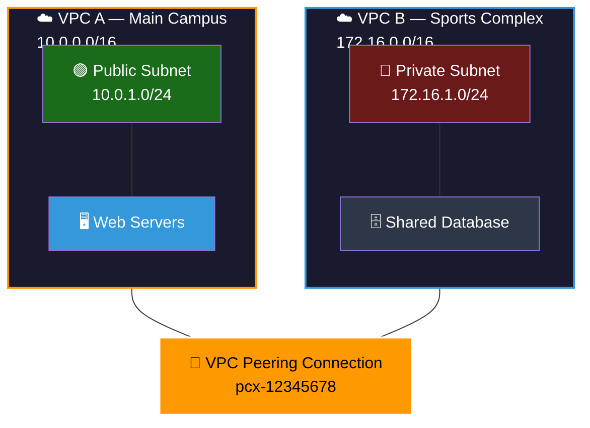

## 📖 Story First

Our school campus is running well. Classes are happening. The network is working.

But now the school has a problem.

The school has a **separate sports complex** located across the street. It also has a **sister school** in the same city that shares some resources — a shared library, shared laboratory equipment, shared faculty.

These buildings are separate. They have their own walls. They have their own security. They are completely isolated from each other.

How do students and staff move between them?

If they walk on the public street, they risk traffic accidents, delays, and security issues. They cannot just build a permanent public road — that belongs to the city.

The solution? Build a **private bridge or tunnel** that connects the two campuses directly. Only authorized people can use it. Traffic stays private. No public roads involved.

In AWS, this private bridge between two VPCs is called **VPC Peering**.

---

## 🎯 Learning Objectives

By the end of this chapter, you will be able to:

- ✅ Explain what VPC Peering is
- ✅ Understand when to use VPC Peering
- ✅ Know the rules and limitations of VPC Peering
- ✅ Set up a VPC Peering connection
- ✅ Configure route tables for peering

---

## 🏫 School Analogy

```
┌─────────────────────────────────────────────────────────┐
│        SCHOOL  ←→  VPC PEERING MAPPING                 │
├──────────────────────────┬──────────────────────────────┤
│    SCHOOL CONCEPT        │      AWS CONCEPT             │
├──────────────────────────┼──────────────────────────────┤
│ Private bridge between   │ VPC Peering connection        │
│ two campuses             │                               │
│ Both campuses keep       │ Both VPCs remain isolated    │
│ their own walls          │ and independent               │
│ Only authorized people   │ Traffic stays within AWS      │
│ use the bridge           │ network (never public)        │
│ Bridge connects exactly  │ One peering connects exactly  │
│ two campuses             │ two VPCs                      │
│ No bridge between        │ No transitive peering         │
│ A→B→C (B cannot relay)  │ (VPC A→B, VPC B→C ≠ A→C)    │
└──────────────────────────┴──────────────────────────────┘
```

---

## ☁️ The Actual Concept

**VPC Peering** is a networking connection between two VPCs that enables you to route traffic between them using private IPv4 or IPv6 addresses.

Think of it as a direct, private link between two VPCs — like a dedicated fiber-optic cable running from one VPC to the other. Traffic never touches the public internet.

```
┌─────────────────────────────────────────────────────────┐
│                 VPC PEERING BASICS                      │
├─────────────────────────────────────────────────────────┤
│                                                         │
│  • Connects two VPCs via private IP addresses          │
│  • Traffic stays within AWS network                    │
│  • No Internet Gateway, VPN, or physical device needed │
│  • Instances in either VPC can communicate as if        │
│    they are on the same network                        │
│  • Works across AWS accounts and across Regions        │
│  • No bandwidth limit (but follows standard data       │
│    transfer pricing)                                   │
│                                                         │
└─────────────────────────────────────────────────────────┘
```

---

## 🗺️ VPC Peering Diagram



---

## 📋 VPC Peering Rules

```
┌─────────────────────────────────────────────────────────┐
│               VPC PEERING RULES                          │
├─────────────────────────────────────────────────────────┤
│                                                         │
│  ✅ CAN peer VPCs in same account                       │
│  ✅ CAN peer VPCs in different accounts                 │
│  ✅ CAN peer VPCs in same Region                        │
│  ✅ CAN peer VPCs in different Regions                  │
│     (Inter-Region VPC Peering)                          │
│                                                         │
│  ❌ CANNOT have overlapping CIDR blocks                 │
│     (If VPC A has 10.0.0.0/16 and VPC B also           │
│      has 10.0.0.0/16, they CANNOT peer)                │
│                                                         │
│  ❌ NO transitive peering                               │
│     (If A is peered with B, and B is peered with C,    │
│      A cannot talk to C through B)                     │
│                                                         │
│  ❌ NO edge-to-edge routing through peering             │
│     (Traffic from on-premise through VPN→VPC A→        │
│      peering→VPC B is NOT allowed)                     │
│                                                         │
└─────────────────────────────────────────────────────────┘
```

---

## 🔗 Transitive Peering — Why It Does Not Work

This is one of the most important concepts to understand about VPC Peering.

```
┌─────────────────────────────────────────────────────────┐
│           TRANSITIVE PEERING — WHAT NOT TO EXPECT        │
├─────────────────────────────────────────────────────────┤
│                                                         │
│                 ┌─────────┐                             │
│                 │  VPC A  │                             │
│                 │ 10.0.0.0│                             │
│                 └────┬────┘                             │
│                      │ Peer                             │
│                      ▼                                  │
│                 ┌─────────┐                             │
│                 │  VPC B  │                             │
│                 │ 10.1.0.0│                             │
│                 └────┬────┘                             │
│                      │ Peer                             │
│                      ▼                                  │
│                 ┌─────────┐                             │
│                 │  VPC C  │                             │
│                 │ 10.2.0.0│                             │
│                 └─────────┘                             │
│                                                         │
│  ❌ VPC A CANNOT reach VPC C through VPC B              │
│  ❌ VPC C CANNOT reach VPC A through VPC B              │
│                                                         │
│  If VPC A needs to talk to VPC C, you must create      │
│  a SEPARATE VPC Peering between A and C directly.      │
│                                                         │
│  Think: Just because Campus A is connected to Campus B  │
│  and Campus B is connected to Campus C does not mean    │
│  Campus A can send students through B to reach C.       │
│  A needs its own bridge to C.                          │
│                                                         │
└─────────────────────────────────────────────────────────┘
```

---

## 🌐 Inter-Region VPC Peering

You can peer VPCs across AWS Regions. This is useful when:

- Your main application runs in Mumbai (ap-south-1)
- Your disaster recovery site is in Singapore (ap-southeast-1)
- You want them to communicate privately

Inter-Region VPC Peering works the same way as same-Region peering, with one addition:

```
┌─────────────────────────────────────────────────────────┐
│            INTER-REGION VPC PEERING                      │
├─────────────────────────────────────────────────────────┤
│                                                         │
│  • Same rules apply (no overlapping CIDR, no transitive)│
│  • Data transfer costs are higher (cross-region)        │
│  • Latency is higher (geographic distance)              │
│  • Security Groups can reference peer VPC CIDR          │
│  • No internet gateway needed — stays on AWS backbone  │
│                                                         │
│  Use Case:                                              │
│  Primary site: ap-south-1 (Mumbai)                      │
│  DR site:     ap-southeast-1 (Singapore)                │
│  Peered so DB replication happens privately             │
│                                                         │
└─────────────────────────────────────────────────────────┘
```

---

## 🧪 Hands-On Lab — Create a VPC Peering Connection

```
STEP 1: Create two VPCs (if you do not have them already)
         VPC A: MyMainVPC     CIDR: 10.0.0.0/16
         VPC B: MySportsVPC   CIDR: 172.16.0.0/16

STEP 2: Go to VPC Console → Peering Connections
         Click "Create peering connection"

STEP 3: Configure the peering:
         Name tag: Main-to-Sports-Peering
         VPC ID (Requester): Select MyMainVPC
         VPC ID (Accepter):  Select MySportsVPC
         (Select "My account" and "This Region")
         Click "Create peering connection"

STEP 4: Accept the request:
         Select the peering connection
         Click "Actions" → "Accept request"
         Click "Accept"

STEP 5: Update Route Tables (IMPORTANT!):
         VPC A Route Table — Add route:
            Destination: 172.16.0.0/16
            Target:      pcx-12345678 (the peering ID)
         VPC B Route Table — Add route:
            Destination: 10.0.0.0/16
            Target:      pcx-12345678 (the peering ID)

STEP 6: Update Security Groups:
         Ensure Security Groups in both VPCs allow
         traffic from the peer VPC's CIDR range

✅ Your VPCs can now communicate privately!
   Test: SSH into an EC2 in VPC A
         Ping a private IP in VPC B
```

---

## 💡 Pro Tips

> 💡 **Tip 1:** Plan your CIDR ranges carefully before creating VPCs. Overlapping CIDRs are the number one reason why peering fails. If you think you might peer VPCs in the future, use different CIDR blocks from the start.

> 💡 **Tip 2:** Remember the route tables! Creating the peering connection alone does nothing — you MUST add routes in both VPCs pointing to the peering connection. This is the most common mistake beginners make.

> 💡 **Tip 3:** For complex multi-VPC architectures, consider using a Transit Gateway instead of multiple peering connections. Transit Gateway supports transitive routing (many VPCs connected through a central hub) and is much easier to manage than a mesh of peering connections.

---

## ❓ Quick Quiz

import Quiz from '@site/src/components/Quiz';

<Quiz questions={[
    {
        "id": 1,
        "question": "What is VPC Peering?",
        "options": [
            "A VPN connection from your office to AWS",
            "A private connection between two VPCs",
            "A public internet connection between VPCs",
            "A connection between VPC and on-premise data center"
        ],
        "correct": 1,
        "explanation": ""
    },
    {
        "id": 2,
        "question": "VPC A (10.0.0.0/16) is peered with VPC B (10.0.0.0/16). What is the problem?",
        "options": [
            "No problem, this works fine",
            "CIDR blocks overlap so peering is not allowed",
            "VPC B must be in a different Region",
            "They need an Internet Gateway"
        ],
        "correct": 1,
        "explanation": "VPC Peering requires non-overlapping CIDR blocks. If both VPCs use 10.0.0.0/16, AWS cannot route traffic correctly."
    },
    {
        "id": 3,
        "question": "VPC A is peered with VPC B. VPC B is peered with VPC C. Can VPC A communicate with VPC C through VPC B?",
        "options": [
            "Yes, through transitive routing",
            "No, VPC Peering does not support transitive routing",
            "Yes, but only for TCP traffic",
            "Only if all three are in the same Region"
        ],
        "correct": 1,
        "explanation": "VPC Peering does NOT support transitive routing. A separate peering connection between A and C is required."
    }
]} />

---

## 🎤 Interview Questions

**Q: What is VPC Peering and when would you use it?**

> VPC Peering is a networking connection between two VPCs that enables private communication using IPv4 or IPv6 addresses. You would use it when you need to connect resources across different VPCs — for example, connecting an application VPC to a shared database VPC, or connecting VPCs across different AWS accounts for资源共享.

**Q: What are the limitations of VPC Peering?**

> The key limitations are: no overlapping CIDRs, no transitive peering (you need a direct peering for each VPC pair), no edge-to-edge routing (traffic from a VPN or Direct Connect cannot transit through a peering connection to reach another VPC), and each VPC can have a maximum of 125 peering connections.

**Q: What is the difference between VPC Peering and Transit Gateway?**

> VPC Peering creates a one-to-one connection between two VPCs. To connect multiple VPCs, you need individual peering connections between each pair (a mesh topology), which does not support transitive routing. Transit Gateway acts as a central hub that can connect hundreds of VPCs and on-premises networks with transitive routing, making it much simpler to manage complex network topologies.

---

## 📝 Chapter Summary

```
┌─────────────────────────────────────────────────────────┐
│                 CHAPTER 10 SUMMARY                       │
├─────────────────────────────────────────────────────────┤
│                                                         │
│  ✅ VPC Peering = Private bridge between two VPCs       │
│  ✅ Traffic stays within AWS network (no internet)      │
│  ✅ Works across accounts and Regions                   │
│  ✅ Must have non-overlapping CIDR blocks               │
│  ✅ Need: Peering Connection + Route Tables + SG rules  │
│  ✅ No transitive peering — direct connection only     │
│  ✅ Route table entries required in BOTH VPCs          │
│  ✅ Great for connecting shared resources               │
│  ✅ For complex multi-VPC: use Transit Gateway instead  │
│                                                         │
└─────────────────────────────────────────────────────────┘
```
---
---
