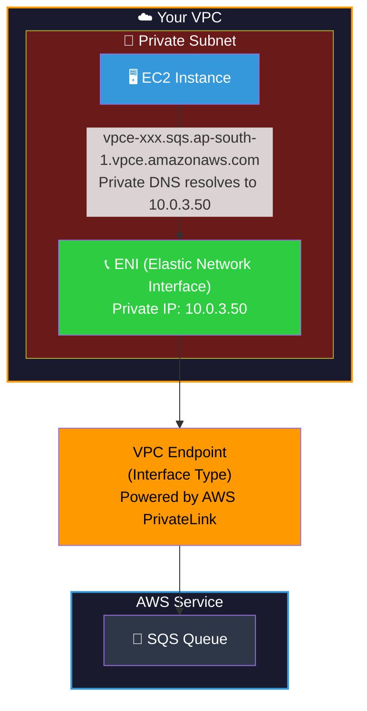

## 📖 Story First

The school has a problem.

The administrative staff frequently needs to access the **central education board's document repository** — exam results, curriculum updates, teacher certifications, and student records.

Currently, the staff has to go through the main school gate, walk down the public street, and enter the government building through its public entrance. This is:

1. **Slow** — they have to cross traffic and navigate public roads
2. **Insecure** — they are exposed to the public street
3. **Unreliable** — traffic jams, road closures, and weather delays

The school wants a better way. They want a **private delivery room** — a secure window built directly into the school's campus wall where staff can hand over documents and receive files without ever leaving the campus grounds. The government building also has a matching window on its side. The exchange happens through a private channel.

In AWS, this private delivery room is called a **VPC Endpoint**, and the technology that makes it possible is called **AWS PrivateLink**.

---

## 🎯 Learning Objectives

By the end of this chapter, you will be able to:

- ✅ Explain what VPC Endpoints are and why they matter
- ✅ Differentiate between Gateway Endpoints and Interface Endpoints
- ✅ Understand AWS PrivateLink as the underlying technology
- ✅ Configure a Gateway Endpoint for S3
- ✅ Configure an Interface Endpoint for other AWS services
- ✅ Know when to use Endpoints vs NAT Gateway vs Internet Gateway

---

## 🏫 School Analogy

```
┌─────────────────────────────────────────────────────────┐
│   SCHOOL  ←→  VPC ENDPOINTS & PRIVATELINK MAPPING       │
├──────────────────────────┬──────────────────────────────┤
│    SCHOOL CONCEPT        │      AWS CONCEPT             │
├──────────────────────────┼──────────────────────────────┤
│ Private delivery room    │ VPC Endpoint                  │
│ built into campus wall   │                               │
│ Secure window where      │ Private connection from       │
│ staff collect supplies   │ VPC to AWS service            │
│ No need to go through    │ No Internet Gateway or        │
│ main gate (IGW)          │ NAT Gateway needed            │
│ Private channel between  │ AWS PrivateLink — the         │
│ two buildings            │ underlying technology         │
│ Delivery to central      │ Gateway Endpoint (to S3       │
│ school warehouse only    │ or DynamoDB only)             │
│ Delivery to specific     │ Interface Endpoint (to any    │
│ room in any building     │ AWS service via ENI)          │
└──────────────────────────┴──────────────────────────────┘
```

---

## ☁️ The Actual Concept

**VPC Endpoints** allow you to privately connect your VPC to supported AWS services without requiring an Internet Gateway, NAT Gateway, VPN, or Direct Connect connection.

Traffic between your VPC and the AWS service never leaves the AWS network. It stays entirely within Amazon's infrastructure.

There are two types of VPC Endpoints:

```
┌─────────────────────────────────────────────────────────┐
│            VPC ENDPOINT — TWO TYPES                      │
├─────────────────────────────────────────────────────────┤
│                                                         │
│  GATEWAY ENDPOINT                                       │
│  ┌─────────────────────────────────────────────────┐    │
│  │ • Target: S3 and DynamoDB ONLY                   │    │
│  │ • Added as a TARGET in your Route Table          │    │
│  │ • Free to use (no hourly cost)                   │    │
│  │ • Automatically routes traffic to the service    │    │
│  │ • Uses AWS global network (no internet)          │    │
│  │ • Cannot be accessed from outside the VPC        │    │
│  └─────────────────────────────────────────────────┘    │
│                                                         │
│  INTERFACE ENDPOINT (Powered by AWS PrivateLink)        │
│  ┌─────────────────────────────────────────────────┐    │
│  │ • Target: Most AWS services (SNS, SQS, KMS,     │    │
│  │   CloudWatch, API Gateway, STS, etc.)           │    │
│  │ • Creates an Elastic Network Interface (ENI)    │    │
│  │   in your subnet with a private IP              │    │
│  │ • Has an hourly cost                            │    │
│  │ • Accessed via DNS name                         │    │
│  │ • Can be accessed from on-premises via VPN/DX   │    │
│  └─────────────────────────────────────────────────┘    │
│                                                         │
└─────────────────────────────────────────────────────────┘
```

---

## 🗺️ Gateway Endpoint — How It Works

Think of a Gateway Endpoint as a special route in your Route Table that says: *"If traffic is heading to S3 or DynamoDB, send it through the AWS private network instead of the internet."*

```mermaid
graph TB
    subgraph VPC["☁️ Your VPC"]
        direction TB
        
        subgraph PrivateSubnet["🔵 Private Subnet"]
            EC2["🖥️ EC2 Instance"]
        end
        
        subgraph PublicSubnet["🟢 Public Subnet"]
            NAT["📡 NAT Gateway"]
        end
        
        RT["Route Table<br/>10.0.0.0/16 → local<br/>0.0.0.0/0 → NAT GW<br/>pl-xxxxxx (S3) → Gateway Endpoint"]
    end
    
    IGW["🌐 Internet Gateway"]
    Internet["🌍 Internet"]
    S3_Internet["📦 S3 Bucket<br/>(via Internet)"]
    
    VPC_Endpoint_GW["🎯 Gateway Endpoint<br/>Target in Route Table<br/>Free"}
    S3_Private["📦 S3 Bucket<br/>(via PrivateLink)"]
    
    EC2 -- "❌ Slow, public path" --> NAT
    NAT --> IGW
    IGW --> Internet
    Internet --> S3_Internet
    
    EC2 -- "✅ Fast, private path" --> RT
    RT -.-> VPC_Endpoint_GW
    VPC_Endpoint_GW --> S3_Private
    
    style VPC fill:#1a1a2e,color:#fff,stroke:#ff9900,stroke-width:2px
    style PrivateSubnet fill:#6b1a1a,color:#fff
    style PublicSubnet fill:#1a6b1a,color:#fff
    style EC2 fill:#3498db,color:#fff
    style NAT fill:#ff9900,color:#000
    style RT fill:#0d1b2a,color:#fff,stroke:#2ecc40
    style IGW fill:#ff9900,color:#000
    style Internet fill:#2d3748,color:#fff
    style VPC_Endpoint_GW fill:#2ecc40,color:#000
    style S3_Internet fill:#ff9900,color:#000
    style S3_Private fill:#ff9900,color:#000
```

---

## 🗺️ Interface Endpoint (PrivateLink) — How It Works

An Interface Endpoint creates an Elastic Network Interface (ENI) in your subnet with a private IP address. Think of it as a private "phone line" directly connecting your VPC to the AWS service.



---

## 📋 How to Choose — Decision Guide

```
┌─────────────────────────────────────────────────────────┐
│       WHICH TYPE SHOULD YOU USE?                         │
├─────────────────────────────────────────────────────────┤
│                                                         │
│  For S3 or DynamoDB access:                             │
│     → Use GATEWAY ENDPOINT (free, simple)               │
│                                                         │
│  For other AWS services (SNS, SQS, KMS, etc.):         │
│     → Use INTERFACE ENDPOINT (has cost, more complex)   │
│                                                         │
│  For access from on-premises (VPN/Direct Connect):      │
│     → Use INTERFACE ENDPOINT (supports cross-premise)  │
│                                                         │
│  For accessing your own services in another VPC:        │
│     → Use INTERFACE ENDPOINT (via NLB + PrivateLink)   │
│                                                         │
└─────────────────────────────────────────────────────────┘
```

---

## 🔧 Hands-On Lab 1 — Gateway Endpoint for S3

```
STEP 1: Go to VPC Console → Endpoints
         Click "Create endpoint"

STEP 2: Configure:
         Name tag: MyS3Endpoint
         Type:     Gateway
         Service:  com.amazonaws.ap-south-1.s3
         
STEP 3: Select VPC:
         VPC: MyFirstVPC
         
STEP 4: Select Route Tables:
         Select the Private Route Table(s)
         (This automatically adds the S3 prefix list route)

STEP 5: Click "Create endpoint"

✅ Now any instance in the private subnet can access S3
   privately without a NAT Gateway!
   Test: aws s3 ls s3://your-bucket
         (Works from a private EC2 without NAT!)
```

---

## 🔧 Hands-On Lab 2 — Interface Endpoint for SQS

```
STEP 1: Go to VPC Console → Endpoints
         Click "Create endpoint"

STEP 2: Configure:
         Name tag: MySQSInterfaceEndpoint
         Type:     Interface
         Service:  com.amazonaws.ap-south-1.sqs
         
STEP 3: Select VPC:
         VPC: MyFirstVPC
         
STEP 4: Select Subnets:
         Select your Private Subnet(s)
         (AWS creates an ENI in each selected subnet)
         
STEP 5: Security Group:
         Create or select SG allowing:
         Inbound: HTTPS (443) from your VPC CIDR
         
STEP 6: Enable Private DNS Name:
         ✅ Enable (so SQS API calls resolve to
            the endpoint's private IP automatically)

STEP 7: Click "Create endpoint"

✅ Now your EC2 can call SQS APIs using the standard
   AWS SDK — no code changes needed!
   The private DNS automatically resolves to the ENI.
```

---

## 💡 Pro Tips

> 💡 **Tip 1:** Gateway Endpoints are free and simple — always use them for S3 and DynamoDB access from private subnets. This eliminates the need for a NAT Gateway just for these services, saving you money.

> 💡 **Tip 2:** When using Interface Endpoints, enable **Private DNS Name**. This makes AWS SDK calls automatically route through the endpoint without any code changes. Without it, you would need to manually modify DNS or use the endpoint-specific DNS name.

> 💡 **Tip 3:** Interface Endpoints cost money (about $7/month per AZ per endpoint + data processing costs). Only create them for services you actually need. A NAT Gateway costs about $32/month, so if you just need access to a few AWS services, endpoints can be cheaper.

> 💡 **Tip 4:** You can also use PrivateLink to expose your own services securely to other VPCs or AWS accounts. Create a Network Load Balancer (NLB) in your VPC, then create a VPC Endpoint Service — other accounts can create Interface Endpoints to connect to your service privately.

---

## ❓ Quick Quiz

import Quiz from '@site/src/components/Quiz';

<Quiz questions={[
    {
        "id": 1,
        "question": "What is the main benefit of using a VPC Endpoint?",
        "options": [
            "It makes your VPC internet access faster",
            "It allows private access to AWS services without internet",
            "It replaces Security Groups",
            "It creates a VPN connection"
        ],
        "correct": 1,
        "explanation": ""
    },
    {
        "id": 2,
        "question": "Which AWS services can be accessed using a Gateway Endpoint?",
        "options": [
            "S3 and DynamoDB",
            "S3 only",
            "All AWS services",
            "EC2 and RDS"
        ],
        "correct": 0,
        "explanation": "Gateway Endpoints only support S3 and DynamoDB. All other AWS services require Interface Endpoints."
    },
    {
        "id": 3,
        "question": "What is the difference between a Gateway Endpoint and an Interface Endpoint?",
        "options": [
            "Gateway Endpoints are faster",
            "Gateway Endpoints are added as a route in Route Table; Interface Endpoints create an ENI in the subnet",
            "Interface Endpoints are free; Gateway Endpoints cost money",
            "There is no difference — they are the same thing"
        ],
        "correct": 1,
        "explanation": "Gateway Endpoints work by adding a prefix list route to your Route Table. Interface Endpoints create an Elastic Network Interface with a private IP in your subnet."
    },
    {
        "id": 4,
        "question": "Which AWS technology powers Interface Endpoints?",
        "options": [
            "AWS Direct Connect",
            "AWS VPN",
            "AWS PrivateLink",
            "AWS Transit Gateway"
        ],
        "correct": 2,
        "explanation": "AWS PrivateLink is the technology behind Interface Endpoints. It provides private connectivity between VPCs and AWS services."
    }
]} />

---

## 🎤 Interview Questions

**Q: What is a VPC Endpoint and what are the two types?**

> A VPC Endpoint allows private connectivity between your VPC and supported AWS services without going through the internet. Gateway Endpoints are used for S3 and DynamoDB — they work by adding a route to your Route Table pointing to the service. Interface Endpoints (powered by AWS PrivateLink) are used for most other AWS services — they create an Elastic Network Interface in your subnet with a private IP address.

**Q: How do you enable an EC2 instance in a private subnet to access S3 without a NAT Gateway?**

> You create a Gateway Endpoint for S3 and attach it to the private subnet's Route Table. This adds a route for the S3 prefix list that directs traffic to the endpoint instead of the internet. The EC2 instance can then use the AWS CLI or SDK to access S3 — the traffic stays within the AWS network and never goes to the internet.

**Q: What is AWS PrivateLink and how is it different from VPC Peering?**

> AWS PrivateLink is a technology that enables private connectivity between VPCs and AWS services (or your own services) by creating interface endpoints. Unlike VPC Peering, PrivateLink is one-to-many: you can expose a service (like an application) in one VPC and allow many other VPCs to connect to it individually through interface endpoints. PrivateLink also does not require VPC-to-VPC peering with non-overlapping CIDRs — each consumer connects independently.

---

## 📝 Chapter Summary

```
┌─────────────────────────────────────────────────────────┐
│                 CHAPTER 11 SUMMARY                       │
├─────────────────────────────────────────────────────────┤
│                                                         │
│  ✅ VPC Endpoint = Private access to AWS services        │
│  ✅ Two types: Gateway (S3/DynamoDB) and Interface      │
│     (all other services, powered by PrivateLink)        │
│  ✅ Traffic stays within AWS network (no internet)      │
│  ✅ Gateway Endpoint: Added as route in Route Table     │
│  ✅ Interface Endpoint: Creates ENI in your subnet      │
│  ✅ Gateway Endpoint: FREE                              │
│  ✅ Interface Endpoint: Hourly cost + data processing   │
│  ✅ Enable Private DNS for automatic routing            │
│  ✅ PrivateLink also lets you expose your own services  │
│                                                         │
└─────────────────────────────────────────────────────────┘
```
---
---
