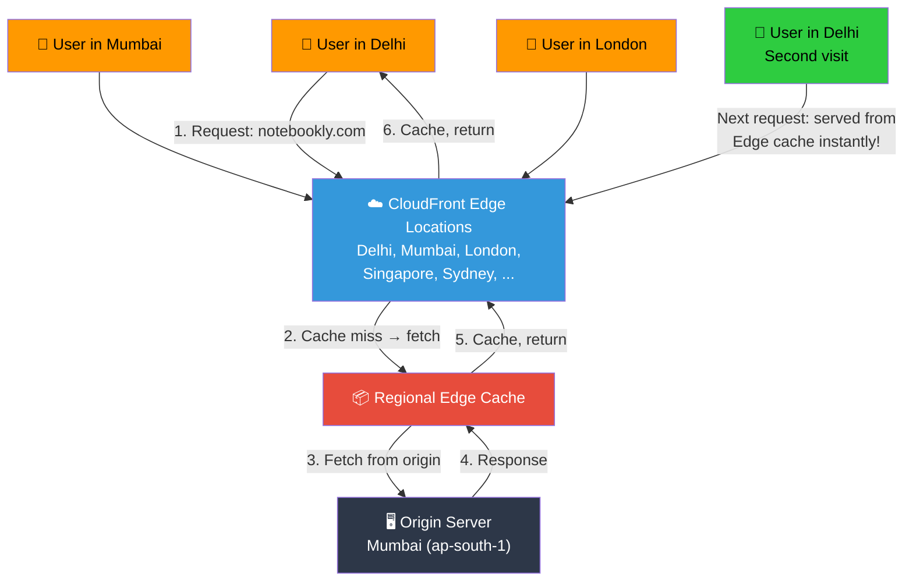
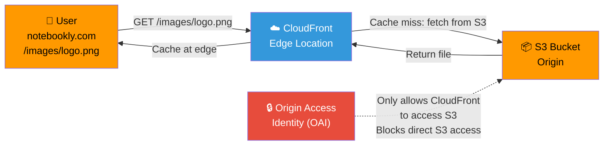

## 📖 Story First

Notebookly is now popular across India. Students in Mumbai, Delhi, Bangalore, Chennai, and Kolkata all visit the website.

But there is a problem.

When a student in Delhi visits notebookly.com, their request travels all the way to the server in Mumbai (ap-south-1). That is over 1,400 kilometers. The page takes 3-4 seconds to load.

When a student in Bangalore visits, the request travels 1,000 kilometers to Mumbai. Page loads in 2-3 seconds.

Students in Mumbai get the page in 0.5 seconds because the server is nearby.

This is not fair. Students in Delhi should get the same fast experience as students in Mumbai.

What does the school do?

The school creates **branch libraries** in every major city. Each branch library keeps copies of the most popular books and study materials. When a student in Delhi asks for a book, they get it from the Delhi branch — not from the Mumbai main library. The book arrives instantly.

When a new edition of a textbook is released, the school sends copies to all branch libraries so they are always up to date.

In AWS, this global network of branch libraries is called **CloudFront**.

---

## 🎯 Learning Objectives

By the end of this chapter, you will be able to:

- ✅ Explain what CloudFront is and how a CDN works
- ✅ Understand the difference between CloudFront and Route 53
- ✅ Configure a CloudFront distribution
- ✅ Understand origin, behavior, and cache settings
- ✅ Know about edge locations and Regional Edge Caches
- ✅ Apply security with CloudFront Signed URLs and WAF

---

## 🏫 School Analogy

```
┌─────────────────────────────────────────────────────────┐
│        SCHOOL  ←→  CLOUDFRONT MAPPING                   │
├──────────────────────────┬──────────────────────────────┤
│    SCHOOL CONCEPT        │      AWS CONCEPT             │
├──────────────────────────┼──────────────────────────────┤
│ Main library in Mumbai   │ Origin server (S3/ALB/EC2)   │
│ Branch libraries in      │ CloudFront Edge Locations    │
│ every major city         │ (Global network of PoPs)      │
│ Popular book copies      │ Cached content (CDN cache)   │
│ kept at branches         │                               │
│ Student gets book from   │ User gets content from        │
│ nearest branch           │ nearest Edge Location         │
│ School sends new books   │ Origin shields keep cache     │
│ to branches              │ fresh with Regional Edge      │
│                          │ Caches                        │
│ Only enrolled students   │ CloudFront Signed URLs /      │
│ can borrow books         │ Cookies for restricted access │
└──────────────────────────┴──────────────────────────────┘
```

---

## ☁️ The Actual Concept

**Amazon CloudFront** is a Content Delivery Network (CDN) service that delivers data, videos, applications, and APIs to users globally with low latency and high transfer speeds.

Instead of every user request going to your origin server (which might be in Mumbai), CloudFront caches your content at **Edge Locations** around the world — over 600 points of presence (PoPs) across 100+ cities in 50+ countries.

```
┌─────────────────────────────────────────────────────────┐
│              CLOUDFRONT KEY CONCEPTS                     │
├─────────────────────────────────────────────────────────┤
│                                                         │
│  EDGE LOCATION                                          │
│  • Physical data center where CloudFront caches content │
│  • 600+ locations worldwide                             │
│  • Used for static + dynamic content                    │
│  • Content is cached temporarily (TTL)                  │
│                                                         │
│  REGIONAL EDGE CACHE                                    │
│  • Larger cache between Edge Location and Origin        │
│  • Fewer locations than Edge (about 40)                 │
│  • Improves cache hit ratio for less popular content    │
│  • Automatically used (no extra config needed)          │
│                                                         │
│  ORIGIN                                                 │
│  • The source of the content being distributed          │
│  • Can be: S3 bucket, ALB, EC2 instance, or HTTP server │
│  • Can have multiple origins per distribution          │
│                                                         │
│  DISTRIBUTION                                           │
│  • A named CloudFront configuration                     │
│  • Each distribution has a unique domain name           │
│    (d123.cloudfront.net)                               │
│  • Can use custom domain with SSL (notebookly.com)     │
│                                                         │
│  BEHAVIOR                                               │
│  • Path pattern rules for different content types       │
│  • Example: /images/* → S3 origin, /api/* → ALB origin │
│  • Each behavior has its own cache TTL settings        │
│                                                         │
└─────────────────────────────────────────────────────────┘
```

---

## 🗺️ How CloudFront Works



---

## 🌐 CloudFront + S3 — Static Website Architecture

This is the most common CloudFront setup: serve static assets (images, CSS, JS) from S3 through CloudFront.



---

## ⚙️ CloudFront + ALB — Dynamic Application Architecture

CloudFront can also proxy dynamic API requests to your ALB, providing DDoS protection and SSL termination at the edge.

```
┌─────────────────────────────────────────────────────────┐
│        CLOUDFRONT FOR DYNAMIC CONTENT                    │
├─────────────────────────────────────────────────────────┤
│                                                         │
│  User → https://notebookly.com/api/orders               │
│                                                         │
│  1. CloudFront receives request at Edge Location        │
│     (e.g., Delhi — latency < 10ms)                     │
│                                                         │
│  2. CloudFront forwards to ALB in Mumbai               │
│     over AWS backbone (fast, private)                   │
│                                                         │
│  3. ALB forwards to EC2 in Auto Scaling Group           │
│                                                         │
│  4. Response flows back: EC2 → ALB → CloudFront → User │
│                                                         │
│  Benefits:                                              │
│  • SSL termination at edge (users connect via HTTPS)   │
│  • DDoS protection (AWS Shield Standard included)       │
│  • Custom SSL certificate (ACM)                         │
│  • Can cache API responses if they are idempotent      │
│  • Geo-restriction (block access from certain countries)│
│                                                         │
└─────────────────────────────────────────────────────────┘
```

---

## ⏱️ Cache Behavior & TTL

```
┌─────────────────────────────────────────────────────────┐
│              CACHING STRATEGIES                          │
├─────────────────────────────────────────────────────────┤
│                                                         │
│  STATIC CONTENT (images, CSS, JS, PDFs)                 │
│  • TTL: 1 day to 1 year (long cache)                   │
│  • Use versioned filenames: style.v2.css               │
│  • Invalidate cache only when files change              │
│                                                         │
│  DYNAMIC CONTENT (API responses, user data)             │
│  • TTL: 0 seconds (no cache, forward to origin)        │
│  • Or cache for short periods if data changes rarely   │
│  • Set Cache-Control: no-cache header from origin      │
│                                                         │
│  STREAMING (videos, live events)                        │
│  • Use CloudFront for video on demand (VoD)            │
│  • Supports HLS, DASH, Smooth Streaming                │
│  • Can integrate with AWS Media Services               │
│                                                         │
│  CACHE INVALIDATION                                     │
│  • Force CloudFront to clear cached content            │
│  • Path: /images/* (invalidate all images)             │
│  • Cost: ~$0.005 per path per distribution             │
│  • Alternative: Use versioned filenames to avoid        │
│    invalidation costs                                   │
│                                                         │
└─────────────────────────────────────────────────────────┘
```

---

## 🔒 CloudFront Security Features

```
┌─────────────────────────────────────────────────────────┐
│              CLOUDFRONT SECURITY                         │
├─────────────────────────────────────────────────────────┤
│                                                         │
│  AWS SHIELD STANDARD (automatic, free)                  │
│  • Basic DDoS protection for all distributions         │
│  • Protects against SYN floods, UDP floods, etc.       │
│                                                         │
│  AWS SHIELD ADVANCED ($3,000/month)                    │
│  • Enhanced DDoS protection                            │
│  • DDoS cost protection (credit for scaling)           │
│  • 24/7 access to DDoS Response Team (DRT)             │
│                                                         │
│  AWS WAF (Web Application Firewall)                    │
│  • Block SQL injection, XSS attacks                    │
│  • Rate-based rules (block IPs making too many reqs)   │
│  • IP blacklisting/whitelisting                        │
│  • Geographic restrictions (block certain countries)   │
│                                                         │
│  SIGNED URLs & SIGNED COOKIES                          │
│  • Restrict access to premium content                  │
│  • URL expires after a set time                        │
│  • Only authorized users can download files            │
│  • Used for: paid courses, private videos, etc.        │
│                                                         │
│  ORIGIN ACCESS IDENTITY (OAI)                          │
│  • Keeps S3 bucket private — only CloudFront can       │
│    access it                                           │
│  • Users cannot bypass CloudFront to reach S3 directly │
│                                                         │
└─────────────────────────────────────────────────────────┘
```

---

## 🧪 Hands-On Lab — Set Up CloudFront with S3

```
STEP 1: Create an S3 bucket (if not already created)
         Bucket name: notebookly-static-assets
         Region: ap-south-1 (Mumbai)
         Block all public access: ✅

STEP 2: Upload sample files
         Create folder "images" and upload a sample image

STEP 3: Go to CloudFront Console
         Click "Create distribution"

STEP 4: Origin settings:
         Origin domain: Select your S3 bucket
         (notebookly-static-assets.s3.ap-south-1.amazonaws.com)
         Origin access: "Origin access control settings (recommended)"
         → Create new OAC or use existing
         
STEP 5: Default cache behavior:
         Viewer protocol policy: Redirect HTTP to HTTPS
         Allowed HTTP methods: GET, HEAD (for static assets)
         Cache policy: CachingOptimized
         (TTL: 1 day, stale-while-revalidate enabled)

STEP 6: Distribution settings:
         Price class: Use only North America and Europe
         (cheaper — or use All Edge Locations for global reach)
         Alternate domain name: images.notebookly.com (optional)
         Custom SSL certificate: Request from ACM (optional)
         Default root object: index.html

STEP 7: Click "Create distribution"

STEP 8: Update S3 bucket policy
         CloudFront will prompt you to copy the policy
         Click "Copy policy" → Go to S3 bucket → Permissions
         → Bucket Policy → Paste → Save

STEP 9: Wait for deployment (~5-10 minutes)
         Status changes from "In Progress" to "Deployed"

✅ Your content is now served globally!
   Access: https://d123.cloudfront.net/images/sample.jpg
   Test from different locations — it will be fast everywhere!
```

---

## 💡 Pro Tips

> 💡 **Tip 1:** Use CloudFront in front of your ALB even for dynamic content. It provides SSL termination at the edge, DDoS protection (AWS Shield), and keeps your ALB's IP address hidden from the internet — attackers cannot directly target your ALB.

> 💡 **Tip 2:** For S3 origins, always use **Origin Access Control (OAC)** or **Origin Access Identity (OAI)** to keep your bucket private. Users should only access your content through CloudFront, never directly from S3.

> 💡 **Tip 3:** Use **versioned filenames** (style.v2.css, logo.v3.png) instead of cache invalidation. This avoids invalidation costs and ensures users always get the latest version. Cache invalidation should be your last resort.

> 💡 **Tip 4:** Combine CloudFront with **Route 53 latency-based routing** for the ultimate global architecture. Route 53 sends users to the nearest CloudFront edge, and CloudFront serves cached content or fetches from the nearest origin.

---

## ❓ Quick Quiz

import Quiz from '@site/src/components/Quiz';

<Quiz questions={[
    {
        "id": 1,
        "question": "What is the primary purpose of CloudFront?",
        "options": [
            "To host web applications",
            "To deliver content to users with low latency globally",
            "To replace Route 53",
            "To store files long-term"
        ],
        "correct": 1,
        "explanation": ""
    },
    {
        "id": 2,
        "question": "What happens when a user requests content that is already cached at the nearest Edge Location?",
        "options": [
            "The request goes to the origin anyway",
            "CloudFront serves it from the Edge Location cache — fast response",
            "CloudFront deletes the cache and fetches fresh content",
            "The request is denied"
        ],
        "correct": 1,
        "explanation": "When content is cached at an Edge Location, CloudFront serves it directly from the cache without contacting the origin. This is called a 'cache hit' and provides the fastest response."
    },
    {
        "id": 3,
        "question": "How can you ensure users cannot access your S3 bucket directly, only through CloudFront?",
        "options": [
            "Make the bucket public",
            "Use Origin Access Control (OAC) and a bucket policy that only allows CloudFront",
            "Use a password on the bucket",
            "Enable S3 Transfer Acceleration"
        ],
        "correct": 1,
        "explanation": "OAC (or the older OAI) creates a special identity that CloudFront uses to access S3. The bucket policy allows only that identity, blocking all direct user access."
    },
    {
        "id": 4,
        "question": "What is the recommended way to update cached content in CloudFront without paying for invalidation?",
        "options": [
            "Delete the distribution and recreate it",
            "Use versioned filenames",
            "Change the origin server",
            "Wait for the TTL to expire"
        ],
        "correct": 1,
        "explanation": "Versioned filenames (e.g., style.v2.css) ensure users always get the latest file since it has a different URL. This avoids invalidation costs and is the recommended approach."
    }
]} />

---

## 🎤 Interview Questions

**Q: What is CloudFront and how does it differ from Route 53?**

> Amazon CloudFront is a Content Delivery Network (CDN) that caches content at Edge Locations worldwide to reduce latency for users. Route 53 is a DNS service that resolves domain names to IP addresses. They complement each other: Route 53 tells users where to find your website, and CloudFront makes sure the content is delivered quickly from the nearest location. Together, they provide a complete global content delivery solution.

**Q: How does CloudFront handle both static and dynamic content?**

> CloudFront can serve both types. For static content (images, CSS, JS), it caches files at Edge Locations based on TTL settings — subsequent requests are served from cache. For dynamic content (API responses), you can set TTL to 0 so requests always go to the origin, but CloudFront still provides SSL termination, DDoS protection, and optimized routing over the AWS backbone network.

**Q: What is the difference between CloudFront and S3 Cross-Region Replication?**

> CloudFront caches content temporarily at Edge Locations worldwide for low-latency access. It is designed for global delivery and works with any origin (S3, ALB, EC2, custom HTTP server). S3 Cross-Region Replication (CRR) copies objects permanently to S3 buckets in other Regions. CRR is useful for data durability, compliance, and disaster recovery, but it is more expensive than CloudFront for serving content globally because you pay for storage in multiple Regions.

**Q: How do you secure content delivered through CloudFront that should only be accessible to paying users?**

> You can use CloudFront Signed URLs or Signed Cookies. A Signed URL is a time-limited URL that only works for specific users. A Signed Cookie allows access to multiple files without modifying URLs. You create these by generating a policy document that specifies who can access the content and for how long, then signing it with a CloudFront key pair.

---

## 📝 Chapter Summary

```
┌─────────────────────────────────────────────────────────┐
│                 CHAPTER 24 SUMMARY                       │
├─────────────────────────────────────────────────────────┤
│                                                         │
│  ✅ CloudFront = AWS's global CDN                       │
│  ✅ 600+ Edge Locations worldwide                       │
│  ✅ Caches static content (images, CSS, JS, videos)     │
│  ✅ Accelerates dynamic content (API, streaming)        │
│  ✅ Can serve from S3, ALB, EC2, or custom origins     │
│  ✅ SSL termination at the Edge                         │
│  ✅ DDoS protection via AWS Shield                      │
│  ✅ WAF integration for web security                    │
│  ✅ Signed URLs / Cookies for restricted content        │
│  ✅ OAC/OAI keeps S3 bucket private                     │
│  ✅ Use versioned filenames to avoid invalidation       │
│  ✅ Combine with Route 53 for global architecture       │
│                                                         │
└─────────────────────────────────────────────────────────┘
```
---
---
