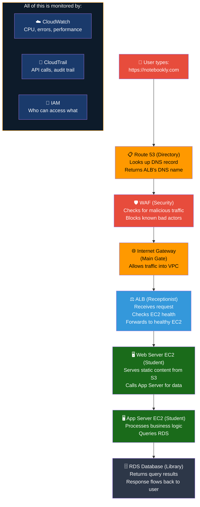

## 🎯 Chapter Goal

You have learned 23 individual AWS services. Now it is time to put every single piece together and see how they interact in a real-world, production-ready architecture.

By the end of this chapter, you will be able to:

- ✅ Visualize how all AWS services connect in production
- ✅ Design a multi-AZ, highly available architecture
- ✅ Explain the purpose of each component in the stack
- ✅ Build this architecture step by step
- ✅ Apply production best practices

---

## 📖 Story First — The Final Story

Remember Rahul from Chapter 1? The student who wanted to start an online notebook business?

Rahul has now completed 23 chapters of AWS learning. He is no longer a beginner. He is ready to build a real, production-grade application.

His notebook website, **Notebookly**, sells handmade notebooks across India. It has:
- 50,000 daily visitors
- 10,000 registered users
- 500+ orders per day
- Payment processing and order tracking
- High traffic during festival seasons (Diwali, Christmas)

Rahul needs his application to be:
- **Always available** — no downtime, even if a server fails
- **Scalable** — handle 10x traffic during sales without crashing
- **Secure** — customer data is private and protected
- **Fast** — pages load in under 2 seconds for users across India
- **Observable** — if something breaks, he knows immediately
- **Cost-efficient** — he does not want to pay for idle resources

This chapter builds the architecture that meets all of these requirements.

---

## 🗺️ Complete Architecture Diagram

This is the final, complete architecture. Every component you have learned is here.

```mermaid
graph TB
    subgraph AWS["☁️ AWS Cloud — ap-south-1 (Mumbai)"]
        direction TB

        R53["📋 Route 53<br/>notebookly.com → ALB DNS"]

        WAF["🛡️ WAF (Web ACL)<br/>Security Guard"]

        IGW["🌐 Internet Gateway<br/>Main School Gate"]

        subgraph VPC["VPC: 10.0.0.0/16 (The School Campus)"]
            direction TB

            subgraph AZ1["🏛️ AZ-1 (Building A)"]
                PubSub1["🟢 PUBLIC SUBNET-A<br/>10.0.1.0/24 (Science Wing)"]
                NAT1["📡 NAT Gateway (Staff Exit)"]
                PrivSub1["🔵 PRIVATE SUBNET-A<br/>10.0.3.0/24 (Admin Block)"]
                Web1["🖥️ EC2 Web Server (Student)"]
                App1["🖥️ EC2 App Server (Student)"]
                RDS_B["🗄️ RDS Read Replica (Library Branch)"]
                PubSub1 --- NAT1
                PrivSub1 --- Web1
                PrivSub1 --- App1
                PrivSub1 --- RDS_B
            end

            subgraph AZ2["🏛️ AZ-2 (Building B)"]
                PubSub2["🟢 PUBLIC SUBNET-B<br/>10.0.2.0/24 (Arts Wing)"]
                NAT2["📡 NAT Gateway (Staff Exit)"]
                PrivSub2["🔵 PRIVATE SUBNET-B<br/>10.0.4.0/24 (Admin Block)"]
                Web2["🖥️ EC2 Web Server (Student)"]
                App2["🖥️ EC2 App Server (Student)"]
                RDS_P["🗄️ RDS Primary (Main Library)"]
                PubSub2 --- NAT2
                PrivSub2 --- Web2
                PrivSub2 --- App2
                PrivSub2 --- RDS_P
            end

            ASG["⚙️ Auto Scaling Group<br/>Min:2 Max:10 Desired:2<br/>Scale out: CPU > 70% 5min<br/>Scale in: CPU < 30% 15min"]

            ALB["⚖️ Application Load Balancer<br/>School Receptionist<br/>HTTP:80 → HTTPS:443<br/>Target: ASG EC2 instances<br/>Health check: /health → 200"]
        end

        S3["📦 S3 Bucket<br/>Central Library<br/>Product images, static assets, backups"]
        S3_CT["📦 S3 Bucket<br/>CloudTrail Audit Logs<br/>Security Cam Footage<br/>7 year retention"]

        IAM["🔑 IAM<br/>AdminUser → Full access<br/>DevTeam → EC2,RDS,S3<br/>EC2-Role → S3+RDS<br/>Billing-View → Read billing"]

        CW["☁️ CloudWatch<br/>School Control Room"]

        CT["📜 CloudTrail<br/>Security Camera System<br/>Records all API calls"]
    end

    User["👤 User"]
    User --> R53
    R53 --> WAF
    WAF --> IGW
    IGW --> ALB
    ALB --> AZ1
    ALB --> AZ2
    ASG -.-> Web1
    ASG -.-> App1
    ASG -.-> Web2
    ASG -.-> App2
    App1 -.-> RDS_P
    App2 -.-> RDS_P
    RDS_P -.->|"Replication"| RDS_B

    style AWS fill:#1a1a2e,color:#fff,stroke:#ff9900,stroke-width:3px
    style VPC fill:#0d1b2a,color:#fff,stroke:#2ecc40,stroke-width:2px
    style AZ1 fill:#1a1a2e,color:#fff,stroke:#3498db,stroke-width:1px
    style AZ2 fill:#1a1a2e,color:#fff,stroke:#3498db,stroke-width:1px
    style PubSub1 fill:#1a6b1a,color:#fff
    style PubSub2 fill:#1a6b1a,color:#fff
    style PrivSub1 fill:#6b1a1a,color:#fff
    style PrivSub2 fill:#6b1a1a,color:#fff
    style R53 fill:#ff9900,color:#000
    style WAF fill:#e74c3c,color:#fff
    style IGW fill:#ff9900,color:#000
    style NAT1 fill:#ff9900,color:#000
    style NAT2 fill:#ff9900,color:#000
    style Web1 fill:#3498db,color:#fff
    style Web2 fill:#3498db,color:#fff
    style App1 fill:#3498db,color:#fff
    style App2 fill:#3498db,color:#fff
    style RDS_P fill:#2d3748,color:#fff
    style RDS_B fill:#2d3748,color:#fff
    style ASG fill:#ff9900,color:#000
    style ALB fill:#e74c3c,color:#fff
    style S3 fill:#ff9900,color:#000
    style S3_CT fill:#ff9900,color:#000
    style IAM fill:#2ecc40,color:#000
    style CW fill:#3498db,color:#fff
    style CT fill:#3498db,color:#fff
    style User fill:#e74c3c,color:#fff
```


```

---

## 📚 Complete Recap — All 24 Chapters in One View

Let us walk through every service in this architecture and see how it maps to our school.

```
╔════════════════════════════════════════════════════════════════════════════════════════╗
║                   THE COMPLETE SCHOOL — EVERY SERVICE AND ITS ROLE                    ║
╠════════════════════════════════════════════════════════════════════════════════════════╣
║                                                                                         ║
║  ┌────── CHAPTER 1-2: CLOUD COMPUTING & AWS ───────────────────────────────────┐      ║
║  │  The entire concept. Instead of building your own school, you rent space      │      ║
║  │  in a massive international school system (AWS). You pay only for what you    │      ║
║  │  use. No building costs, no maintenance headaches.                            │      ║
║  └───────────────────────────────────────────────────────────────────────────────┘      ║
║                                                                                         ║
║  ┌────── CHAPTER 3: GLOBAL INFRASTRUCTURE ──────────────────────────────────────┐      ║
║  │  The school system has campuses worldwide (Regions). Each campus has           │      ║
║  │  multiple buildings (Availability Zones) so that if one building has a fire,  │      ║
║  │  the school keeps running in the other buildings. We chose Mumbai campus.     │      ║
║  └───────────────────────────────────────────────────────────────────────────────┘      ║
║                                                                                         ║
║  ┌────── CHAPTER 4: VPC ────────────────────────────────────────────────────────┐      ║
║  │  The campus walls. Without the VPC, anyone can walk in. The VPC isolates      │      ║
║  │  our entire infrastructure inside a private network. CIDR: 10.0.0.0/16.      │      ║
║  └───────────────────────────────────────────────────────────────────────────────┘      ║
║                                                                                         ║
║  ┌────── CHAPTER 5-6: SUBNETS & CIDR ───────────────────────────────────────────┐      ║
║  │  Inside the campus, we have wings. Public subnets (Science Wing, Arts Wing)     │      ║
║  │  for things that need internet access. Private subnets (Admin Block) for      │      ║
║  │  databases and internal servers. CIDR gives each wing an address range.       │      ║
║  └───────────────────────────────────────────────────────────────────────────────┘      ║
║                                                                                         ║
║  ┌────── CHAPTER 7: ROUTE TABLES ───────────────────────────────────────────────┐      ║
║  │  The direction signboards inside the campus. Public subnet route table says:    │      ║
║  │  "Traffic to internet → go to Internet Gateway." Private subnet says:          │      ║
║  │  "Traffic to internet → go to NAT Gateway."                                    │      ║
║  └───────────────────────────────────────────────────────────────────────────────┘      ║
║                                                                                         ║
║  ┌────── CHAPTER 8: INTERNET GATEWAY ───────────────────────────────────────────┐      ║
║  │  The main school gate. Connects the campus to the outside world. Without it,   │      ║
║  │  nobody from the internet can reach our web servers, and our servers cannot    │      ║
║  │  be accessed by customers.                                                    │      ║
║  └───────────────────────────────────────────────────────────────────────────────┘      ║
║                                                                                         ║
║  ┌────── CHAPTER 9: NAT GATEWAY ────────────────────────────────────────────────┐      ║
║  │  The staff-only side exit. Instances in private subnets can use it to reach     │      ║
║  │  the internet (download updates), but the internet cannot reach them.         │      ║
║  │  One NAT Gateway per AZ for high availability.                                │      ║
║  └───────────────────────────────────────────────────────────────────────────────┘      ║
║                                                                                         ║
║  ┌────── CHAPTER 10-11: SECURITY GROUPS & NACLs ────────────────────────────────┐      ║
║  │  Security Groups are the guards at each classroom door (stateful — allow out   │      ║
║  │  automatically). NACLs are the guards at each wing entrance (stateless —       │      ║
║  │  check both ways). SG: "Allow HTTP from ALB only." NACL: "Allow ephemeral      │      ║
║  │  ports 1024-65535 from VPC CIDR."                                             │      ║
║  └───────────────────────────────────────────────────────────────────────────────┘      ║
║                                                                                         ║
║  ┌────── CHAPTER 12: EC2 ───────────────────────────────────────────────────────┐      ║
│  EC2 instances are the students — they do the actual computing work. Web       │      ║
│  servers run Nginx/Apache. App servers run the backend code. AMIs provide the   │      ║
│  pre-configured template for launching these instances consistently.           │      ║
└───────────────────────────────────────────────────────────────────────────────┘      ║
║                                                                                         ║
║  ┌────── CHAPTER 13-14: AMI & EBS ─────────────────────────────────────────────┐      ║
│  AMIs are the master computer images — pre-installed software ready for new    │      ║
│  students. EBS volumes are the students' lockers — persistent block storage    │      ║
│  attached to each EC2 instance. Snapshots back up locker contents.             │      ║
└───────────────────────────────────────────────────────────────────────────────┘      ║
║                                                                                         ║
║  ┌────── CHAPTER 15: EFS ───────────────────────────────────────────────────────┐      ║
│  The school library — shared file storage that multiple EC2 instances can       │      ║
│  mount simultaneously across different Availability Zones. Unlike EBS, EFS     │      ║
│  is accessible from anywhere on campus and scales automatically.               │      ║
└───────────────────────────────────────────────────────────────────────────────┘      ║
║                                                                                         ║
║  ┌────── CHAPTER 16: S3 ────────────────────────────────────────────────────────┐      ║
│  The central document archive. Stores all static files — product images,        │      ║
│  CSS/JS assets, backups, CloudTrail logs. Practically unlimited storage,       │      ║
│  99.999999999% durability. Lifecycle rules move old files to Glacier.          │      ║
└───────────────────────────────────────────────────────────────────────────────┘      ║
║                                                                                         ║
║  ┌────── CHAPTER 17: IAM ───────────────────────────────────────────────────────┐      ║
│  The school ID management system. Every person has a role: Principal (root),   │      ║
│  Teachers (developers), Students (apps). Each gets only the permissions they    │      ║
│  need. EC2 instances assume IAM Roles to access S3 and RDS.                   │      ║
└───────────────────────────────────────────────────────────────────────────────┘      ║
║                                                                                         ║
║  ┌────── CHAPTER 18: LOAD BALANCER (ELB/ALB) ───────────────────────────────────┐      ║
║  │  The school receptionist. When 50,000 visitors arrive, the receptionist        │      ║
║  │  distributes them evenly across all available classrooms so no single room     │      ║
║  │  is overloaded. Also performs health checks — only sends visitors to          │      ║
║  │  classrooms that are open and functioning.                                    │      ║
║  └───────────────────────────────────────────────────────────────────────────────┘      ║
║                                                                                         ║
║  ┌────── CHAPTER 19: AUTO SCALING ───────────────────────────────────────────────┐      ║
║  │  During exam season (high traffic), the school automatically hires temporary    │      ║
║  │  teachers and opens more classrooms. During holidays (low traffic), it          │      ║
║  │  releases them. No human decides — the system does it automatically based      │      ║
║  │  on rules (CPU > 70% → add more EC2 instances).                               │      ║
║  └───────────────────────────────────────────────────────────────────────────────┘      ║
║                                                                                         ║
║  ┌────── CHAPTER 20: RDS ───────────────────────────────────────────────────────┐      ║
║  │  The school library. All data is stored here — student records, orders,         │      ║
║  │  inventory. RDS manages the database for us (backups, patching, replication).   │      ║
║  │  Multi-AZ deployment: library in Building A has a backup copy in Building B.   │      ║
║  └───────────────────────────────────────────────────────────────────────────────┘      ║
║                                                                                         ║
║  ┌────── CHAPTER 21: ROUTE 53 ───────────────────────────────────────────────────┐      ║
║  │  The school directory / phonebook. When a user types "notebookly.com," R53      │      ║
║  │  looks up the IP address of our load balancer and directs the user there.      │      ║
║  │  Also provides health checks and routing policies (latency, geo, failover).   │      ║
║  └───────────────────────────────────────────────────────────────────────────────┘      ║
║                                                                                         ║
║  ┌────── CHAPTER 22: CLOUDWATCH ────────────────────────────────────────────────┐      ║
║  │  The school control room. Real-time monitoring of every classroom. CPU         │      ║
║  │  metrics, error logs, billing alarms. When CPU of our web servers hits 80%,   │      ║
║  │  an alarm triggers and an email/SMS is sent to the DevOps team.                │      ║
║  └───────────────────────────────────────────────────────────────────────────────┘      ║
║                                                                                         ║
║  ┌────── CHAPTER 23: CLOUDTRAIL ─────────────────────────────────────────────────┐      ║
║  │  The security camera system and visitor log. Every API call recorded: WHO      │      ║
║  │  deleted that S3 bucket, WHEN was the security group modified, WHERE did the   │      ║
║  │  API call come from. Logs stored in S3 for compliance.                        │      ║
║  └───────────────────────────────────────────────────────────────────────────────┘      ║
║                                                                                         ║
╚════════════════════════════════════════════════════════════════════════════════════════╝
```

---

## 🏗️ Step by Step — Building This Architecture

Let us build Rahul's Notebookly application from scratch, step by step. This is the practical guide to creating everything we have learned.

### Phase 1: Foundation (Account Setup)

```
STEP 1: Create AWS Account (Chapter 2)
         → Sign up for AWS Free Tier
         → Enable billing alerts in CloudWatch
         → Create a Trail in CloudTrail (Chapter 23)
           (Do this BEFORE launching any resources!)

STEP 2: Create IAM Users (Chapter 17)
         → Create Admin group with AdministratorAccess
         → Create user: admin-rahul (add to Admin group)
         → Enable MFA on root account
         → Never use root account again
```

### Phase 2: Network (VPC & Subnets)

```
STEP 3: Create VPC (Chapter 4)
         → Name: Notebookly-VPC
         → CIDR: 10.0.0.0/16
         → Region: ap-south-1 (Mumbai)

STEP 4: Create Subnets (Chapter 5)
         → Public Subnet AZ-1: 10.0.1.0/24 (Public)
         → Public Subnet AZ-2: 10.0.2.0/24 (Public)
         → Private Subnet AZ-1: 10.0.3.0/24 (App + DB)
         → Private Subnet AZ-2: 10.0.4.0/24 (App + DB)

STEP 5: Create Internet Gateway (Chapter 8)
         → Name: Notebookly-IGW
         → Attach to Notebookly-VPC

STEP 6: Create NAT Gateways (Chapter 9)
         → NAT-GW-AZ1 in Public Subnet AZ-1
         → NAT-GW-AZ2 in Public Subnet AZ-2
         → (One per AZ for high availability)
```

### Phase 3: Routing & Security

```
STEP 7: Create Route Tables (Chapter 7)
         → Public Route Table:
            • 0.0.0.0/0 → Internet Gateway
            • Associate with Public Subnets
         → Private Route Table AZ-1:
            • 0.0.0.0/0 → NAT-GW-AZ1
            • Associate with Private Subnet AZ-1
         → Private Route Table AZ-2:
            • 0.0.0.0/0 → NAT-GW-AZ2
            • Associate with Private Subnet AZ-2

STEP 8: Create Security Groups (Chapter 10)
         → ALB-SG:
            • Inbound: HTTP (80), HTTPS (443) from 0.0.0.0/0
            • Outbound: Allow all
         → WebServer-SG:
            • Inbound: HTTP (80) from ALB-SG only
            • Inbound: SSH (22) from Admin-IP (your IP)
            • Outbound: Allow all
         → Database-SG:
            • Inbound: MySQL (3306) from WebServer-SG only
            • Outbound: Allow all
```

### Phase 4: Compute & Database

```
STEP 9: Create RDS Database (Chapter 16)
         → Engine: MySQL 8.0
         → DB Instance: db.t3.micro (Free Tier)
         → VPC: Notebookly-VPC
         → Subnet group: Private Subnets (AZ-1 + AZ-2)
         → Security group: Database-SG
         → Multi-AZ: Yes (for production)
         → Automated backups: 7 days retention
         → Storage: 20 GB gp3

STEP 10: Create Application Load Balancer (Chapter 14)
          → Name: Notebookly-ALB
          → Scheme: Internet-facing
          → VPC: Notebookly-VPC
          → Subnets: Public Subnet AZ-1 + AZ-2
          → Security Group: ALB-SG
          → Listener: HTTP:80 (redirect to HTTPS in prod)
          → Target group: Notebookly-TG (HTTP:80, /health)

STEP 11: Create Launch Template
          → AMI: Amazon Linux 2023
          → Instance type: t3.micro
          → Security group: WebServer-SG
          → IAM Instance Profile: EC2-S3-Role (for S3 access)
          → User data: Script to install app + join ASG
          → Storage: 8 GB gp3

STEP 12: Create Auto Scaling Group (Chapter 15)
          → Name: Notebookly-ASG
          → Launch template: Notebookly-Template
          → VPC: Notebookly-VPC
          → Subnets: Private Subnet AZ-1 + AZ-2
          → Load balancer: Notebookly-ALB target group
          → Min: 2, Max: 10, Desired: 2
          → Scale out policy: CPU > 70% for 5 minutes
          → Scale in policy: CPU < 30% for 15 minutes
```

### Phase 5: Storage & Content

```
STEP 13: Create S3 Buckets (Chapter 18)
          → Bucket 1: notebookly-static-assets
             • Store: product images, CSS, JS, PDFs
             • Enable: Static website hosting (optional)
             • Lifecycle: Move to Glacier after 90 days
          → Bucket 2: notebookly-logs-and-backups
             • Store: DB snapshots, CloudTrail logs
             • Enable: Versioning
             • Enable: MFA Delete (prevent accidental deletion)

STEP 14: Set up Route 53 (Chapter 19)
          → Register domain: notebookly.com (or use existing)
          → Create hosted zone: notebookly.com
          → Create A record (Alias):
             • Name: notebookly.com
             • Alias target: Notebookly-ALB DNS name
          → Create CNAME: www.notebookly.com → notebookly.com
```

### Phase 6: Monitoring & Audit

```
STEP 15: Set up CloudWatch (Chapter 22)
          → Dashboard: "Notebookly-Production"
             • Widget 1: CPU graph for ASG (avg)
             • Widget 2: RDS connections
             • Widget 3: ALB request count + 5XX errors
             • Widget 4: S3 bucket sizes
          → Alarms:
             • CPU > 80% on any EC2 → SNS email to team
             • RDS Storage > 80% → SNS email
             • ALB 5XX > 1% of requests → SNS + Lambda
             • Billing > $100 → SNS (monthly estimate)
          → Logs:
             • Stream EC2 application logs to CloudWatch
             • Create metric filter: "ERROR" → count metric

STEP 16: Verify CloudTrail (Chapter 23)
          → Trail: Notebookly-Audit-Trail
          → Log to S3: notebookly-logs-and-backups/cloudtrail/
          → Enable: Log file validation
          → Enable: CloudWatch Logs integration
          → Set up metric filter: "StopLogging" event → alarm
```

---

## ✅ Final Architecture Checklist

Use this checklist when building your own real-world AWS architecture.

```
┌─────────────────────────────────────────────────────────┐
│       PRODUCTION ARCHITECTURE CHECKLIST                 │
├─────────────────────────────────────────────────────────┤
│                                                         │
│  ☐ Custom VPC created (never use default VPC)          │
│  ☐ At least 2 AZs used (for high availability)         │
│  ☐ Public subnets for load balancers + NAT Gateways   │
│  ☐ Private subnets for EC2 instances + RDS            │
│  ☐ NAT Gateways in each AZ (for private subnet egress) │
│  ☐ Security Groups follow least privilege              │
│  ☐ NACLs as additional subnet-level defense            │
│  ☐ ALB distributing traffic across multiple AZs        │
│  ☐ Auto Scaling with min 2 instances (one per AZ)      │
│  ☐ RDS Multi-AZ enabled (automatic failover)          │
│  ☐ S3 bucket for logs with versioning enabled          │
│  ☐ IAM roles assigned to EC2 (no hardcoded keys)      │
│  ☐ IAM groups with appropriate policies                │
│  ☐ Route 53 DNS pointing to ALB (not EC2 directly)    │
│  ☐ CloudWatch alarms for key metrics                   │
│  ☐ CloudTrail Trail enabled + log validation           │
│  ☐ Billing alarm set                                   │
│  ☐ MFA enabled on root account                         │
│  ☐ All data encrypted at rest (RDS + S3 + EBS)        │
│  ☐ Regular backups configured (RDS + S3 lifecycle)    │
│                                                         │
└─────────────────────────────────────────────────────────┘
```

---

## 🏆 Production Best Practices

### High Availability

```
┌─────────────────────────────────────────────────────────┐
│               HIGH AVAILABILITY DESIGN                  │
├─────────────────────────────────────────────────────────┤
│                                                         │
│  • Deploy across MULTIPLE AZs (at least 2)              │
│  • Use Auto Scaling with min instances in each AZ      │
│  • Use ALB to distribute traffic across AZs             │
│  • Use RDS Multi-AZ for database failover               │
│  • Use NAT Gateways in each AZ (not a single one)      │
│  • Test: Simulate AZ failure and verify app survives    │
│                                                         │
│  School: If Building A catches fire, Building B         │
│  continues running. No one notices the switch.          │
└─────────────────────────────────────────────────────────┘
```

### Security

```
┌─────────────────────────────────────────────────────────┐
│                   SECURITY BEST PRACTICES               │
├─────────────────────────────────────────────────────────┤
│                                                         │
│  • Principle of Least Privilege for all IAM policies   │
│  • MFA required for all IAM users                      │
│  • No public S3 buckets (block public access by default)│
│  • Security Groups: only allow what is needed           │
│  • NACLs: deny known bad traffic at subnet level        │
│  • Use AWS WAF in front of ALB to block common attacks │
│  • Encrypt data at rest (EBS, RDS, S3)                 │
│  • Encrypt data in transit (HTTPS/TLS on ALB)          │
│  • Rotate access keys regularly (90 days)              │
│  • Use IAM Roles, never hardcode credentials            │
│                                                         │
│  School: Every door locked. Only authorized people      │
│  have keys. Cameras everywhere. Logs of who entered.    │
└─────────────────────────────────────────────────────────┘
```

### Cost Optimization

```
┌─────────────────────────────────────────────────────────┐
│               COST OPTIMIZATION TIPS                    │
├─────────────────────────────────────────────────────────┤
│                                                         │
│  • Use Reserved Instances for predictable workloads    │
│  • Use Spot Instances for fault-tolerant batch jobs    │
│  • Right-size EC2 instances (monitor with CloudWatch)   │
│  • Set S3 lifecycle policies (move old data to Glacier) │
│  • Delete unused resources (EBS snapshots, Elastic IPs) │
│  • Use AWS Budgets with alerts                          │
│  • Auto Scaling should scale IN during low traffic      │
│  • Choose the right Region (prices vary)                │
│                                                         │
│  School: Don't pay for empty classrooms. Turn off       │
│  lights in rooms that aren't being used. Rent only      │
│  the space you need.                                    │
└─────────────────────────────────────────────────────────┘
```

### Operational Excellence

```
┌─────────────────────────────────────────────────────────┐
│               OPERATIONAL BEST PRACTICES                │
├─────────────────────────────────────────────────────────┤
│                                                         │
│  • Tag ALL resources (Name, Environment, Owner, Cost)  │
│  • Use Infrastructure as Code (Terraform/CloudFormation)│
│  • Document your architecture (diagrams + descriptions) │
│  • Implement CI/CD pipeline for deployments             │
│  • Set up runbooks for common incidents                 │
│  • Regularly review CloudTrail logs                     │
│  • Test disaster recovery (restore from backup)         │
│  • Use AWS Systems Manager for patch management         │
│                                                         │
│  School: Have a fire drill. Know what to do when        │
│  the alarm rings. Practice it.                          │
└─────────────────────────────────────────────────────────┘
```

---

## 🧪 Final Hands-On Lab — Deploy the Complete Architecture

This is your capstone project. If you can build this, you are ready for the real world.

```
FINAL CAPSTONE: DEPLOY NOTEBOOKLY ARCHITECTURE

Objective: Deploy a complete, production-ready three-tier 
           web application on AWS.

Time: 4-6 hours (spread over a few days)

Steps (detailed in phases above):
  1. Set up account + IAM + CloudTrail
  2. Create VPC with subnets, IGW, NAT Gateways, Route Tables
  3. Create Security Groups (ALB, Web, DB)
  4. Launch RDS MySQL in private subnets (Multi-AZ)
  5. Create ALB in public subnets
  6. Create Launch Template + Auto Scaling Group
  7. Deploy a simple web app on the EC2 instances
  8. Set up S3 for static assets + logs
  9. Configure Route 53 to point domain to ALB
 10. Set up CloudWatch monitoring + alarms
 11. Verify CloudTrail is logging everything

Validation:
  ✅ Visit http://notebookly.com → App loads
  ✅ Stop one EC2 → App still works (ALB sends to other)
  ✅ Simulate CPU spike → ASG scales out
  ✅ Check CloudTrail → See all API calls recorded
  ✅ Check CloudWatch Dashboard → All metrics visible
```

---

## 📊 Traffic Flow Summary

Here is what happens when a user visits notebookly.com:



---

## 💡 Pro Tips — Final Words

> 💡 **Tip 1:** Start small, grow gradually. Do not try to build this entire architecture on your first attempt. Begin with a single EC2 in a default VPC. Then add a VPC. Then add an ALB. Then Auto Scaling. Build it one piece at a time. Each piece you add makes the previous pieces more meaningful.

> 💡 **Tip 2:** Use the AWS Free Tier generously but carefully. This entire architecture can be built within the Free Tier for the first 12 months. Just remember to STOP or TERMINATE resources when you are done practicing. A running RDS instance or NAT Gateway costs money even in the first year.

> 💡 **Tip 3:** Destroy and rebuild. The best way to learn is to build this architecture, test it, and then destroy everything and rebuild it from memory. Do this 3 times. By the third time, you will understand how every component connects. This is how professional AWS engineers learn.

> 💡 **Tip 4:** Tag everything. Every resource you create should have tags: `Name`, `Environment` (dev/prod), `Owner`, `CostCenter`. This becomes critically important when you have 50+ resources and need to know what each one is for and who to contact if something breaks.

> 💡 **Tip 5:** You now know more than most beginners. If you have understood and practiced all 24 chapters, you know more about AWS than 80% of people who call themselves "cloud developers." The concepts you have learned — VPC design, security groups, IAM, auto scaling, high availability — are the exact same concepts used by companies like Netflix, Airbnb, and Amazon itself. You are no longer a beginner.

---

## ❓ Quick Quiz

import Quiz from '@site/src/components/Quiz';

<Quiz questions={[
    {
        "id": 1,
        "question": "Why should you deploy EC2 instances in private subnets instead of public subnets?",
        "options": [
            "Private subnets are faster",
            "Private subnets are cheaper",
            "Private subnets do not have direct internet exposure,",
            "Private subnets can access the internet, public subnets cannot"
        ],
        "correct": 2,
        "explanation": "Instances in private subnets cannot be directly reached from the internet. The ALB acts as the single entry point, and instances communicate through the NAT Gateway for outbound traffic."
    },
    {
        "id": 2,
        "question": "What happens if an EC2 instance fails its health check in an Auto Scaling Group behind an ALB?",
        "options": [
            "The ALB continues sending traffic to it",
            "Auto Scaling terminates it and launches a new one",
            "CloudWatch sends an email",
            "Both B and C"
        ],
        "correct": 3,
        "explanation": "The ALB stops sending traffic to the unhealthy instance, Auto Scaling terminates it and launches a replacement, and if CloudWatch alarms are configured, the team gets notified."
    },
    {
        "id": 3,
        "question": "Your website is experiencing high traffic. Which two services work together to automatically handle this?",
        "options": [
            "IAM and S3",
            "Auto Scaling and ALB",
            "CloudTrail and Route 53",
            "NAT Gateway and VPC"
        ],
        "correct": 1,
        "explanation": "Auto Scaling automatically adds more EC2 instances when CPU is high, and the ALB distributes traffic among all instances."
    },
    {
        "id": 4,
        "question": "In the complete architecture, which component is the single entry point for all user traffic?",
        "options": [
            "NAT Gateway",
            "Internet Gateway",
            "Application Load Balancer",
            "Route 53"
        ],
        "correct": 2,
        "explanation": "The ALB is the single entry point for application traffic. Route 53 resolves DNS, Internet Gateway allows VPC access, but the ALB is where traffic is actually received and forwarded."
    },
    {
        "id": 5,
        "question": "What is the minimum number of Availability Zones needed for a highly available production architecture?",
        "options": [
            "1",
            "2",
            "3",
            "4"
        ],
        "correct": 1,
        "explanation": "At least 2 AZs are needed so that if one AZ fails, the application continues running in the other. AWS recommends 3 AZs for even higher availability."
    }
]} />

---

## 🎤 Interview Questions

**Q: Design a highly available, scalable web application architecture on AWS.**

> I would design a three-tier architecture across multiple Availability Zones. The presentation tier uses an Application Load Balancer in public subnets to distribute traffic. The application tier uses EC2 instances in an Auto Scaling Group in private subnets across 2+ AZs, with scaling policies based on CPU or request count. The database tier uses RDS Multi-AZ in private subnets for automatic failover. Route 53 routes traffic to the ALB. CloudWatch monitors everything, and CloudTrail audits all API calls. All resources are secured with Security Groups, NACLs, and IAM roles with least privilege.

**Q: How do you ensure zero downtime during deployments?**

> I use a rolling update strategy with Auto Scaling. I launch new instances with the updated code while old instances continue serving traffic. The ALB health checks detect when new instances are healthy and start routing traffic to them. Old instances are terminated only after new ones pass health checks. This ensures no traffic is dropped during the deployment.

**Q: What happens if an Availability Zone goes down completely?**

> If AZ-1 goes down, the ALB in AZ-2 continues serving traffic. Auto Scaling detects that instances in AZ-1 are unhealthy and launches replacement instances in AZ-2 (if configured for cross-AZ). The RDS database in AZ-2 becomes the primary (Multi-AZ failover). Users connected to the app in AZ-1 lose their session (if session is stored in-memory), but the application remains accessible. This is why you need stateless applications and external session storage (ElastiCache) for true zero-downtime.

**Q: What is the difference between horizontal and vertical scaling?**

> Horizontal scaling means adding more instances (more EC2 servers). Vertical scaling means making the existing instance bigger (t3.micro → t3.large). For cloud-native architectures, horizontal scaling is preferred because it is more resilient (spread across AZs), has no downtime during scaling (add/remove instances without restart), and is essentially unlimited (you cannot make an instance infinitely large). Auto Scaling implements horizontal scaling.

---

## 📝 Chapter Summary

```
┌─────────────────────────────────────────────────────────┐
│                 CHAPTER 24 SUMMARY                      │
├─────────────────────────────────────────────────────────┤
│                                                         │
│  ✅ Complete architecture = All 23 chapters combined    │
│  ✅ Three-tier: Web (ALB) → App (EC2) → Data (RDS)     │
│  ✅ Multi-AZ deployment for high availability           │
│  ✅ Public subnets for ALB + NAT Gateways              │
│  ✅ Private subnets for EC2 + RDS                      │
│  ✅ Auto Scaling handles traffic changes automatically  │
│  ✅ Route 53 directs users to the ALB                   │
│  ✅ S3 stores static assets and audit logs              │
│  ✅ CloudWatch monitors every component                 │
│  ✅ CloudTrail records every API call                   │
│  ✅ IAM controls who can access and modify resources    │
│  ✅ Security Groups + NACLs = defense in depth          │
│  ✅ Production = least privilege + encryption + MFA     │
│  ✅ Tag all resources for organization                  │
│  ✅ Build it, destroy it, rebuild it — 3 times         │
│                                                         │
└─────────────────────────────────────────────────────────┘
```
---

---

