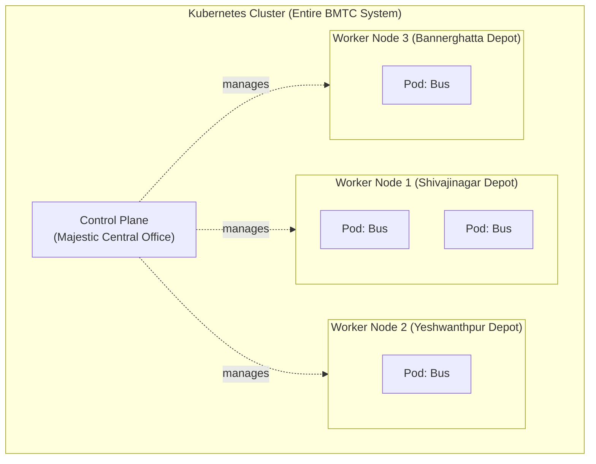

# Chapter 1: The Big Picture

## The Story So Far

Bengaluru is growing fast. Millions of people need to travel every day. The government decides to build the most modern, intelligent bus system in India. They call it the **New BMTC System**.

This system needs to:
- Run hundreds of buses across the city
- Never stop even if something breaks down
- Add more buses when crowds grow
- Remove buses when demand drops
- Keep everything organized and trackable

The engineers who built this system made the same decisions that Kubernetes engineers made. That is not a coincidence. Both are solving the same fundamental problem: **how do you manage a large number of things reliably, automatically, and at scale?**

---

## What Is the Whole System?

### Kubernetes Concept: Cluster

When you run Kubernetes, you are not working with one computer. You are working with a **group of computers working together as one unified system**.

This group is called a **Cluster**.

> **BMTC Analogy:** The entire BMTC transportation system across Bengaluru. Not one bus. Not one depot. The whole thing — every depot, every bus, every route, every office — working together as one transportation network.

---

## Who Is In Charge?

Every large system needs a brain. Someone or something that:
- Knows the overall plan
- Makes decisions
- Monitors whether things are working
- Fixes problems when they occur

### Kubernetes Concept: Control Plane

The **Control Plane** is the brain of Kubernetes. It does not run your applications. It manages everything else that does.

> **BMTC Analogy:** The **Majestic BMTC Central Control Office**. The big building where senior officers sit. They do not drive buses. They decide how many buses run, which routes need more buses, and what to do when a bus breaks down.

---

## Where Do Buses Actually Run?

The control office makes decisions, but buses actually run from **depots**. Depots are where buses are parked, maintained, and dispatched.

### Kubernetes Concept: Worker Node

A **Worker Node** is a computer (or server) where your actual applications run. The Control Plane tells Worker Nodes what to do. Worker Nodes do the actual work.

> **BMTC Analogy:** A **BMTC Depot**. Each depot in Bengaluru — Shivajinagar Depot, Yeshwanthpur Depot, Bannerghatta Depot — is a Worker Node. The Control Office (Control Plane) instructs each depot what to do.



---

## What Actually Runs on a Worker Node?

### Kubernetes Concept: Pod

A **Pod** is the smallest thing Kubernetes manages. When you want to run an application, Kubernetes wraps it inside a Pod and places that Pod on a Worker Node.

Think of a Pod as a **wrapper** or a **capsule** around your application.

> **BMTC Analogy:** A **BMTC Bus**. The bus is the unit of transportation. It goes to a depot. It runs on routes. It is tracked and managed. When you need more capacity, you add more buses. When a bus breaks, you replace it.

---

## What Is Inside a Pod?

### Kubernetes Concept: Container

A **Container** is the actual application running inside a Pod. A Pod usually has one main Container. Sometimes it has two (one doing the main work, one doing a supporting task).

> **BMTC Analogy:** The **Driver** inside the bus. The driver is the one actually doing the work — driving the bus. Without the driver, the bus is just a parked vehicle. The bus (Pod) exists to house and transport the driver (Container) so the driver can do the job.

> **Slightly advanced note:** Sometimes a bus has both a **driver and a conductor**. The conductor collects tickets while the driver drives. In Kubernetes, this is called a **sidecar container** — a second container inside the Pod doing a supporting job like logging or security.

---

## Where Do Buses Come From?

### Kubernetes Concept: Image

Before a bus hits the road, someone had to **design and build it**. There is a blueprint — exact specifications for engine type, seat count, door positions, fuel type. Every bus built from that blueprint is identical.

In Kubernetes, your application needs to be packaged before it can run. This package is called an **Image**. It contains everything your application needs: the code, the settings, the libraries.

> **BMTC Analogy:** The **bus manufacturing blueprint**. Tata Motors or Volvo creates a design. BMTC orders buses built from that design. Every bus built from the same blueprint is identical and behaves the same way.

### Kubernetes Concept: Registry

Where are these blueprints stored? In a **Registry**. When Kubernetes needs to create a new Pod (bus), it fetches the Image (blueprint) from the Registry.

> **BMTC Analogy:** The **bus factory and warehouse**. All standard bus models are stored here. When a depot needs a new bus, they request one from the factory.

---

## 🛠️ Try It Yourself

Throughout this guide, you will see `kubectl` commands. `kubectl` is the command-line tool for interacting with your Kubernetes cluster. If you have a cluster running (Minikube, Docker Desktop, or a cloud cluster), try these:

```bash
# List all nodes (depots) in your cluster
kubectl get nodes

# List all pods (buses) across all namespaces
kubectl get pods --all-namespaces

# List all pods in the default namespace
kubectl get pods

# Get more details about a specific pod
kubectl describe pod <pod-name>

# List container images running in pods
kubectl get pods -o wide
```

Do not worry if these return nothing right now. The commands are here for reference so you can try them when you have a cluster.

---

## Episode 1 Summary

| Term | BMTC Meaning | Kubernetes Meaning |
|------|-------------|-------------------|
| Cluster | Entire BMTC System | Group of computers working as one |
| Control Plane | Central Control Office | Brain of Kubernetes |
| Worker Node | BMTC Depot | Computer where apps run |
| Pod | BMTC Bus | Wrapper around your application |
| Container | Bus Driver | The actual application |
| Image | Bus Blueprint | Packaged application |
| Registry | Bus Factory/Warehouse | Where Images are stored |

---

## ❓ Quick Quiz

import Quiz from '@site/src/components/Quiz';

<Quiz questions={[
  {
    id: 1,
    question: "What is a Kubernetes Cluster?",
    options: [
      "A single computer running your application",
      "A group of computers working together as one unified system",
      "A tool for managing Docker containers",
      "A cloud provider like AWS or GCP",
    ],
    correct: 1,
    explanation: "A Cluster is a group of computers (nodes) working together as one system. Like the entire BMTC transportation network — not one bus or one depot, but everything together.",
  },
  {
    id: 2,
    question: "In the BMTC analogy, what does a Worker Node represent?",
    options: [
      "A bus stop",
      "The Central Control Office",
      "A BMTC Depot",
      "A bus driver",
    ],
    correct: 2,
    explanation: "A Worker Node is like a BMTC Depot — the physical location where buses (Pods) are housed, maintained, and dispatched from.",
  },
  {
    id: 3,
    question: "What is the difference between a Pod and a Container?",
    options: [
      "There is no difference — they are the same thing",
      "A Pod is the wrapper, a Container is the actual application running inside it",
      "A Container is the wrapper, a Pod is the application",
      "A Pod runs on the Control Plane, a Container runs on a Worker Node",
    ],
    correct: 1,
    explanation: "A Pod is the wrapper (the bus) and a Container is the actual application running inside it (the driver). A pod can have one or more containers.",
  },
  {
    id: 4,
    question: "What is an Image in Kubernetes?",
    options: [
      "A screenshot of your application",
      "A packaged blueprint of your application with everything it needs to run",
      "A log file generated by your application",
      "A network configuration for your Pod",
    ],
    correct: 1,
    explanation: "An Image is like a bus blueprint — it contains everything needed to run your application. Kubernetes uses images from a Registry to create containers.",
  },
]} />

---

## 🎤 Interview Questions

**Q: What is Kubernetes and what problem does it solve?**

> Kubernetes is an open-source platform for automating deployment, scaling, and management of containerized applications. It solves the problem of running applications reliably at scale by grouping computers into a cluster and managing them as a single system.

**Q: Explain the difference between a Pod and a Container.**

> A Pod is the smallest deployable unit in Kubernetes — it wraps one or more containers. A Container is the actual running application. Think of the Pod as the bus and the Container as the driver inside it.

**Q: What is the Control Plane?**

> The Control Plane is the brain of Kubernetes. It makes global decisions about the cluster (scheduling, scaling, health monitoring) and does not run application containers itself.
