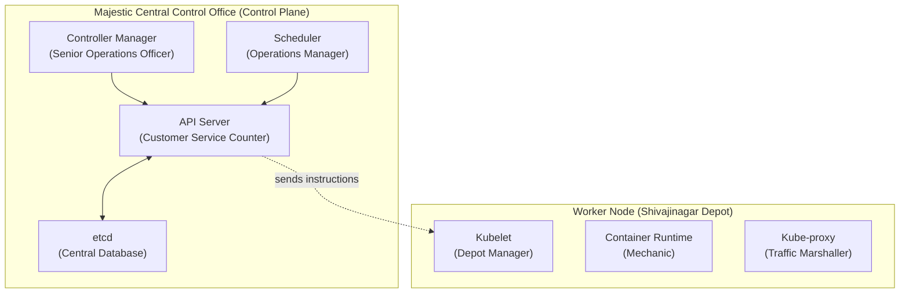
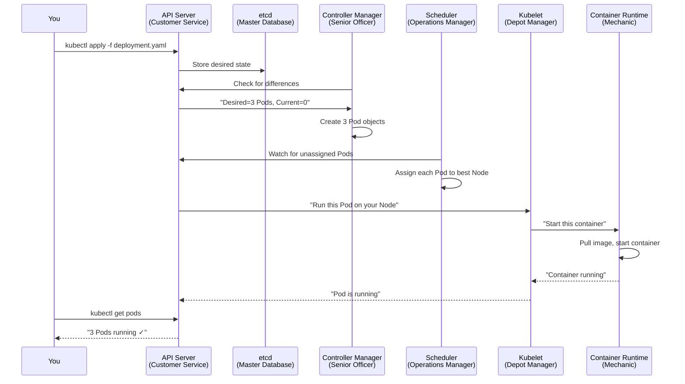

# Chapter 2: Inside the Control Room

In Chapter 1, we learned about the main parts of Kubernetes — the Cluster, Control Plane, Worker Nodes, Pods, and Containers.

Now it is time to open the doors of the Control Office and look inside. The Control Plane is not one thing. It is **four components working together**, and each Worker Node also has internal components that make everything run.

---

## The Four Components of the Control Plane



---

## Part 1: The Front Door

### Kubernetes Concept: API Server

The **API Server** is the **front door** of the entire Kubernetes system. Every request — from you, from other components, from automated systems — goes through the API Server.

Nothing in Kubernetes happens without going through the API Server.

> **BMTC Analogy:** The **Customer Service Counter at Majestic**.
>
> Want to ask about a route? Go to the counter. Want to submit a complaint? Go to the counter. Want to request a new bus? Go to the counter. Internal departments sending updates? They go through the counter.
>
> No one bypasses the counter. Everything is recorded, validated, and processed at the counter.

```bash
# Check the API Server health
kubectl get componentstatuses

# List all API resources available
kubectl api-resources

# Explain a specific resource
kubectl explain pod
```

---

## Part 2: The Master Database

### Kubernetes Concept: etcd

**etcd** is the database of Kubernetes. It stores **everything**:
- What Pods should exist
- What Pods currently exist
- All configurations
- All the state of the cluster

If etcd is lost without backup, the cluster loses all knowledge of itself. This is why etcd is treated with extreme care.

> **BMTC Analogy:** The **Central BMTC Master Database**.
>
> Every route, every bus, every depot location, every driver record, every schedule, every maintenance log. Everything is here. If this database was wiped clean, BMTC would not know how many buses it has, what routes exist, or which depots are operational.

---

## Part 3: The Operations Manager

### Kubernetes Concept: Scheduler

The **Scheduler** watches for new Pods that have been created but not yet assigned to a Worker Node. It then assigns them to the best available Node based on resource availability, constraints, and policies.

> **BMTC Analogy:** The **Operations Manager** at the Central Office.
>
> When a new bus needs to be dispatched, the Operations Manager checks: Which depot has available bays? Which depot has fuel? Which depot is closest to the route? Then they say: *"Send the bus from Yeshwanthpur Depot."*

---

## Part 4: The Senior Operations Officer

### Kubernetes Concept: Controller Manager

The **Controller Manager** runs a set of **control loops**. A control loop is a simple process that runs forever:

1. Check the current situation
2. Compare it to the desired situation
3. Take action to fix any difference
4. Repeat

> **BMTC Analogy:** A **Senior Operations Officer** who walks through the entire system all day, every day. They check every route, every depot, every bus. If something is wrong — a bus broke down, a depot is overloaded, a route has no buses — they trigger the right action. They never stop checking.

```text
CONTROL LOOP EXAMPLE:

Desired State:  5 buses on Route 500D
Current State:  4 buses on Route 500D (one broke down)
Action:         Create 1 new Pod (dispatch 1 replacement bus)
Result:         5 buses on Route 500D ✓
```

---

## Part 5: The External Coordination Officer

### Kubernetes Concept: Cloud Controller Manager

When Kubernetes runs on a cloud provider (AWS, GCP, Azure), there are external systems to coordinate with:
- Cloud load balancers
- Cloud storage
- Cloud networking
- Cloud node management

The **Cloud Controller Manager** handles this communication with external systems.

> **BMTC Analogy:** The **External Coordination Officer** who interfaces with Bengaluru Traffic Police (route approvals), BBMP (road conditions), GPS providers (real-time tracking), and fuel suppliers (automated ordering). These are outside BMTC's direct control. This officer is the bridge.

---

## Part 6: Inside a Worker Node

Now let us look **inside a Worker Node (Depot)**. Three key components live on every Worker Node.

### Kubelet — The Depot Manager

The **Kubelet** runs on every Worker Node. It receives instructions from the Control Plane and ensures the right Pods are running on its Node.

> **BMTC Analogy:** The **Depot Manager**. The Control Office sends orders. The Depot Manager receives them and makes sure the right buses are dispatched, running, and healthy.

```bash
# Check which Node a Pod is running on
kubectl get pods -o wide

# Get detailed info about a Node
kubectl describe node <node-name>
```

### Container Runtime — The Mechanic

The **Container Runtime** is the software that actually **starts and runs containers**. It does the low-level work of pulling images and starting processes.

> **BMTC Analogy:** The **Mechanic** who physically starts the bus engine, checks the oil, and gets the bus ready to roll. The Depot Manager (Kubelet) gives the order. The Mechanic (Container Runtime) executes it.

### Kube-proxy — The Traffic Marshaller

**Kube-proxy** runs on every Node and handles networking. It maintains network rules so that traffic to a Service gets forwarded to the right Pod.

> **BMTC Analogy:** The **depot's traffic marshaller** who directs arriving passenger vehicles to the right bus bay. *"Route 500D passengers? Bay 5. Airport Express? Bay 12."*

---

## The Complete Request Flow

Let us trace what happens when you run: `kubectl apply -f deployment.yaml`



---

## 🛠️ Try It Yourself

```bash
# View cluster info
kubectl cluster-info

# List all nodes in the cluster
kubectl get nodes

# View component health
kubectl get componentstatuses

# Get detailed node information
kubectl describe nodes

# View events in the cluster
kubectl get events --sort-by='.lastTimestamp'
```

---

## Chapter 2 Summary

| Term | BMTC Meaning | Kubernetes Meaning |
|------|-------------|-------------------|
| API Server | Customer Service Counter | Front door for all requests |
| etcd | Central BMTC Database | Stores all cluster state |
| Scheduler | Operations Manager | Assigns Pods to Nodes |
| Controller Manager | Senior Operations Officer | Runs control loops to maintain desired state |
| Cloud Controller Manager | External Coordination Officer | Interfaces with cloud providers |
| Kubelet | Depot Manager | Manages Pods on each Worker Node |
| Container Runtime | Mechanic | Starts and runs containers |
| Kube-proxy | Traffic Marshaller | Handles networking on each Node |

---

## ❓ Quick Quiz

import Quiz from '@site/src/components/Quiz';

<Quiz questions={[
  {
    id: 1,
    question: "What is the API Server in Kubernetes?",
    options: [
      "The database that stores all cluster state",
      "The front door through which all requests to Kubernetes must pass",
      "The component that assigns Pods to Nodes",
      "The software that actually starts containers",
    ],
    correct: 1,
    explanation: "The API Server is the front door of Kubernetes. Every request — whether from kubectl, automated systems, or internal components — goes through the API Server.",
  },
  {
    id: 2,
    question: "What happens if etcd is lost without a backup?",
    options: [
      "Nothing — Kubernetes recreates it automatically",
      "Only the current Pod state is lost, configurations survive",
      "The cluster loses all knowledge of itself — it forgets everything",
      "Only the networking rules are lost",
    ],
    correct: 2,
    explanation: "etcd stores everything about the cluster. If lost without backup, the cluster would not know what Pods should exist, what Nodes are available, or any configuration.",
  },
  {
    id: 3,
    question: "The Kubelet runs on every Worker Node. What is its job?",
    options: [
      "It assigns new Pods to the best available Node",
      "It stores the cluster's configuration data",
      "It receives instructions from the Control Plane and ensures the right Pods are running on its Node",
      "It handles external traffic routing to Services",
    ],
    correct: 2,
    explanation: "Kubelet is like the Depot Manager. It receives orders from the Control Office (Control Plane) and makes sure the right buses (Pods) are running on its depot (Node).",
  },
  {
    id: 4,
    question: "What does a control loop do in the Controller Manager?",
    options: [
      "It sends emails to the cluster administrator",
      "It checks the current state, compares it to the desired state, and takes action to fix any differences",
      "It compiles your application code",
      "It encrypts all data in the cluster",
    ],
    correct: 1,
    explanation: "A control loop is a simple process that runs forever: check current state → compare to desired state → take action to fix difference → repeat. This is how Kubernetes maintains reliability automatically.",
  },
]} />
