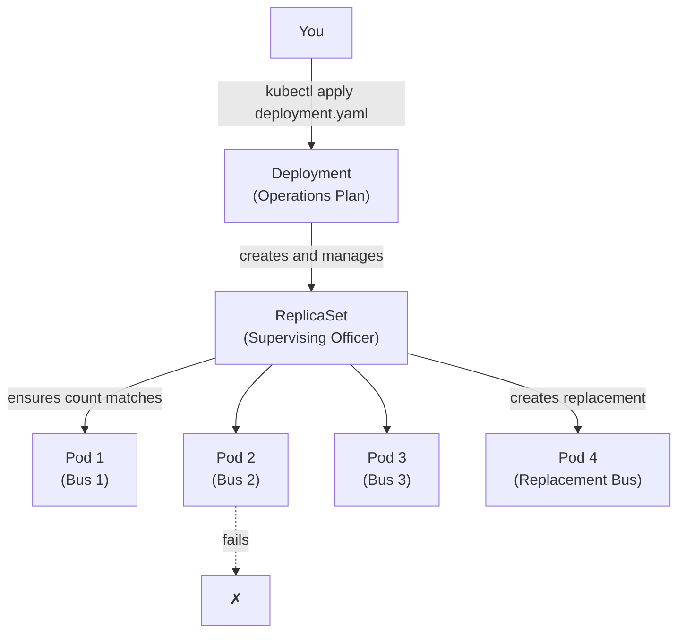

# Chapter 3: Deployments and Reliability

## The Problem This Chapter Solves

Imagine BMTC says: **"Route 500D must always have exactly 5 buses running."**

Now, what happens when one bus breaks down? Someone needs to notice and send a replacement. What if two break down simultaneously? What if demand spikes and you need 10 buses instead of 5?

This chapter explains how Kubernetes handles all of this automatically.

---

## Part 1: The Operations Plan

### Kubernetes Concept: Deployment

A **Deployment** is a document you give to Kubernetes that says: *"I want this application to always run with this many copies."*

You declare your desire. Kubernetes figures out how to make it happen.

> **BMTC Analogy:** The **Daily Operations Plan** issued by the Central Control Office. This document says things like: *"Route 500D must always have 5 buses running. Use the Volvo AC model."* The plan is the authority. Everything else exists to fulfill the plan.

```bash
# Create a deployment with 3 replicas
kubectl create deployment bus-app --image=my-app:latest --replicas=3

# View all deployments
kubectl get deployments

# Get detailed info about a deployment
kubectl describe deployment bus-app

# Scale a deployment to 5 replicas
kubectl scale deployment bus-app --replicas=5

# Delete a deployment
kubectl delete deployment bus-app
```

---

## Part 2: The Officer Counting Buses

### Kubernetes Concept: ReplicaSet

When you create a Deployment, Kubernetes automatically creates a **ReplicaSet** underneath it.

A ReplicaSet has one job: **count the running Pods and make sure the count matches what was requested**.

If you asked for 5 Pods and only 4 are running, the ReplicaSet creates one more. If 6 are running somehow, it removes one.

> **BMTC Analogy:** A **Supervising Officer** stationed at the route checkpoint. This officer counts buses on Route 500D every few minutes. If the count drops below 5, they immediately radio the depot to dispatch another. They do not care why a bus is missing. They just care about the number.

```text
Deployment     =  The Operations Plan ("Always run 5 buses on 500D")
ReplicaSet     =  The Supervising Officer (counts and corrects)
Replica        =  Each individual bus dispatched from the plan
```

```bash
# View ReplicaSets created by a deployment
kubectl get replicasets

# Scale a replica set directly (rarely done — use deployment instead)
kubectl scale replicaset bus-app-7d8f9 --replicas=3
```

---

## Part 3: Self-Healing — The Most Impressive Feature

This is where beginners usually have their first *"wow"* moment.

When a Pod crashes or a Worker Node fails, **Kubernetes automatically replaces it**. You do not need to wake up at 3 AM to manually restart your application.

> **BMTC Analogy:** Bus number KA-57-F-1234 breaks down on Route 500D. The Supervising Officer (ReplicaSet) notices the count dropped from 5 to 4. They radio the depot. Within minutes, a replacement bus is dispatched. The passenger at the bus stop never even knew one bus was missing. The system healed itself.

This is called **Self-Healing**, and it is one of Kubernetes' most important features.

```bash
# Simulate a Pod crash (in a real cluster)
kubectl delete pod bus-app-7d8f9-abc123

# Watch Kubernetes recreate it automatically
kubectl get pods --watch
```

---

## Part 4: Scaling — Growing and Shrinking

**Scaling** means changing the number of running Pods based on demand.

- **Scale up:** Run more Pods when demand increases
- **Scale down:** Run fewer Pods when demand decreases

> **BMTC Analogy:**
> - **Rajyotsava Day:** Massive crowds everywhere. The Control Office scales up Route 500D from 5 buses to 15 buses.
> - **Sunday 2 AM:** Almost no passengers. The Control Office scales down from 5 buses to 2 buses to save fuel and maintenance cost.

Scaling can be done:
- **Manually:** You tell Kubernetes the new number
- **Automatically:** Kubernetes detects load and scales by itself (covered in Chapter 8)

```bash
# Manual scaling
kubectl scale deployment bus-app --replicas=10

# Check current replica count
kubectl get deployment bus-app -o wide
```

---

## The Flow: Deployment → ReplicaSet → Pod



---

## Chapter 3 Summary

| Term | BMTC Meaning | Kubernetes Meaning |
|------|-------------|-------------------|
| Deployment | Daily Operations Plan | Desired state declaration |
| ReplicaSet | Supervising Officer | Ensures correct Pod count |
| Replica | Each dispatched bus | One copy of your application |
| Self-Healing | Auto-replacement of broken bus | K8s auto-replaces crashed Pods |
| Scaling | Add/remove buses by demand | Add/remove Pods by demand |

---

## ❓ Quick Quiz

import Quiz from '@site/src/components/Quiz';

<Quiz questions={[
  {
    id: 1,
    question: "What is the primary purpose of a Deployment?",
    options: [
      "To expose your application to the internet",
      "To declare the desired state for your application (how many copies should run)",
      "To store configuration data for your application",
      "To assign IP addresses to Pods",
    ],
    correct: 1,
    explanation: "A Deployment is like an Operations Plan — you tell Kubernetes how many copies of your app you want running, and it makes sure that happens.",
  },
  {
    id: 2,
    question: "What is the difference between a Deployment and a ReplicaSet?",
    options: [
      "They are the same thing with different names",
      "A Deployment manages ReplicaSets; a ReplicaSet ensures the correct number of Pods are running",
      "A ReplicaSet manages Deployments",
      "A Deployment runs on the Control Plane, a ReplicaSet runs on Worker Nodes",
    ],
    correct: 1,
    explanation: "A Deployment is the higher-level concept (the Operations Plan). It creates a ReplicaSet (the Supervising Officer) which actually counts and ensures the correct number of Pods.",
  },
  {
    id: 3,
    question: "What happens when a Pod managed by a Deployment crashes?",
    options: [
      "The application goes down permanently",
      "The ReplicaSet detects the count is wrong and automatically creates a replacement Pod",
      "Nothing — the administrator must manually restart it",
      "The Deployment sends an email alert to the admin",
    ],
    correct: 1,
    explanation: "The ReplicaSet continuously monitors Pod count. When a Pod crashes, it immediately creates a replacement. This is Self-Healing — passengers never even notice.",
  },
  {
    id: 4,
    question: "What does scaling mean in Kubernetes?",
    options: [
      "Increasing the size of each individual Pod",
      "Changing the number of running Pods based on demand",
      "Moving Pods to a different cluster",
      "Upgrading the Kubernetes version",
    ],
    correct: 1,
    explanation: "Scaling means adding or removing Pods as demand changes — like adding more buses during peak hours and removing them when demand drops.",
  },
]} />
