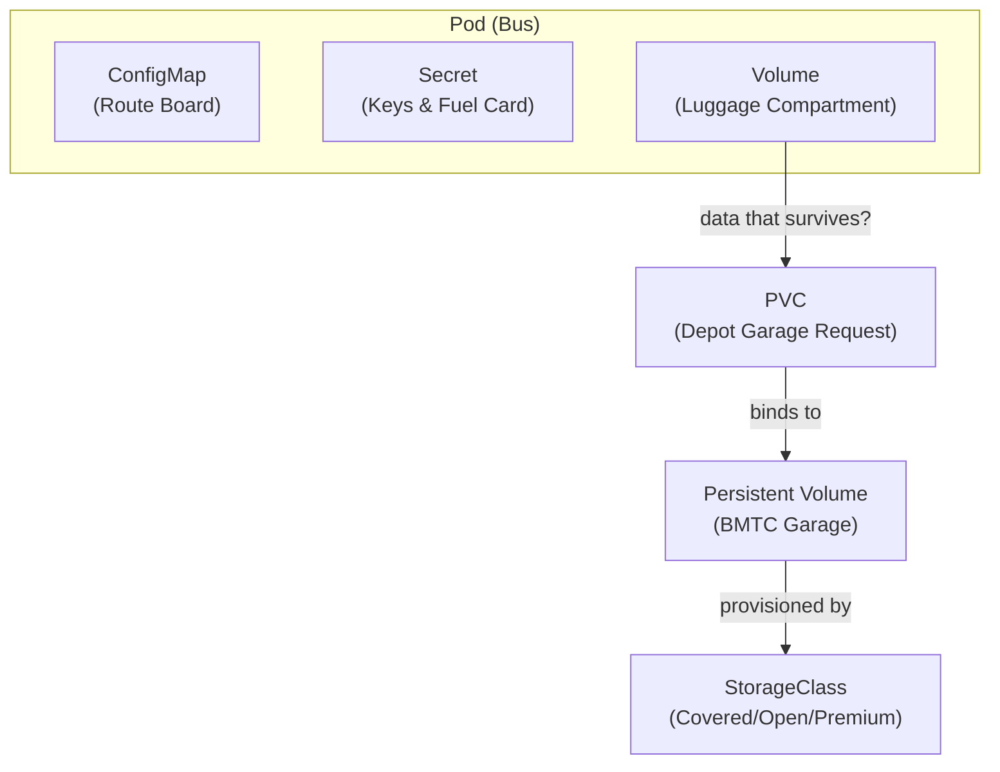

# Chapter 5: Configuration and Storage

## The Problem This Chapter Solves

Buses need more than just a driver. They need:
- A route board showing passengers where they are going
- Fuel cards and keys to operate
- Luggage compartments for passenger bags
- Garages where luggage can be stored permanently

Your application needs the same things:
- Configuration (which database to connect to, what port to use)
- Secrets (passwords, API keys)
- Storage (where to save files that must survive a restart)

---

## Part 1: The Route Board

### Kubernetes Concept: ConfigMap

A **ConfigMap** stores non-sensitive configuration that your application needs. Things like:
- Which database host to connect to
- What port to listen on
- What timezone to use
- Feature flags

You store this in a ConfigMap, not hardcoded inside your application. This way, you can change the configuration without rebuilding the application.

> **BMTC Analogy:** The **route board and timetable inside the bus**. It tells the driver which route they are on today, which stops to make, what time they should reach each stop. The driver (application) reads this board (ConfigMap) to know how to behave today. Change the route board, change the behavior — without changing the driver.

```bash
# Create a ConfigMap from literal values
kubectl create configmap bus-config --from-literal=route=500D --from-literal=stops=42

# Create a ConfigMap from a file
kubectl create configmap app-config --from-file=config.properties

# View ConfigMaps
kubectl get configmaps

# Get detailed config
kubectl describe configmap bus-config
```

---

## Part 2: The Keys and Fuel Card

### Kubernetes Concept: Secret

A **Secret** stores **sensitive** information. Passwords, database credentials, API keys, certificates.

Secrets look similar to ConfigMaps but Kubernetes treats them with extra care. They are encoded and restricted so not everyone can read them.

> **BMTC Analogy:** The **driver's keys, fuel card, and ticket machine credentials**. These are not posted on the route board for everyone to see. They are given privately to the driver. Only authorized people know these details.

```text
ConfigMap  =  Route board (visible, non-sensitive)
Secret     =  Driver's keys and fuel card (private, sensitive)
```

```bash
# Create a Secret from literal values
kubectl create secret generic db-credentials --from-literal=username=admin --from-literal=password=S3cret!

# View Secrets (names only — values are hidden)
kubectl get secrets

# View encoded Secret values
kubectl get secret db-credentials -o yaml
```

> **Important difference:**
> - ConfigMap: "Connect to database at `db.bmtc.internal`" → not sensitive
> - Secret: "Database password is `Sup3rS3cur3!`" → very sensitive

---

## Part 3: The Luggage Compartment

### Kubernetes Concept: Volume

By default, if a Pod (bus) is replaced, everything that was stored inside it **disappears**. The new Pod starts completely fresh.

Sometimes that is fine. But sometimes your application needs to **save data that survives** even if the Pod is replaced.

A **Volume** is storage attached to a Pod that can hold data.

> **BMTC Analogy:** The **luggage compartment underneath the bus**. Passengers store their bags there during the journey. The compartment is part of this bus.

---

## Part 4: The Permanent Garage

### Kubernetes Concept: Persistent Volume (PV)

A **Persistent Volume** is storage that exists **independently of any Pod**. Even if the Pod is deleted and recreated, the data in the Persistent Volume survives.

> **BMTC Analogy:** A **BMTC garage or storage facility**. The garage exists independently of any specific bus. Buses come and go. Buses get retired. But the garage stays. Luggage stored in the garage is there regardless of which bus comes next.

### Kubernetes Concept: Persistent Volume Claim (PVC)

A **Persistent Volume Claim** is how a Pod **requests access** to a Persistent Volume. The Pod says: *"I need 10GB of storage."* Kubernetes finds an appropriate Persistent Volume and connects them.

> **BMTC Analogy:** A **depot formally requesting access to storage space**. The depot submits a request: *"We need a covered garage with space for 10 buses."* The central office finds and assigns an appropriate facility.

### Kubernetes Concept: StorageClass

A **StorageClass** defines the **type** of storage that can be provisioned. Fast SSD? Slow HDD? Network-attached? Premium?

> **BMTC Analogy:** The **type of garage requested**. Covered with security = premium. Open parking = standard. Climate-controlled = special. Different options, different costs.

```text
Persistent Volume (PV)       =  The actual garage facility
Persistent Volume Claim (PVC) =  Depot's request for garage space
StorageClass                 =  Type of garage (covered, open, premium)
```

---

## Storage Architecture



---

## Chapter 5 Summary

| Term | BMTC Meaning | Kubernetes Meaning |
|------|-------------|-------------------|
| ConfigMap | Route board and timetable | Non-sensitive configuration data |
| Secret | Driver keys and fuel card | Sensitive data like passwords |
| Volume | Luggage compartment in bus | Storage attached to a Pod |
| Persistent Volume | BMTC garage | Storage independent of any Pod |
| PVC | Depot's request for garage | Pod's request for persistent storage |
| StorageClass | Type of garage | Type of storage to provision |

---

## ❓ Quick Quiz

import Quiz from '@site/src/components/Quiz';

<Quiz questions={[
  {
    id: 1,
    question: "When should you use a Secret instead of a ConfigMap?",
    options: [
      "Whenever you need to store any configuration",
      "Only when storing sensitive data like passwords, API keys, or certificates",
      "Secrets are deprecated — always use ConfigMaps",
      "ConfigMaps are for Pods, Secrets are for Nodes",
    ],
    correct: 1,
    explanation: "Use Secrets for sensitive data (keys, passwords) and ConfigMaps for non-sensitive config (route numbers, port settings). Like the driver's fuel card vs the route board.",
  },
  {
    id: 2,
    question: "What happens to data stored in a regular Volume when the Pod is deleted?",
    options: [
      "The data survives forever",
      "The data is automatically backed up to the cloud",
      "The data is deleted along with the Pod",
      "The data is moved to another Pod automatically",
    ],
    correct: 2,
    explanation: "A regular Volume is like the luggage compartment — it belongs to that specific bus. When the bus (Pod) is deleted, the compartment and its contents go away too.",
  },
  {
    id: 3,
    question: "What is the difference between a PV and a PVC?",
    options: [
      "They are the same thing with different names",
      "PV is the actual storage resource (the garage), PVC is the request for storage (the depot's request form)",
      "PV is for Pods, PVC is for Containers",
      "PV stores configuration, PVC stores secrets",
    ],
    correct: 1,
    explanation: "Persistent Volume (PV) is the actual garage facility. Persistent Volume Claim (PVC) is the depot's formal request to use that garage space. The claim gets bound to a suitable volume.",
  },
]} />
