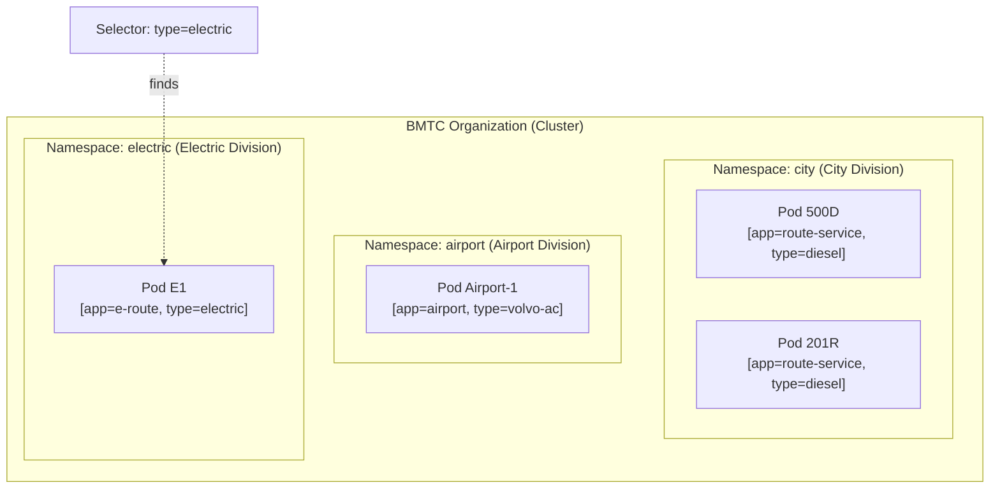

# Chapter 6: Organization

## The Problem This Chapter Solves

BMTC runs many types of services:
- City buses
- Airport buses
- Electric buses
- Volvo AC buses
- School special buses

Without organization, it becomes chaos. You cannot manage hundreds of buses without a system to group, label, and find them.

Kubernetes faces the same challenge at scale. This chapter covers how Kubernetes organizes everything.

---

## Part 1: Dividing Into Departments

### Kubernetes Concept: Namespace

A **Namespace** is a way to divide one Kubernetes cluster into multiple virtual sections. Each section is isolated. Resources in one Namespace do not interfere with another.

Think of it as different divisions within the same company. Same parent organization, but separate operations.

> **BMTC Analogy:** Different **BMTC service divisions**:
> - Airport Division (handles all airport routes)
> - Electric Bus Division (handles all electric routes)
> - City Division (handles regular city routes)
> - School Special Division (handles school buses)
>
> They all belong to BMTC. But they operate separately, have separate budgets, separate staff, and separate rules.

```text
Kubernetes Cluster     =  BMTC Organization
Namespace: production  =  City Division
Namespace: staging     =  Training Division
Namespace: monitoring  =  Operations Division
```

```bash
# List all namespaces
kubectl get namespaces

# Run a Pod in a specific namespace
kubectl run bus --image=my-app -n production

# List Pods in a specific namespace
kubectl get pods -n production

# List Pods across ALL namespaces
kubectl get pods --all-namespaces
```

---

## Part 2: Stickers on Buses

### Kubernetes Concept: Labels

**Labels** are key-value pairs attached to any Kubernetes resource. They help identify and organize resources.

A Pod might have labels like:
- `app: ticket-service`
- `type: electric`
- `route: 500D`
- `tier: premium`

> **BMTC Analogy:** **Stickers on buses**.
>
> Look at a BMTC bus. It has stickers showing:
> - Electric (green sticker)
> - AC (blue sticker)
> - Volvo (logo)
> - Express (red stripe)
> - Route number board
>
> These stickers help everyone instantly identify what kind of bus it is and what rules apply to it.

```bash
# Add labels to a Pod
kubectl label pod bus-app type=electric

# View Pods with their labels
kubectl get pods --show-labels

# Filter Pods by label
kubectl get pods -l type=electric

# Filter by multiple labels
kubectl get pods -l 'type=electric,route=500D'
```

---

## Part 3: Selecting the Right Buses

### Kubernetes Concept: Selectors

A **Selector** is a query that says: *"Find all resources that have these labels."*

Services use Selectors to find which Pods they should route traffic to. Deployments use Selectors to know which Pods they manage.

> **BMTC Analogy:** A **rule to pick specific buses**:
> - *"Send only Electric buses to this charging station route"*
> - *"Pick all Volvo AC buses for the airport service"*
> - *"Find all Route 500D buses for the peak-hour audit"*
>
> You are not naming specific buses. You are saying: *"Any bus with these labels."*

```text
Label    =  Sticker on the bus
Selector =  Rule like "find all buses with the Electric sticker"
```

```yaml
# In a Service definition — select Pods with these labels
selector:
  app: ticket-service
  tier: frontend
```

---

## Part 4: Staff Notes That Passengers Do Not See

### Kubernetes Concept: Annotations

**Annotations** are also key-value pairs, like Labels. But they are **not used for selection or identification**. They store extra information that tools or humans might need.

Things like:
- When this was last deployed
- Who owns this resource
- Link to the documentation
- Configuration used by monitoring tools

> **BMTC Analogy:** **Staff notes attached to the bus file** (not on the bus itself). The passenger never sees these. But the depot manager's records show: *"This bus was serviced on 15-Nov. Next service due 15-Feb. Inspector: Ravi. Workshop: Majestic Workshop 3."* Useful information for staff, not for passengers.

```bash
# Add an annotation
kubectl annotate pod bus-app owner=devops-team

# View annotations
kubectl describe pod bus-app
```

---

## Organization Diagram



---

## Chapter 6 Summary

| Term | BMTC Meaning | Kubernetes Meaning |
|------|-------------|-------------------|
| Namespace | BMTC service division | Virtual partition of cluster |
| Label | Sticker on bus | Key-value tag for identification |
| Selector | Rule to find buses by sticker | Query to find resources by label |
| Annotation | Staff notes in bus file | Extra metadata for tools and humans |

---

## ❓ Quick Quiz

import Quiz from '@site/src/components/Quiz';

<Quiz questions={[
  {
    id: 1,
    question: "Two teams are using the same Kubernetes cluster. How do they avoid interfering with each other?",
    options: [
      "They cannot — only one team can use a cluster",
      "Each team uses a separate Namespace",
      "Each team uses a separate Label",
      "They must use different cloud providers",
    ],
    correct: 1,
    explanation: "Namespaces are like BMTC divisions — Airport, City, Electric — they operate independently within the same organization. Each team gets their own isolated space.",
  },
  {
    id: 2,
    question: "A Service needs to find all Pods running the ticket-booking app. What does it use?",
    options: [
      "Annotations",
      "A Label Selector",
      "The Pod name",
      "The Deployment name",
    ],
    correct: 1,
    explanation: "A Selector is like a rule that says 'find all buses with the ticket-booking sticker.' The Service uses this to dynamically discover the right Pods even as they come and go.",
  },
  {
    id: 3,
    question: "What is the difference between a Label and an Annotation?",
    options: [
      "There is no difference — they are interchangeable",
      "Labels are used to identify and select resources; Annotations store extra metadata not used for selection",
      "Labels are for Pods, Annotations are for Services",
      "Annotations can only store numbers, Labels store text",
    ],
    correct: 1,
    explanation: "Labels are stickers on the bus used for identification (selectable). Annotations are staff notes in the file cabinet — useful information that passengers (selectors) never see.",
  },
]} />
