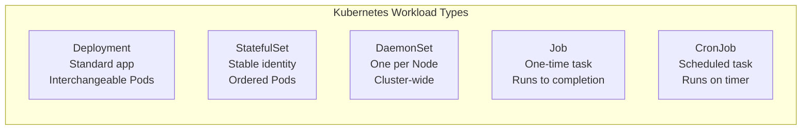

# Chapter 7: Special Workloads

## The Problem This Chapter Solves

Not all buses operate the same way.

Some routes are standard — the same bus model, running the same route, interchangeable with any other bus on that route.

But some operations are special:
- The Airport Express has reserved, numbered buses
- Road-sweeping trucks must cover every area of the city
- The census bus visits once a year
- Night maintenance runs happen on a fixed schedule

Kubernetes has different workload types to handle these different scenarios.

---

## Part 1: Reserved Identity Buses

### Kubernetes Concept: StatefulSet

A regular Deployment creates Pods that are **interchangeable**. Pod A and Pod B are identical. If Pod A dies, Pod B can do its job. Order does not matter.

But some applications need **stable identity**. They have a fixed name, fixed storage, and they come up in a fixed order. Databases are a good example. You cannot just swap Database-0 with Database-2 without consequences.

A **StatefulSet** manages Pods that need stable, persistent identity.

> **BMTC Analogy:** **Reserved, numbered airport express buses**.
>
> Airport Bus #1, Airport Bus #2, Airport Bus #3.
>
> These are not interchangeable. Bus #1 always loads at Terminal 1. Bus #2 at Terminal 2. Bus #3 at Terminal 3. Each bus has its own designated boarding area (storage). If Bus #1 breaks down, you fix Bus #1 specifically — you do not just swap it with Bus #3 and hope passengers figure it out.

```text
Deployment  =  Standard city buses (interchangeable)
StatefulSet =  Reserved airport buses with fixed identities
```

```bash
# Create a StatefulSet
kubectl apply -f statefulset.yaml

# List StatefulSets
kubectl get statefulsets

# StatefulSet Pods have stable names like "mysql-0", "mysql-1"
kubectl get pods -l app=mysql
```

---

## Part 2: One Guard at Every Depot

### Kubernetes Concept: DaemonSet

A **DaemonSet** ensures that **exactly one copy** of a Pod runs on **every Worker Node** in the cluster. Whenever a new Node joins, the DaemonSet automatically places a Pod on it.

This is typically used for cluster-wide tasks like:
- Log collection (collect logs from every machine)
- Security scanning (run on every machine)
- Monitoring agents (report metrics from every machine)

> **BMTC Analogy:** The rule that says **every BMTC depot must have exactly one security guard and one cleaning crew**.
>
> It does not matter how many depots there are. When a new depot opens, a security guard is immediately assigned. When a depot closes, the guard is removed. One guard per depot, always, automatically.

```text
New depot opens  →  DaemonSet automatically places one Pod there
Depot closes     →  DaemonSet automatically removes the Pod
```

```bash
# List DaemonSets
kubectl get daemonsets

# Common DaemonSets in clusters
kubectl get daemonsets --all-namespaces
```

---

## Part 3: The Festival Shuttle

### Kubernetes Concept: Job

A **Job** creates one or more Pods to perform a **specific task**, and when the task is complete, the Pods are done. They do not restart. They are not meant to run forever.

Use cases:
- Sending a batch of emails
- Processing a file
- Running a database migration
- Generating a report

> **BMTC Analogy:** A **one-time special shuttle service**.
>
> Bengaluru Marathon Day: BMTC deploys special shuttle buses to transport runners from the finish line to parking areas. The task starts at 7 AM, finishes by 1 PM, and the buses return to their depots. The job is done. These buses are not permanently assigned to this route.

```bash
# Run a one-time job
kubectl create job marathon-shuttle --image=bus-image -- sleep 3600

# List jobs
kubectl get jobs

# Check if a job completed
kubectl describe job marathon-shuttle
```

---

## Part 4: The 5 AM Daily Airport Shuttle

### Kubernetes Concept: CronJob

A **CronJob** is like a Job, but it runs on a **schedule**. You define when it should run using a time expression, and Kubernetes kicks it off automatically at that time.

> **BMTC Analogy:** The **scheduled daily 5 AM airport shuttle**.
>
> Every single morning at 5:00 AM, regardless of who is working or who remembers, the airport special shuttle departs. It is on the schedule. It runs automatically. No one needs to manually start it each day.

```text
Job      =  One-time festival shuttle (runs once, then done)
CronJob  =  Daily 5 AM airport shuttle (runs on schedule, repeats)
```

```bash
# Create a CronJob that runs every hour
kubectl create cronjob hourly-check --image=check-image --schedule="0 * * * *" -- sleep 60

# List CronJobs
kubectl get cronjobs

# View Jobs created by CronJob
kubectl get jobs --watch
```

---

## Chapter 7 Comparison Table



| Workload Type | When to Use | BMTC Analogy |
|--------------|------------|--------------|
| Deployment | Standard apps that run continuously | Regular city bus routes |
| StatefulSet | Apps that need fixed identity and ordered startup | Reserved numbered airport buses |
| DaemonSet | Something that must run on every Node | One security guard per depot |
| Job | One-time task with a definite end | Marathon day festival shuttle |
| CronJob | Recurring scheduled task | Daily 5 AM airport special |

---

## ❓ Quick Quiz

import Quiz from '@site/src/components/Quiz';

<Quiz questions={[
  {
    id: 1,
    question: "When would you use a StatefulSet instead of a Deployment?",
    options: [
      "When you need interchangeable, stateless Pods",
      "When your application needs stable identity, fixed names, and ordered startup",
      "StatefulSets are deprecated — always use Deployments",
      "When you want one Pod per Node",
    ],
    correct: 1,
    explanation: "Use StatefulSet when each Pod needs a stable identity, like numbered airport buses. Databases and clustered applications often need StatefulSets.",
  },
  {
    id: 2,
    question: "A DaemonSet is deployed and the cluster adds a new Node. What happens automatically?",
    options: [
      "Nothing — you must manually deploy to the new Node",
      "The DaemonSet automatically places a Pod on the new Node",
      "The DaemonSet scales down to make room",
      "The new Node is ignored until you restart the DaemonSet",
    ],
    correct: 1,
    explanation: "DaemonSet ensures one Pod per Node always. When a new Node joins, a Pod is automatically placed on it — like assigning a security guard to a newly opened depot.",
  },
  {
    id: 3,
    question: "What is the difference between a Job and a CronJob?",
    options: [
      "They are the same thing",
      "A Job runs once and completes; a CronJob runs on a recurring schedule",
      "A CronJob runs once; a Job runs on a schedule",
      "Jobs run on the Control Plane, CronJobs run on Worker Nodes",
    ],
    correct: 1,
    explanation: "Job = one-time festival shuttle (runs once, then done). CronJob = daily 5 AM airport shuttle (runs on a recurring schedule automatically).",
  },
]} />
