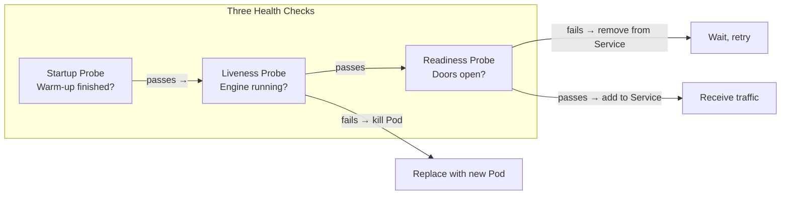

# Chapter 8: Health and Updates

## The Problem This Chapter Solves

Running buses is not enough. You need to know:
- Is this bus still working?
- Is this bus ready to take passengers yet?
- Is demand increasing? Should we add more buses?
- Can we update buses without service interruption?

---

## Part 1: Health Checks — Three Types

Kubernetes has three ways to check if a Pod is healthy. All three map beautifully to bus analogies.

### Liveness Probe — *"Is this bus engine still running?"*

A **Liveness Probe** checks whether a Pod is **alive**. If it fails, Kubernetes kills the Pod and creates a new one.

Imagine a bus engine that seized up. The bus is technically present, but it is not functioning. It will never function again on its own. The right action is to remove it and bring a replacement.

> **BMTC Analogy:** A **remote engine check**. The Control Office pings the bus: *"Is your engine running?"* If there is no response three times in a row, they declare the bus broken and dispatch a replacement.

### Readiness Probe — *"Is this bus ready to take passengers?"*

A **Readiness Probe** checks whether a Pod is **ready to receive traffic**. Even if the Pod is alive, it might not be ready yet — it might still be loading data, warming up, or connecting to a database.

If a Readiness Probe fails, Kubernetes removes that Pod from the Service's Endpoints list. No traffic is sent to it until it passes.

> **BMTC Analogy:** A **pre-departure check**. The bus has arrived at the stop. Engine is running. But the doors are not yet open. Passengers cannot board yet. The bus stop display still shows *"Next bus in 3 minutes"* because this bus is not ready yet. Once the doors open, it is added to the available list.

### Startup Probe — *"Has this bus finished warming up?"*

A **Startup Probe** is specifically for applications that take a long time to start. During startup, you do not want Liveness Probes to kill the Pod just because it has not responded yet.

> **BMTC Analogy:** **Cold morning engine warm-up**. On a cold winter morning, a bus engine needs 5 minutes to warm up before it can be checked normally. You do not apply the normal checks during warm-up. You wait for warm-up to finish, then begin regular health checks.

```text
Startup Probe   =  "Has the warm-up finished?" (one-time, at startup)
Liveness Probe  =  "Is the engine still running?" (ongoing, kills if failed)
Readiness Probe =  "Are the doors open for passengers?" (ongoing, removes from traffic if failed)
```

```yaml
# probes.yaml — health check configuration
apiVersion: v1
kind: Pod
metadata:
  name: bus-app
spec:
  containers:
    - name: app
      image: my-app:latest
      livenessProbe:
        httpGet:
          path: /health
          port: 8080
        initialDelaySeconds: 5
        periodSeconds: 10
      readinessProbe:
        httpGet:
          path: /ready
          port: 8080
        initialDelaySeconds: 3
        periodSeconds: 5
      startupProbe:
        httpGet:
          path: /startup
          port: 8080
        initialDelaySeconds: 10
        periodSeconds: 5
        failureThreshold: 30
```

---

## Part 2: Updating Without Disruption

### Rolling Update

When you deploy a new version of your application, you do not want to shut everything down and restart. That would cause downtime.

A **Rolling Update** replaces Pods **one at a time**. New version Pod comes up. Old version Pod goes down. Repeat. Service continues throughout.

> **BMTC Analogy:** Replacing the bus fleet with new Volvo models **one bus at a time**.
>
> Replace Bus 1 with new Volvo → Route still has 4 buses running.
> Replace Bus 2 with new Volvo → Route still has 4 buses running.
> Continue until all 5 are replaced.
>
> Passengers barely notice. Service was never interrupted.

```bash
# Update the image of a deployment (triggers rolling update)
kubectl set image deployment/bus-app app=my-app:v2

# Check rollout status
kubectl rollout status deployment/bus-app

# View rollout history
kubectl rollout history deployment/bus-app

# Pause a rollout
kubectl rollout pause deployment/bus-app

# Resume a rollout
kubectl rollout resume deployment/bus-app
```

### Rollback

If the new version has problems, **Rollback** brings back the previous version immediately.

> **BMTC Analogy:** The new Volvo buses have a defect — their doors get stuck. The Control Office immediately rolls back: bring the old buses back into service while the problem is fixed.

```bash
# Rollback to the previous version
kubectl rollout undo deployment/bus-app

# Rollback to a specific revision
kubectl rollout undo deployment/bus-app --to-revision=2
```

---

## Part 3: Automatic Scaling

### Horizontal Pod Autoscaler (HPA)

The **HPA** watches CPU or memory usage. When it goes high, it automatically adds more Pods. When it drops, it removes Pods.

*Horizontal* means adding more copies of the same thing (more buses, same size).

> **BMTC Analogy:** **Automatic crowd detection**.
>
> Sensors at Silk Board Bus Stop detect a growing queue. Signal reaches the Control Office automatically. System dispatches 3 additional buses. Queue clears. Demand drops. Extra buses return to depot.

```bash
# Create an HPA that scales between 2-10 Pods based on CPU
kubectl autoscale deployment bus-app --min=2 --max=10 --cpu-percent=70

# View HPA status
kubectl get hpa

# Describe HPA for details
kubectl describe hpa bus-app
```

### Vertical Pod Autoscaler (VPA)

Instead of adding more Pods, the **VPA** makes existing Pods **bigger** — giving them more CPU or memory.

*Vertical* means making the existing thing bigger (same number of buses, bigger buses).

> **BMTC Analogy:** **Upgrading from mini-bus to full-size bus**.
>
> Instead of sending 2 extra small buses, you swap the mini-bus currently running with a 60-seater. Same number of buses, more capacity.

```text
Horizontal Scaling (HPA)  =  Add more buses (same size)
Vertical Scaling (VPA)    =  Replace with bigger buses
```

---

## Health Checks Diagram



---

## Chapter 8 Summary

```text
HEALTH CHECKS:
─────────────
Startup Probe   → Bus warming up? Wait for it.
Liveness Probe  → Engine running? If not, replace bus.
Readiness Probe → Doors open? If not, do not send passengers.

UPDATES:
────────
Rolling Update  → Replace buses one at a time. No downtime.
Rollback        → New buses defective? Bring back old ones immediately.

SCALING:
────────
HPA → Queue growing? Add more buses automatically.
VPA → Need more capacity? Upgrade to bigger bus.
```

---

## ❓ Quick Quiz

import Quiz from '@site/src/components/Quiz';

<Quiz questions={[
  {
    id: 1,
    question: "A Pod's application is alive but still warming up — the database connection is not ready yet. Which probe prevents it from receiving traffic until fully ready?",
    options: [
      "Startup Probe — it checks if the app has started at all",
      "Liveness Probe — it kills and restarts unhealthy Pods",
      "Readiness Probe — it checks if the Pod is ready to receive traffic",
      "None — probes only work during initial startup",
    ],
    correct: 2,
    explanation: "A Readiness Probe checks if the Pod is ready to receive traffic — like checking if the bus doors are open for passengers. If the database is not connected yet, the probe fails and no traffic is sent.",
  },
  {
    id: 2,
    question: "A new Pod just started but is still connecting to the database. Should traffic be sent to it?",
    options: [
      "Yes — if the Pod is alive, it can handle traffic",
      "No — the Readiness Probe will fail until the database connection is ready, so no traffic is sent",
      "Yes — but the admin must manually approve it",
      "No — the Pod will crash immediately",
    ],
    correct: 1,
    explanation: "The Readiness Probe acts like a pre-departure check. The bus doors stay closed until everything is ready. Traffic is only sent when the probe passes.",
  },
  {
    id: 3,
    question: "Why does a Rolling Update replace Pods one at a time instead of all at once?",
    options: [
      "It is faster to do them one at a time",
      "To ensure zero downtime — some Pods keep serving traffic while others are updated",
      "Kubernetes cannot update more than one Pod at a time",
      "To save on cloud costs",
    ],
    correct: 1,
    explanation: "Like replacing buses one at a time on a route — the route always has enough buses running so passengers never experience interruption.",
  },
  {
    id: 4,
    question: "What is the difference between HPA and VPA?",
    options: [
      "HPA adds more Pods (horizontal), VPA makes existing Pods bigger (vertical)",
      "HPA is for production, VPA is for development",
      "HPA works on CPU, VPA works on memory only",
      "There is no difference — they are the same thing",
    ],
    correct: 0,
    explanation: "HPA = add more buses of the same size. VPA = replace existing buses with bigger ones. Both handle increased demand, but in different ways.",
  },
]} />
