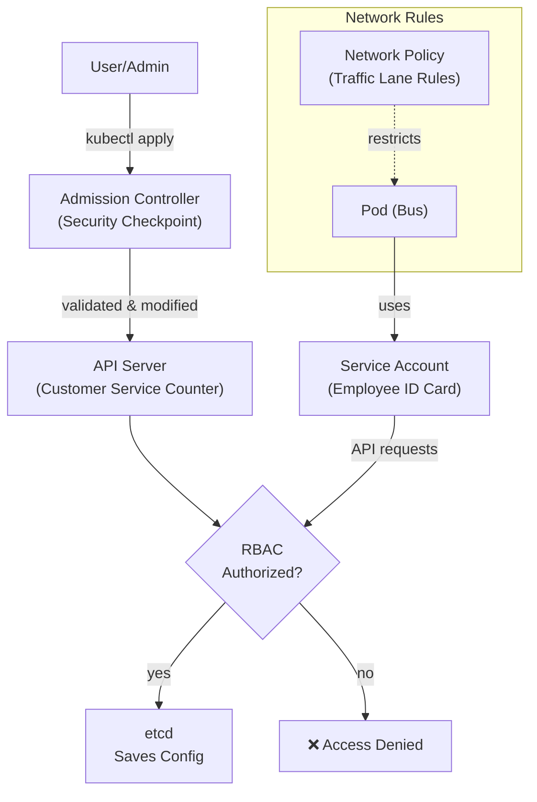

# Chapter 9: Security

## The Problem This Chapter Solves

Not everyone in BMTC has the same authority.

- A **Commissioner** can approve new routes and budgets
- A **Depot Manager** can manage their depot but not others
- A **Driver** can operate their assigned bus
- A **Conductor** can manage tickets but cannot drive

If every employee had access to everything, it would be chaotic and unsafe. The same is true in Kubernetes.

---

## Part 1: Who Can Do What

### Kubernetes Concept: RBAC (Role-Based Access Control)

**RBAC** is the system for controlling who can do what in Kubernetes.

You define:
- **Roles:** What actions are allowed (read Pods, create Deployments, delete Services)
- **RoleBindings:** Which users or services get which role

> **BMTC Analogy:** **Job titles and authority levels**.

| Role | What They Can Do |
|------|----------------|
| Commissioner | Approve routes, change budgets, access everything |
| Depot Manager | Manage their own depot only |
| Driver | Operate their assigned bus |
| Conductor | Manage tickets on their bus |

A conductor cannot suddenly drive the bus. A depot manager cannot approve a new route. Authority is defined by role.

```bash
# List RBAC roles
kubectl get roles --all-namespaces

# List cluster-wide roles
kubectl get clusterroles

# Check what you can do
kubectl auth can-i create deployments
kubectl auth can-i delete pods

# Check what another user can do
kubectl auth can-i create pods --as=jane
```

```yaml
# role.yaml — define a role
apiVersion: rbac.authorization.k8s.io/v1
kind: Role
metadata:
  namespace: default
  name: pod-reader
rules:
  - apiGroups: [""]
    resources: ["pods"]
    verbs: ["get", "list", "watch"]
```

---

## Part 2: Official Employee ID for Applications

### Kubernetes Concept: Service Account

When a Pod needs to interact with the Kubernetes API — for example, to query what other Pods are running — it needs an identity.

A **Service Account** is an identity given to a Pod so it can interact with Kubernetes systems with defined permissions.

> **BMTC Analogy:** An **official employee ID card** issued to each bus.
>
> When Bus KA-57-F-1234 needs to access the BMTC fuel system or log into the maintenance portal, it uses its official ID card. The system knows who is making the request and what they are allowed to do.

```bash
# List Service Accounts
kubectl get serviceaccounts

# Create a Service Account
kubectl create serviceaccount bus-monitor

# Assign a Service Account to a Pod
kubectl run bus-app --image=my-app --serviceaccount=bus-monitor
```

---

## Part 3: Road Rules for Network Traffic

### Kubernetes Concept: Network Policy

By default, all Pods in a Kubernetes cluster can communicate with all other Pods. This is convenient but not always safe.

A **Network Policy** defines which Pods can talk to which other Pods.

> **BMTC Analogy:** **Traffic rules controlling which buses can enter certain lanes or depots**.
>
> *"Only airport buses are allowed in Terminal entry lanes."*
> *"Fuel tankers cannot enter passenger zones."*
> *"City buses cannot enter the airport restricted area."*
>
> These rules control traffic flow based on the type of vehicle, not individual vehicles.

```yaml
# network-policy.yaml — allow only frontend to talk to backend
apiVersion: networking.k8s.io/v1
kind: NetworkPolicy
metadata:
  name: backend-policy
spec:
  podSelector:
    matchLabels:
      app: backend
  ingress:
    - from:
        - podSelector:
            matchLabels:
              app: frontend
      ports:
        - port: 8080
```

---

## Part 4: The Security Checkpoint

### Kubernetes Concept: Admission Controller

When a request comes to create or modify a resource in Kubernetes, **Admission Controllers** intercept the request and can:
- **Validate** it (is this request allowed?)
- **Modify** it (add default values)
- **Reject** it (this violates policy)

> **BMTC Analogy:** The **security checkpoint before a bus enters service**.
>
> Before any new bus is allowed on the road, it goes through:
> - Document verification (insurance, fitness certificate)
> - Safety inspection (brakes, lights, emergency exits)
> - Compliance check (meets pollution norms)
>
> If it fails any check, it does not get cleared. The Admission Controller is this checkpoint.

---

## Security Layers Diagram



---

## Chapter 9 Summary

| Term | BMTC Meaning | Kubernetes Meaning |
|------|-------------|-------------------|
| RBAC | Job titles defining authority | Permission system for Kubernetes access |
| Service Account | Bus's official employee ID | Identity for Pods to interact with Kubernetes |
| Network Policy | Traffic lane rules | Rules controlling Pod-to-Pod communication |
| Admission Controller | Pre-service safety checkpoint | Validates/modifies/rejects API requests |

---

## ❓ Quick Quiz

import Quiz from '@site/src/components/Quiz';

<Quiz questions={[
  {
    id: 1,
    question: "A developer should be able to read Pods but not delete them. What Kubernetes feature handles this?",
    options: [
      "Network Policy",
      "RBAC — you define a Role with only 'get' and 'list' permissions for pods",
      "Service Account",
      "Admission Controller",
    ],
    correct: 1,
    explanation: "RBAC defines roles with specific permissions (what actions are allowed on which resources). Like BMTC job titles — a conductor can sell tickets but cannot drive the bus.",
  },
  {
    id: 2,
    question: "A Pod needs to query the Kubernetes API. What identity does it use?",
    options: [
      "Its IP address",
      "Its Pod name",
      "Its Service Account — like an employee ID card for the Pod",
      "The user who created it",
    ],
    correct: 2,
    explanation: "A Service Account is like an employee ID card for a bus. When the bus needs to access the BMTC fuel system, it uses its ID card to authenticate and authorize the request.",
  },
  {
    id: 3,
    question: "By default, Pod A can talk to Pod B in the same cluster. How would you block this?",
    options: [
      "You cannot — all Pods can always talk to each other",
      "Use a Network Policy that restricts which Pods can communicate",
      "Delete Pod A",
      "Use a Secret to encrypt traffic",
    ],
    correct: 1,
    explanation: "Network Policies control Pod-to-Pod traffic, like lane rules saying 'only airport buses can enter the terminal lane.' Without a policy, all traffic is allowed by default.",
  },
]} />
