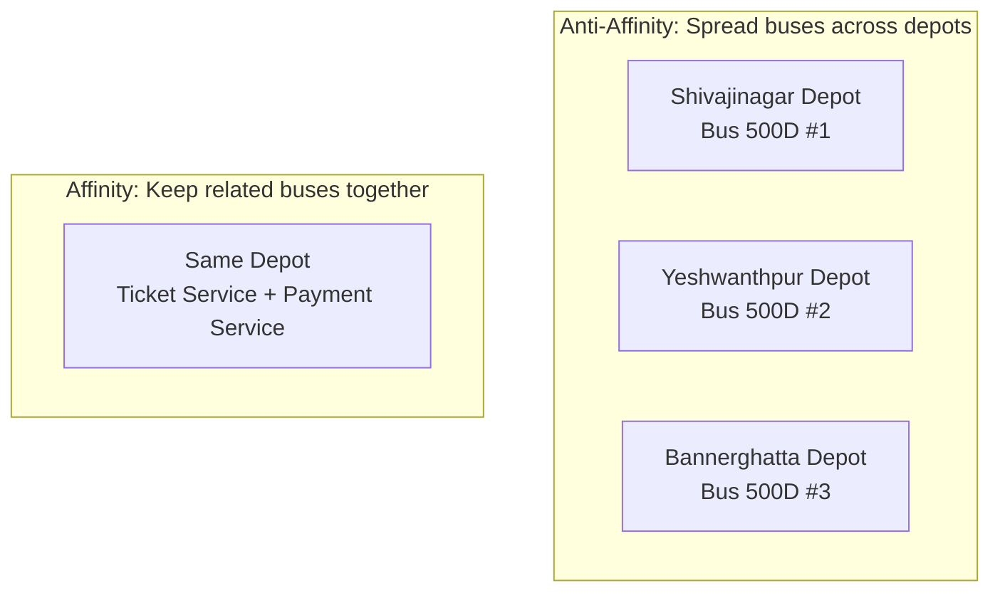

# Chapter 10: Advanced Scheduling

## The Problem This Chapter Solves

Not every bus can go to every depot. Some depots have special requirements. Some buses need special facilities. Some routes work better when buses are spread across multiple depots (so one depot failure does not kill the entire route).

Kubernetes has a rich system for controlling exactly where Pods are placed.

---

## Part 1: Resource Management

### Resource Requests

When you create a Pod, you can tell Kubernetes: *"This Pod needs at least 2 CPUs and 4GB of RAM to run properly."*

This is a **Resource Request**. Kubernetes uses it when scheduling — it will only place the Pod on a Node that has at least that much available.

> **BMTC Analogy:** **Reserved resources for a bus**.
>
> *"Bus route 500D requires: 1 dedicated bay at the depot, fuel allocation for 200km, 1 assigned driver."*
>
> The operations manager only assigns this bus to a depot that can meet these requirements.

### Resource Limits

A **Resource Limit** sets the **maximum** a Pod can use. Even if more is available, the Pod cannot exceed this limit.

> **BMTC Analogy:** **Maximum allowed fuel consumption**.
>
> A bus is allocated fuel for 200km. Even if there is more fuel available at the depot, this bus cannot take more than its limit. This ensures resources are fairly distributed.

```text
Resource Request = Minimum needed (guaranteed)
Resource Limit   = Maximum allowed (cannot exceed)
```

```yaml
# resources.yaml
apiVersion: v1
kind: Pod
metadata:
  name: bus-app
spec:
  containers:
    - name: app
      image: my-app:latest
      resources:
        requests:
          memory: "512Mi"
          cpu: "500m"
        limits:
          memory: "1Gi"
          cpu: "1000m"
```

```bash
# Check resource usage of Nodes
kubectl top nodes

# Check resource usage of Pods
kubectl top pods

# Describe a Node to see its capacity and available resources
kubectl describe node <node-name>
```

---

## Part 2: Controlling Pod Placement

### Taints and Tolerations

**Taints** are marks on a Node that say: *"Normal Pods cannot be scheduled here."*

**Tolerations** are marks on a Pod that say: *"I can handle this taint. I am allowed to go there."*

> **BMTC Analogy:**
>
> **Taint:** Yeshwanthpur Charging Depot puts up a sign: *"Only Electric Buses Allowed."* Regular diesel buses cannot enter.
>
> **Toleration:** The electric bus has the right credentials. It can enter the charging depot. The diesel bus does not have a toleration for this taint — it stays out.

```text
Taint on Node       =  "Electric buses only" sign on depot
Toleration on Pod   =  Electric bus credentials that allow entry
```

```bash
# Add a taint to a Node
kubectl taint nodes node1 bus-type=electric:NoSchedule

# View taints on a Node
kubectl describe node node1 | grep Taint

# Remove a taint
kubectl taint nodes node1 bus-type=electric:NoSchedule-
```

```yaml
# toleration.yaml — Pod that tolerates the taint
apiVersion: v1
kind: Pod
metadata:
  name: electric-bus
spec:
  tolerations:
    - key: "bus-type"
      operator: "Equal"
      value: "electric"
      effect: "NoSchedule"
  containers:
    - name: app
      image: my-app
```

### Node Selector

The simplest placement rule. You say: *"Put this Pod only on Nodes with this specific label."*

> **BMTC Analogy:** *"Assign this bus to Whitefield Depot only."* The operations manager does not consider any other depot for this bus.

```yaml
# node-selector.yaml
apiVersion: v1
kind: Pod
metadata:
  name: whitefield-bus
spec:
  nodeSelector:
    depot: whitefield
  containers:
    - name: app
      image: my-app
```

### Affinity and Anti-Affinity

**Affinity:** *"Try to place these Pods near each other (on the same Node or nearby Nodes)."*

**Anti-Affinity:** *"Try to keep these Pods away from each other."*

> **BMTC Analogy:**
>
> **Affinity:** *"Keep the ticket booking buses and the payment processing buses in the same depot so they can communicate quickly."*
>
> **Anti-Affinity:** *"Do not park all Route 500D buses in the same depot. Spread them across Shivajinagar, Yeshwanthpur, and Bannerghatta depots. If one depot has a problem, we still have buses at the other two."*

Anti-Affinity is especially important for **high availability** — spreading your application across multiple Nodes so one Node failure does not take down your entire application.



---

## Advanced Scheduling Summary

| Term | BMTC Meaning | Kubernetes Meaning |
|------|-------------|-------------------|
| Resource Request | Minimum fuel, bay, driver needed | Minimum CPU/Memory guaranteed |
| Resource Limit | Maximum fuel allowed | Maximum CPU/Memory the Pod can use |
| Taint | "Electric buses only" depot sign | Node restriction marker |
| Toleration | Electric bus credentials | Pod's permission to enter tainted Node |
| Node Selector | "Whitefield Depot only" | Place Pod on specific labeled Node |
| Affinity | Keep buses together in same depot | Place Pods near each other |
| Anti-Affinity | Spread buses across depots | Keep Pods apart for high availability |

---

## ❓ Quick Quiz

import Quiz from '@site/src/components/Quiz';

<Quiz questions={[
  {
    id: 1,
    question: "A Pod requests 512MB of memory. What does this mean?",
    options: [
      "The Pod is limited to 512MB maximum",
      "The Pod is guaranteed at least 512MB when being scheduled",
      "The Pod will crash if it uses more than 512MB",
      "The request is for storage, not memory",
    ],
    correct: 1,
    explanation: "A Resource Request is the minimum guaranteed. Like saying 'this bus needs at least 1 bay at the depot' — the scheduler only places it where that resource is available.",
  },
  {
    id: 2,
    question: "A Node has a taint 'gpu=true:NoSchedule'. What happens to Pods without a matching toleration?",
    options: [
      "They are scheduled on that Node more slowly",
      "They cannot be scheduled on that Node at all",
      "They are evicted from the Node",
      "Nothing — taints have no effect",
    ],
    correct: 1,
    explanation: "Taints are like 'Electric buses only' signs on a depot. Pods without the matching toleration (electric bus credentials) cannot enter that depot at all.",
  },
  {
    id: 3,
    question: "Why would you use Anti-Affinity for your application Pods?",
    options: [
      "To save money by running fewer Nodes",
      "To spread Pods across different Nodes for high availability",
      "To make Pods run faster",
      "To reduce network traffic",
    ],
    correct: 1,
    explanation: "Anti-Affinity spreads your Pods across different Nodes (depots). If one depot has a fire (Node failure), you still have buses running from other depots. Your application stays up.",
  },
  {
    id: 4,
    question: "What is the difference between a Resource Request and a Resource Limit?",
    options: [
      "Request is minimum guaranteed, Limit is maximum allowed",
      "Request is for CPU, Limit is for memory",
      "They mean the same thing",
      "Request is for Pods, Limit is for Nodes",
    ],
    correct: 0,
    explanation: "Request = minimum needed for scheduling (like reserving 1 bay and fuel for 200km). Limit = maximum the Pod can use (like a fuel cap — cannot take more even if available).",
  },
]} />
