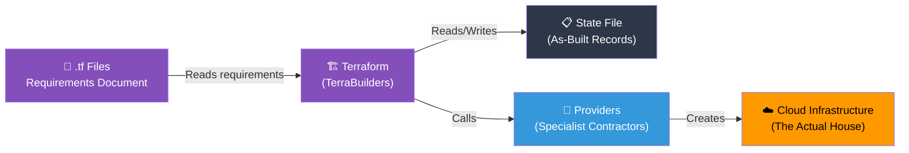

## 📖 Story First

Ramesh and Priya Sharma have been living in a rented apartment in Koramangala, Bengaluru for eight years. They have saved enough and bought a plot in Whitefield. They have a dream — a proper home for their family.

But they have zero experience with construction. They do not know:
- How to hire the right contractors
- In what order things should be built
- How to make sure their vision becomes reality
- What to do when things change midway

So they decide to hire a professional construction management firm.

The firm is called **TerraBuilders**.

TerraBuilders does not build things with their own hands. Instead, they:
- Read the Sharma family's requirements
- Coordinate with the right specialists
- Build everything in the right order
- Keep a perfect record of what was built
- Can modify or tear down anything they built

The Sharma family's relationship with TerraBuilders is exactly your relationship with Terraform.

---

## 🎯 Learning Objectives

By the end of this chapter, you will be able to:

- ✅ Explain Infrastructure as Code (IaC) in simple terms
- ✅ Understand declarative vs imperative approaches
- ✅ Recognize a `.tf` file and HCL syntax
- ✅ Know why we write infrastructure down instead of clicking buttons

---

## 🏫 House Analogy

```
┌─────────────────────────────────────────────────────────┐
│       HOUSE  ←→  TERRAFORM MAPPING                     │
├──────────────────────────┬──────────────────────────────┤
│    HOUSE CONCEPT         │      TERRAFORM CONCEPT        │
├──────────────────────────┼──────────────────────────────┤
│ Written requirements     │ Infrastructure as Code (IaC)  │
│ document                 │                               │
│ "I want a 3BHK house"    │ Declarative — describe the    │
│ (not step-by-step steps) │ destination, not the journey  │
│ Requirements form with   │ HCL (HashiCorp Configuration  │
│ standard sections        │ Language)                     │
│ Multiple pages for       │ Multiple .tf files read       │
│ different topics         │ together                      │
│ TerraBuilders builds     │ Terraform creates cloud       │
│ the exact house          │ resources from .tf files      │
└──────────────────────────┴──────────────────────────────┘
```

---

## ☁️ The Actual Concept

### Infrastructure as Code (IaC)

**Infrastructure as Code** is the practice of managing cloud infrastructure through machine-readable definition files, rather than manual processes or clicking buttons in a web console.

Instead of logging into AWS and clicking "Create Instance," you write a file that describes the instance you want, and let Terraform create it for you.

```hcl
# This is a Terraform file
# It describes WHAT you want, not HOW to build it

resource "aws_instance" "web_server" {
  ami           = "ami-0abcdef1234567890"
  instance_type = "t2.micro"

  tags = {
    Name = "Sharma-Web-Server"
  }
}
```

### Declarative vs Imperative

This is the most important concept to understand.

| Approach | What You Write | Example |
|----------|---------------|---------|
| **Imperative** | Step-by-step instructions | "Dig foundation, then pour concrete, then lay bricks..." |
| **Declarative** | Desired end state | "I want a 3BHK house with a compound wall" |

Terraform is **declarative**. You say **what** you want. Terraform figures out **how** to get there.

> Ramesh did not write *"first dig 3 feet, then pour concrete, then wait 7 days, then lay bricks."* He wrote *"I want a 3BHK house with compound wall and iron gate."* That is Infrastructure as Code.

### `.tf` Files

Terraform reads files with the `.tf` extension. These are your requirements documents.

```
sharma-house/
├── main.tf          ← Main requirements
├── network.tf       ← Water and electricity requirements
├── variables.tf     ← Customizable options
└── outputs.tf       ← What to tell us after building
```

### HCL — The Language

The language you write Terraform files in is called **HCL** (HashiCorp Configuration Language). It is designed to be readable by humans and processable by machines.

```hcl
# HCL is meant to be easy to read

resource "aws_vpc" "main_network" {
  cidr_block = "10.0.0.0/16"

  tags = {
    Name    = "Sharma-Network"
    Project = "Dream-House"
  }
}
```

---

## 🗺️ How Terraform Works



---

## 🧪 Hands-On — Your First Terraform File

```
STEP 1: Create a project directory
         mkdir sharma-house
         cd sharma-house

STEP 2: Create main.tf with your first resource
         (Just write the file for now — we will run it later)

         main.tf:
         resource "aws_instance" "web_server" {
           ami           = "ami-0abcdef1234567890"
           instance_type = "t2.micro"
           tags = {
             Name = "Sharma-Web-Server"
           }
         }

STEP 3: Explore the structure
         You have written your first Infrastructure as Code!
         This file describes what you want.
         In the next chapters, you will learn how to
         initialize, plan, and apply this configuration.

✅ You have written your first IaC file!
   No cloud resources created yet — but the requirements
   document is ready for TerraBuilders to act on.
```

---

## 💡 Pro Tips

> 💡 **Tip 1:** Keep your `.tf` files organized by function — one file for networking, one for compute, one for variables. Terraform reads all `.tf` files in a directory together, so you can split them however you like.

> 💡 **Tip 2:** Always use descriptive names for your resources (`aws_instance.web_server` is better than `aws_instance.foo`). These names are used in error messages and plan output — good names make debugging easier.

> 💡 **Tip 3:** IaC is not just about automation — it is about version control, code review, collaboration, and reproducibility. Treat your `.tf` files like application code: commit them to Git, review changes in pull requests, and tag releases.

---

## ❓ Quick Quiz

import Quiz from '@site/src/components/Quiz';

<Quiz questions={[
    {
        "id": 1,
        "question": "What is Infrastructure as Code?",
        "options": [
            "Writing infrastructure requirements in a file instead of clicking buttons",
            "Building physical data centers",
            "Writing code that runs on servers",
            "A programming language"
        ],
        "correct": 0,
        "explanation": ""
    },
    {
        "id": 2,
        "question": "Terraform is declarative. What does this mean?",
        "options": [
            "You write step-by-step instructions for Terraform to follow",
            "You describe the desired end state and Terraform figures out how to get there",
            "You must declare all variables before using them",
            "You declare which cloud provider to use"
        ],
        "correct": 1,
        "explanation": "Declarative means you describe WHAT you want, not HOW to build it. Terraform figures out the steps."
    },
    {
        "id": 3,
        "question": "What file extension does Terraform use?",
        "options": [
            ".json",
            ".yaml",
            ".tf",
            ".hcl"
        ],
        "correct": 2,
        "explanation": "Terraform uses .tf files. The language is HCL (HashiCorp Configuration Language), but the file extension is .tf."
    }
]} />

---

## 🎤 Interview Questions

**Q: What is Infrastructure as Code and why is it important?**

> Infrastructure as Code (IaC) is the practice of managing and provisioning cloud infrastructure through machine-readable definition files rather than manual processes or interactive configuration tools. It is important because it makes infrastructure reproducible, version-controlled, auditable, and automatable. You can review changes before applying them, roll back to previous versions, and ensure consistency across environments.

**Q: What is the difference between declarative and imperative approaches? Give an example.**

> An imperative approach describes step-by-step instructions: "Create a VPC, then create a subnet in that VPC, then create a route table and associate it with the subnet." A declarative approach describes the desired end state: "I want a VPC with a subnet that has internet access." Terraform is declarative — you write the end state, and Terraform figures out the order of operations automatically by analyzing dependencies.

---

## 📝 Chapter Summary

```
┌─────────────────────────────────────────────────────────┐
│                 CHAPTER 1 SUMMARY                        │
├─────────────────────────────────────────────────────────┤
│                                                         │
│  ✅ IaC = Managing infrastructure through code files    │
│  ✅ Declarative = Describe WHAT, not HOW                │
│  ✅ .tf files = Your infrastructure requirements        │
│  ✅ HCL = HashiCorp Configuration Language              │
│  ✅ Terraform reads .tf files and creates resources      │
│  ✅ Multiple .tf files in one directory = one config    │
│  ✅ Treat .tf files like application code (Git, review) │
│                                                         │
└─────────────────────────────────────────────────────────┘
```
---
---
