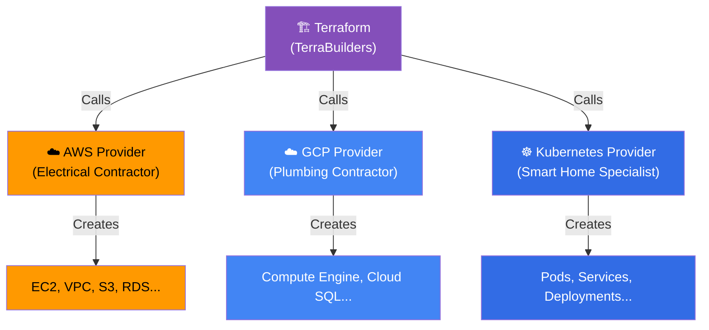

## 📖 Story First

TerraBuilders has agreed to manage the Sharma house project. But TerraBuilders does not do all the actual work themselves. They coordinate with **specialist contractors**:

- **Electricians** for wiring and electrical connections
- **Plumbers** for water lines and drainage
- **Civil contractors** for structure and walls
- **Interior designers** for finishing work

Each contractor type has their own skills, tools, and way of doing things. TerraBuilders knows how to talk to all of them.

In Terraform, these specialist contractors are called **Providers**.

---

## 🎯 Learning Objectives

By the end of this chapter, you will be able to:

- ✅ Explain what a Terraform Provider is
- ✅ Configure providers in your Terraform code
- ✅ Understand how Terraform downloads and uses providers
- ✅ Work with multiple providers in one configuration

---

## 🏫 House Analogy

```
┌─────────────────────────────────────────────────────────┐
│      HOUSE  ←→  PROVIDERS MAPPING                      │
├──────────────────────────┬──────────────────────────────┤
│    HOUSE CONCEPT         │      TERRAFORM CONCEPT        │
├──────────────────────────┼──────────────────────────────┤
│ TerraBuilders            │ Terraform                     │
│ (project manager)        │                               │
│ Specialist contractors   │ Providers                     │
│ (electricians, plumbers) │ (AWS, GCP, Azure, etc.)      │
│ Kaveri Electricals       │ hashicorp/aws provider        │
│ (v5.0 of their methods)  │ (version 5.0)                │
│ Contractor's service     │ Provider configuration        │
│ region/zone              │ (region, credentials)         │
│ Multiple contractors     │ Multiple providers            │
│ working simultaneously   │ in one project                │
└──────────────────────────┴──────────────────────────────┘
```

---

## ☁️ The Actual Concept

A **Provider** is a plugin that Terraform uses to interact with a specific cloud platform or service. Providers know the API of their platform and translate Terraform's configuration into API calls.

### Common Providers

| Provider | Use Case | Like Hiring |
|----------|----------|-------------|
| `hashicorp/aws` | Amazon Web Services | Electrical contractor |
| `hashicorp/google` | Google Cloud Platform | Plumbing contractor |
| `hashicorp/azurerm` | Microsoft Azure | Civil contractor |
| `cloudflare/cloudflare` | Cloudflare DNS | Internet specialist |
| `hashicorp/kubernetes` | Kubernetes clusters | Smart home automation |

### Configuring a Provider

```hcl
# Tell Terraform which providers you need
terraform {
  required_providers {
    aws = {
      source  = "hashicorp/aws"    # Which contractor firm
      version = "~> 5.0"           # Version of their methods
    }
  }
}

# Configure the provider
provider "aws" {
  region = "ap-south-1"            # Bengaluru region
}
```

### Multiple Providers

Just like the Sharma house needs both electricians AND plumbers simultaneously, real infrastructure might need multiple providers:

```hcl
terraform {
  required_providers {
    aws = {
      source  = "hashicorp/aws"
      version = "~> 5.0"
    }
    cloudflare = {
      source  = "cloudflare/cloudflare"
      version = "~> 4.0"
    }
  }
}

# AWS handles the servers
provider "aws" {
  region = "ap-south-1"
}

# Cloudflare handles DNS
provider "cloudflare" {
  api_token = var.cloudflare_token
}
```

---

## 🗺️ Provider Architecture



---

## 🧪 Hands-On — Configure an AWS Provider

```
STEP 1: In your sharma-house directory, update main.tf:

         terraform {
           required_providers {
             aws = {
               source  = "hashicorp/aws"
               version = "~> 5.0"
             }
           }
         }

         provider "aws" {
           region = "ap-south-1"
         }

         resource "aws_instance" "web_server" {
           ami           = "ami-0abcdef1234567890"
           instance_type = "t2.micro"
           tags = {
             Name = "Sharma-Web-Server"
           }
         }

STEP 2: Note: We will run terraform init in the next chapter.
         For now, just observe the structure:
         - terraform block: Which providers to use
         - provider block: How to configure each provider
         - resource block: What to create

✅ You have configured your first provider!
   TerraBuilders has now hired the AWS contractor
   and set up their working parameters.
```

---

## 💡 Pro Tips

> 💡 **Tip 1:** Always pin provider versions (`~> 5.0` means "5.x but not 6.0"). Without version constraints, a future major version might break your configuration with incompatible changes.

> 💡 **Tip 2:** The `source` format is `namespace/type`. `hashicorp/aws` means the official HashiCorp-maintained AWS provider. Community providers use their own namespace, like `cloudflare/cloudflare`.

> 💡 **Tip 3:** You do not need to manually download providers. Running `terraform init` handles that automatically. Terraform downloads them from the Terraform Registry at registry.terraform.io.

---

## ❓ Quick Quiz

import Quiz from '@site/src/components/Quiz';

<Quiz questions={[
    {
        "id": 1,
        "question": "What is a Terraform Provider?",
        "options": [
            "A person who uses Terraform",
            "A plugin that allows Terraform to interact with a cloud platform",
            "A type of Terraform resource",
            "A configuration file"
        ],
        "correct": 1,
        "explanation": ""
    },
    {
        "id": 2,
        "question": "In the house analogy, what does a Provider represent?",
        "options": [
            "The house blueprint",
            "A specialist contractor (electrician, plumber)",
            "The foundation of the house",
            "The Sharma family"
        ],
        "correct": 1,
        "explanation": "Providers are like specialist contractors. Terraform (TerraBuilders) coordinates them."
    },
    {
        "id": 3,
        "question": "Why should you pin provider versions?",
        "options": [
            "It is not necessary — Terraform handles this automatically",
            "To avoid breaking changes from future major versions",
            "To make the code run faster",
            "To reduce the file size"
        ],
        "correct": 1,
        "explanation": "Version pinning (e.g., ~> 5.0) prevents accidental upgrades to incompatible major versions."
    }
]} />

---

## 🎤 Interview Questions

**Q: What is a Terraform Provider and how do you configure one?**

> A Terraform Provider is a plugin that enables Terraform to communicate with a specific cloud platform or service. You configure it by declaring the provider source and version in a `required_providers` block, and then configuring it with settings like region or API credentials. Providers are downloaded from the Terraform Registry when you run `terraform init`.

**Q: Can you use multiple providers in a single Terraform configuration?**

> Yes. You can declare multiple providers in the `required_providers` block and configure each one separately. This allows you to manage infrastructure across different cloud platforms (AWS + GCP) or different services (AWS + Cloudflare) in a single Terraform project.

---

## 📝 Chapter Summary

```
┌─────────────────────────────────────────────────────────┐
│                 CHAPTER 2 SUMMARY                        │
├─────────────────────────────────────────────────────────┤
│                                                         │
│  ✅ Provider = Plugin that talks to a cloud platform    │
│  ✅ Like specialist contractors (electricians, plumbers) │
│  ✅ Declared in required_providers block                │
│  ✅ Configured in provider block                        │
│  ✅ Source format: namespace/type (e.g., hashicorp/aws) │
│  ✅ Pin versions to avoid breaking changes              │
│  ✅ Multiple providers can work together                │
│  ✅ Downloaded automatically by terraform init          │
│                                                         │
└─────────────────────────────────────────────────────────┘
```
---
---
