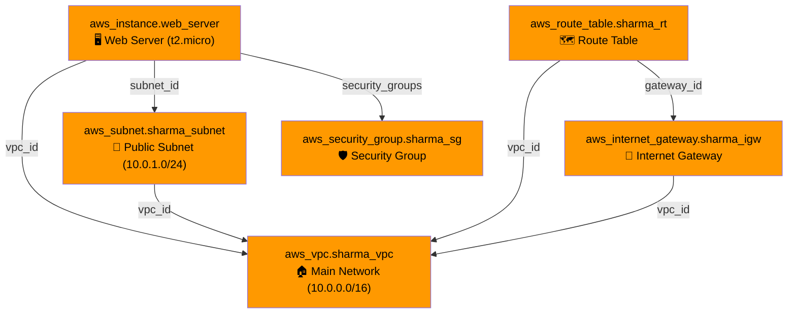

## 📖 Story First

After TerraBuilders (Terraform) hires the specialist contractors (providers), they start reading the Sharma family's requirements document to understand **what exactly needs to be built**.

Each requirement in the document describes a specific thing:
- "A 1400 sq ft house" → This is a **resource**: a house
- "A 6-foot compound wall" → This is a **resource**: a wall
- "An iron gate" → This is a **resource**: a gate
- "Water connection to kitchen and bathrooms" → This is a **resource**: plumbing

Each of these is an individual, identifiable piece of infrastructure. In Terraform, these are called **Resources**.

---

## 🎯 Learning Objectives

By the end of this chapter, you will be able to:

- ✅ Write resource blocks in HCL
- ✅ Understand resource types and local names
- ✅ Use arguments, attributes, and meta-arguments
- ✅ Reference one resource from another

---

## 🏫 House Analogy

```
┌─────────────────────────────────────────────────────────┐
│       HOUSE  ←→  RESOURCES MAPPING                     │
├──────────────────────────┬──────────────────────────────┤
│    HOUSE CONCEPT         │      TERRAFORM CONCEPT        │
├──────────────────────────┼──────────────────────────────┤
│ A house                  │ resource "aws_instance"      │
│ A compound wall          │ resource "aws_security_group"│
│ Water pipes              │ resource "aws_subnet"        │
│ Front door               │ resource "aws_internet_gateway"│
│ Specification doc        │ Resource block arguments     │
│ "The kitchen counter     │ Attributes: outputs of one   │
│ must be 3 meters"        │ resource used in another     │
│ "Put the meter box       │ depends_on - ordering        │
│ before the main line"    │                              │
└──────────────────────────┴──────────────────────────────┘
```

---

## ☁️ The Actual Concept

A **Resource** is the most important element in Terraform. Each resource block describes one piece of infrastructure — a virtual machine, a VPC, a DNS record, a database, anything.

### Resource Block Syntax

```hcl
resource "aws_instance" "web_server" {
  ami           = "ami-0abcdef1234567890"
  instance_type = "t2.micro"

  tags = {
    Name = "Sharma-Web-Server"
  }
}
```

| Part | Meaning | Analogy |
|------|---------|---------|
| `resource` | Keyword: "this is a thing to build" | The word "Requirement" |
| `"aws_instance"` | Resource type: what kind of thing | "House", "Wall", "Gate" |
| `"web_server"` | Local name: what we call it | "The family home" |
| `{ ... }` | Arguments: specific details | "1400 sq ft", "6 feet tall" |

### Arguments vs Attributes

**Arguments** are what you **set** (inputs):

```hcl
resource "aws_instance" "web" {
  ami           = "ami-0abcdef1234567890"   # ← Argument
  instance_type = "t2.micro"                # ← Argument
}
```

**Attributes** are what you **get** (outputs). They are not set by you but become available after creation:

```hcl
# After creating the instance, Terraform exposes attributes like:
resource "aws_instance" "web" {
  ami           = "ami-0abcdef1234567890"
  instance_type = "t2.micro"
}
# web.id          → "i-0a1b2c3d4e5f67890"
# web.public_ip  → "13.235.45.67"
# web.private_ip → "10.0.1.45"
```

### Referencing One Resource from Another

Just as the kitchen layout depends on where the water pipe comes in, one resource often needs information from another:

```hcl
resource "aws_vpc" "sharma_vpc" {
  cidr_block = "10.0.0.0/16"
}

resource "aws_subnet" "sharma_subnet" {
  vpc_id     = aws_vpc.sharma_vpc.id    # ← Reference to VPC
  cidr_block = "10.0.1.0/24"
}
```

The syntax is: `resource_type.local_name.attribute_name`

### Resource Dependencies

Terraform automatically figures out dependencies by tracking references. When it sees `aws_vpc.sharma_vpc.id` in the subnet block, it knows: *"Build the VPC first, then the subnet."*

Sometimes you need to specify a dependency that Terraform cannot detect automatically:

```hcl
resource "aws_s3_bucket" "logs" {
  bucket = "sharma-build-logs"
}

resource "aws_instance" "app" {
  ami           = "ami-0abcdef1234567890"
  instance_type = "t2.micro"

  depends_on = [aws_s3_bucket.logs]   # ← Explicit dependency
}
```

---

## 🗺️ Resources in a Typical Setup



---

## 🧪 Hands-On — Build a Complete Resource Stack

```
Create main.tf in sharma-house/:

         resource "aws_vpc" "sharma_vpc" {
           cidr_block = "10.0.0.0/16"
           tags = { Name = "Sharma-VPC" }
         }

         resource "aws_subnet" "sharma_subnet" {
           vpc_id     = aws_vpc.sharma_vpc.id
           cidr_block = "10.0.1.0/24"
           tags = { Name = "Sharma-Subnet" }
         }

         resource "aws_internet_gateway" "sharma_igw" {
           vpc_id = aws_vpc.sharma_vpc.id
           tags = { Name = "Sharma-IGW" }
         }

         resource "aws_instance" "web_server" {
           ami           = "ami-0abcdef1234567890"
           instance_type = "t2.micro"
           subnet_id     = aws_subnet.sharma_subnet.id
           tags = { Name = "Sharma-Web-Server" }
         }

✅ You have defined 4 Terraform resources:
   - 1 VPC (main network)
   - 1 Subnet (a segment of that network)
   - 1 Internet Gateway (front door to the internet)
   - 1 EC2 Instance (a server)

   Each references something from another.
   Terraform will figure out the build order.
```

---

## 💡 Pro Tips

> 💡 **Tip 1:** Resource types follow the pattern `provider_type`. The provider is the first word before the underscore, and the type is after. `aws_instance` = provider `aws`, type `instance`. `aws_vpc` = provider `aws`, type `vpc`.

> 💡 **Tip 2:** The local name (`"web_server"`) is for you — Terraform uses it to track the resource internally. Choose names that make sense in error messages: `aws_instance.jenkins_master` is clearer than `aws_instance.server_1`.

> 💡 **Tip 3:** Use `depends_on` sparingly. Terraform's automatic dependency detection handles 99% of cases. Explicit `depends_on` is usually needed only for side-effect dependencies that Terraform cannot infer from configuration alone.

---

## ❓ Quick Quiz

import Quiz from '@site/src/components/Quiz';

<Quiz questions={[
    {
        "id": 1,
        "question": "What does a resource block represent in Terraform?",
        "options": [
            "A file that contains Terraform configuration",
            "One piece of infrastructure (a VM, VPC, etc.)",
            "A variable that stores configuration values",
            "The Terraform provider plugin"
        ],
        "correct": 1,
        "explanation": ""
    },
    {
        "id": 2,
        "question": "In the resource block resource \"aws_instance\" \"web\" { ... }, what is \"web\"?",
        "options": [
            "The resource type",
            "The provider name",
            "The local name used within your Terraform code",
            "The AWS instance ID"
        ],
        "correct": 2,
        "explanation": "\"web\" is the local name — a human-friendly identifier used inside your configuration to refer to this resource."
    },
    {
        "id": 3,
        "question": "How do you reference an attribute of a resource?",
        "options": [
            "resource_type.local_name.attribute_name",
            "local_name.resource_type.attribute_name",
            "attribute_name.resource_type.local_name",
            "resource_type.attribute_name.local_name"
        ],
        "correct": 0,
        "explanation": "The syntax is resource_type.local_name.attribute_name, e.g., aws_instance.web.id"
    },
    {
        "id": 4,
        "question": "When should you use depends_on?",
        "options": [
            "For every resource to ensure correct ordering",
            "Only when Terraform cannot automatically detect the dependency",
            "When you want to create resources in parallel",
            "It is deprecated and should not be used"
        ],
        "correct": 1,
        "explanation": "Use depends_on only when Terraform cannot automatically detect a dependency."
    }
]} />

---

## 🎤 Interview Questions

**Q: What is the difference between arguments and attributes in a Terraform resource?**

> Arguments are values you set in the resource block to configure it (like `ami`, `instance_type`). Attributes are values that Terraform assigns to the resource after creation (like `id`, `public_ip`, `arn`). You can reference attributes of one resource in another resource's arguments to create dependencies.

**Q: How does Terraform handle resource dependencies?**

> Terraform automatically builds a dependency graph by scanning resource references. If resource B references `resource_a.some_attribute`, Terraform knows A must be created before B. This is called implicit dependency. For cases where the dependency is not captured by references (like a logging bucket that is used by an application), you can use the explicit `depends_on` meta-argument.

---

## 📝 Chapter Summary

```
┌─────────────────────────────────────────────────────────┐
│               CHAPTER 3 SUMMARY                         │
├─────────────────────────────────────────────────────────┤
│                                                         │
│  ✅ Resource = one piece of infrastructure               │
│  ✅ Syntax: resource \"type\" \"name\" { args }          │
│  ✅ Arguments = what you configure (inputs)              │
│  ✅ Attributes = what Terraform returns (outputs)        │
│  ✅ Reference: type.name.attribute                       │
│  ✅ Terraform auto-detects dependencies                  │
│  ✅ depends_on = manual override when needed             │
│  ✅ Multiple resources form a dependency graph           │
│                                                         │
└─────────────────────────────────────────────────────────┘
```
---
---
