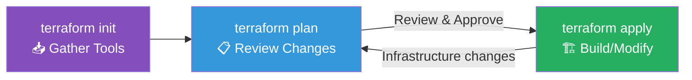
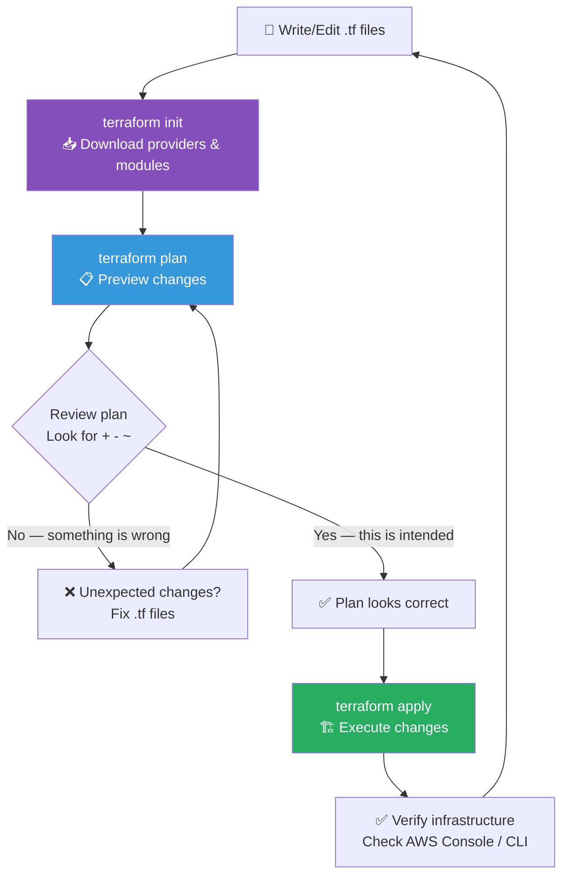

## 📖 Story First

TerraBuilders has received the Sharma family's requirements document. Now they need to actually start the project. The process follows three distinct phases:

**Phase 1: Gather Tools** — TerraBuilders calls all the contractor firms and says *"Get ready for the Sharma project. Bring your tools and latest price lists."* This is like gathering all the provider plugins and modules.

**Phase 2: Review the Plan** — TerraBuilders reviews the requirements and says *"Here is what we will build, here is what it will cost, and here is the order. Let us make sure everyone agrees before we start."* This is like reviewing a detailed blueprint.

**Phase 3: Start Building** — Everyone agrees. TerraBuilders says *"Go ahead — build it exactly as planned."* This is the actual construction.

These three phases map to Terraform's core commands: **init**, **plan**, and **apply**.

---

## 🎯 Learning Objectives

By the end of this chapter, you will be able to:

- ✅ Run `terraform init` to set up your project
- ✅ Run `terraform plan` to preview changes
- ✅ Run `terraform apply` to create infrastructure
- ✅ Understand the core Terraform workflow
- ✅ Read plan output and understand proposed changes

---

## 🏫 House Analogy

```
┌─────────────────────────────────────────────────────────┐
│    HOUSE  ←→  TERRAFORM WORKFLOW MAPPING               │
├──────────────────────────┬──────────────────────────────┤
│    HOUSE CONCEPT         │      TERRAFORM CONCEPT        │
├──────────────────────────┼──────────────────────────────┤
│ Gather tools & materials │ terraform init               │
│ Review blueprints        │ terraform plan               │
│ Get approval from family │ (human reviews plan output)  │
│ Start construction       │ terraform apply              │
│ "Materials ready" status │ .terraform/ directory created │
│ Blueprint with changes   │ Plan output                  │
│ marked in red            │ (+ create, - destroy, ~ mod) │
│ "Construction complete"  │ Apply complete message       │
│ As-built drawings        │ State file (next chapter)    │
└──────────────────────────┴──────────────────────────────┘
```

---

## ☁️ The Actual Concept

### The Core Workflow

Every Terraform project follows this cycle:



### Step 1: `terraform init`

This command:
- Downloads the provider plugins you declared (like hiring contractors)
- Sets up the backend (where Terraform stores state)
- Downloads any modules you reference
- Creates the `.terraform/` directory (working area)

```bash
$ terraform init

Initializing the backend...
Initializing provider plugins...
- Finding hashicorp/aws versions matching "~> 5.0"...
- Installing hashicorp/aws v5.1.0...
- Installed hashicorp/aws v5.1.0 (signed by HashiCorp)

Terraform has been successfully initialized!
```

You must run `init`:
- When you first clone or create a project
- When you add a new provider
- When you change provider versions

### Step 2: `terraform plan`

This command:
- Reads all your `.tf` files
- Compares them with the current state (what exists now)
- Shows you what will be created, changed, or destroyed
- Does **not** make any changes

```bash
$ terraform plan

Terraform will perform the following actions:

  # aws_vpc.sharma_vpc will be created
  + resource "aws_vpc" "sharma_vpc" {
      + cidr_block       = "10.0.0.0/16"
      + id               = (known after apply)
      + tags             = {
          + "Name" = "Sharma-VPC"
        }
    }

  # aws_subnet.sharma_subnet will be created
  + resource "aws_subnet" "sharma_subnet" {
      + vpc_id           = (known after apply)
      + cidr_block       = "10.0.1.0/24"
      + id               = (known after apply)
    }

Plan: 2 to add, 0 to change, 0 to destroy.
```

**Reading plan symbols:**

| Symbol | Meaning |
|--------|---------|
| `+` | Resource will be **created** |
| `-` | Resource will be **destroyed** |
| `-/+` | Resource will be **replaced** (destroy then create) |
| `~` | Resource will be **updated** in-place |
| `(known after apply)` | Value depends on creation of another resource |

### Step 3: `terraform apply`

This command:
- Asks for confirmation (unless you use `-auto-approve`)
- Creates/modifies/destroys resources
- Updates the state file
- Shows the results

```bash
$ terraform apply

Terraform will perform the following actions:
  # ... (same plan shown) ...

Do you want to perform these actions?
  Terraform will perform the actions described above.
  Only 'yes' will be accepted to approve.

  Enter a value: yes    ← You type "yes"

aws_vpc.sharma_vpc: Creating...
aws_vpc.sharma_vpc: Creation complete after 2s [id=vpc-0a1b2c3d4e5f]
aws_subnet.sharma_subnet: Creating...
aws_subnet.sharma_subnet: Creation complete after 1s [id=subnet-0f1e2d3c4b5a]

Apply complete! Resources: 2 added, 0 changed, 0 destroyed.
```

### Quick Apply (for learning/demo)

```bash
# Skip the manual approval prompt
terraform apply -auto-approve
```

> ⚠️ In production, always review the plan before applying. The `-auto-approve` flag is for automation scripts and CI/CD pipelines where the plan has already been reviewed.

---

## 🗺️ The Full Workflow



---

## 🧪 Hands-On — Run Your First Terraform Workflow

```
Run these commands in your sharma-house/ directory:

STEP 1: Initialize
        $ terraform init

        Expected output:
        - "Terraform has been successfully initialized!"
        - A .terraform/ directory is created

STEP 2: Plan
        $ terraform plan

        Expected output:
        - Shows all resources that will be created (+)
        - Shows "Plan: 4 to add, 0 to change, 0 to destroy."

STEP 3: Apply (create infrastructure)
        $ terraform apply

        Type "yes" when prompted.

        Expected output:
        - Each resource prints Creating... then Creation complete
        - "Apply complete! Resources: 4 added, 0 changed, 0 destroyed."

STEP 4: View your resources
        Log in to AWS Console → VPC → Your VPCs
        Look for "Sharma-VPC"

✅ You have completed your first Terraform workflow!
   Requirements → Init → Plan → Apply
   TerraBuilders built everything exactly as requested.
```

---

## 💡 Pro Tips

> 💡 **Tip 1:** Run `terraform plan` before every `apply`, even for small changes. It is free (no resources are created), and it catches mistakes before they cost money or time.

> 💡 **Tip 2:** You can save a plan to a file with `terraform plan -out=plan.tfplan` and apply it later with `terraform apply plan.tfplan`. This is useful in CI/CD pipelines where you want to review the plan before applying.

> 💡 **Tip 3:** Use `terraform fmt` to automatically format your `.tf` files to the canonical style. It is like `gofmt` for Go or `prettier` for JavaScript — consistency matters.

> 💡 **Tip 4:** Use `terraform validate` to check your configuration for syntax errors without connecting to providers. It runs much faster than `plan` and catches basic mistakes.

---

## ❓ Quick Quiz

import Quiz from '@site/src/components/Quiz';

<Quiz questions={[
    {
        "id": 1,
        "question": "What does terraform init do?",
        "options": [
            "Creates all the infrastructure",
            "Downloads provider plugins and sets up the backend",
            "Shows a preview of changes",
            "Destroys all resources"
        ],
        "correct": 1,
        "explanation": ""
    },
    {
        "id": 2,
        "question": "What does the + symbol mean in plan output?",
        "options": [
            "Resource will be destroyed",
            "Resource will be updated in-place",
            "Resource will be created",
            "Resource will be replaced"
        ],
        "correct": 2,
        "explanation": "+ means a new resource will be created."
    },
    {
        "id": 3,
        "question": "What is the correct order of Terraform commands for a new project?",
        "options": [
            "apply → plan → init",
            "init → plan → apply",
            "plan → init → apply",
            "init → apply → plan"
        ],
        "correct": 1,
        "explanation": "Always init first, then plan, then apply."
    },
    {
        "id": 4,
        "question": "What is the purpose of terraform plan?",
        "options": [
            "To create infrastructure resources",
            "To preview what changes Terraform will make without actually doing them",
            "To delete all saved state",
            "To format your configuration files"
        ],
        "correct": 1,
        "explanation": "Plan shows you what will happen before you apply."
    }
]} />

---

## 🎤 Interview Questions

**Q: Explain the Terraform core workflow. What are the three main commands?**

> The Terraform core workflow consists of three commands: (1) `terraform init` — initializes the project by downloading providers and modules, and setting up the backend; (2) `terraform plan` — compares the configuration with current state and shows what will be created, modified, or destroyed; (3) `terraform apply` — executes the changes described in the plan. This forms an iterative cycle: write code → init → plan → review → apply → verify → repeat.

**Q: What is the difference between `terraform plan` and `terraform apply`?**

> `terraform plan` is a read-only operation that shows the execution plan — it tells you what resources will be created, changed, or destroyed without making any actual changes. `terraform apply` executes that plan, making real API calls to create, modify, or destroy infrastructure. Always review the plan before applying to avoid unintended changes.

---

## 📝 Chapter Summary

```
┌─────────────────────────────────────────────────────────┐
│             CHAPTER 4 SUMMARY                           │
├─────────────────────────────────────────────────────────┤
│                                                         │
│  ✅ Core workflow: init → plan → apply                  │
│  ✅ init = Download providers, set up backend           │
│  ✅ plan = Preview changes (no actual modifications)    │
│  ✅ apply = Execute changes (creates/modifies/destroys) │
│  ✅ + = create, - = destroy, ~ = update, -/+ = replace │
│  ✅ (known after apply) = depends on other resource     │
│  ✅ fmt = format code, validate = check syntax          │
│  ✅ Always review plan before applying                   │
│                                                         │
└─────────────────────────────────────────────────────────┘
```
---
---
