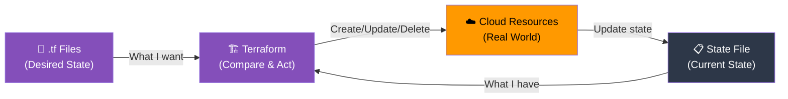

## 📖 Story First

TerraBuilders has finished building the Sharma family's house foundation. The family has approved the work. Now TerraBuilders asks a critical question:

*"What if six months later, someone else builds a wall in your backyard without telling us? Or what if next month you want to add a room — how will we know exactly what was built?"*

The answer is **as-built drawings**.

When a contractor completes a project, they maintain a detailed record of exactly what was built, where, and how — including things that were modified during construction. These as-built drawings are the single source of truth for the property.

In Terraform, this is called the **State File**.

---

## 🎯 Learning Objectives

By the end of this chapter, you will be able to:

- ✅ Explain what Terraform state is and why it matters
- ✅ Understand local vs remote state
- ✅ Know what happens when state is missing or corrupted
- ✅ Use `terraform show` and `terraform state` commands

---

## 🏫 House Analogy

```
┌─────────────────────────────────────────────────────────┐
│       HOUSE  ←→  STATE MAPPING                         │
├──────────────────────────┬──────────────────────────────┤
│    HOUSE CONCEPT         │      TERRAFORM CONCEPT        │
├──────────────────────────┼──────────────────────────────┤
│ As-built drawings        │ State file                    │
│ "Foundation is at depth  │ Resource attributes stored    │
│ 2.5m with reinforcement  │ in state                     │
│ grade Fe500"             │                               │
│ "The compound wall was   │ State tracks actual          │
│ moved 0.5m inward"       │ configuration vs actual       │
│                           │                               │
│ What if you lose the     │ Missing state = Terraform     │
│ drawings?                │ cannot manage resources       │
│ Neighbor built a wall    │ Drift — manual changes        │
│ without telling you      │ outside Terraform             │
│ One master binder for    │ Single source of truth        │
│ the entire project       │                               │
└──────────────────────────┴──────────────────────────────┘
```

---

## ☁️ The Actual Concept

**State** is Terraform's record of what infrastructure it manages. It maps your configuration to real-world resources.

### What State Contains

```json
{
  "version": 4,
  "terraform_version": "1.5.0",
  "resources": [
    {
      "module": "root",
      "mode": "managed",
      "type": "aws_vpc",
      "name": "sharma_vpc",
      "provider": "provider[\"registry.terraform.io/hashicorp/aws\"]",
      "instances": [
        {
          "schema_version": 1,
          "attributes": {
            "id": "vpc-0a1b2c3d4e5f",
            "cidr_block": "10.0.0.0/16",
            "arn": "arn:aws:ec2:ap-south-1:123456789012:vpc/vpc-0a1b2c3d4e5f",
            "tags": {
              "Name": "Sharma-VPC"
            }
          }
        }
      ]
    }
  ]
}
```

### Local vs Remote State

| Aspect | Local State | Remote State |
|--------|-------------|--------------|
| Where stored | `terraform.tfstate` in your directory | S3, Terraform Cloud, etc. |
| Team collaboration | ❌ Only one person at a time | ✅ Multiple team members |
| Safety | Risk of accidental deletion | Built-in backup and versioning |
| Locking | ❌ No locking | ✅ Prevents concurrent modifications |

### Local State (for learning)

```bash
# After terraform apply, you will see:
$ ls -la
drwxr-xr-x  .terraform/
-rw-r--r--  main.tf
-rw-r--r--  terraform.tfstate      ← The state file
-rw-r--r--  terraform.tfstate.backup  ← Previous version
```

### Remote State (for production)

```hcl
# Configure remote state in your terraform block
terraform {
  backend "s3" {
    bucket         = "sharma-terraform-state"
    key            = "prod/terraform.tfstate"
    region         = "ap-south-1"
    dynamodb_table = "terraform-state-lock"
    encrypt        = true
  }
}
```

---

## 🗺️ How State Works



### Why State is Essential

**Without state, Terraform cannot:**
- Know what resources it already created
- Detect when someone manually changed a resource (drift)
- Safely delete resources when you remove them from configuration
- Map a configuration block to a specific real-world resource

### State Drift

Imagine someone logs into the AWS console and changes the Sharma VPC's CIDR block. Terraform does not know about this change. This is called **drift**.

```bash
# Terraform plan will detect the drift:
$ terraform plan
# aws_vpc.sharma_vpc will be updated in-place
  ~ resource "aws_vpc" "sharma_vpc" {
        id           = "vpc-0a1b2c3d4e5f"
      ~ cidr_block   = "10.0.5.0/16" -> "10.0.0.0/16"  ← Drift detected
    }

Plan: 0 to add, 1 to change, 0 to destroy.
```

Terraform will restore it to match your configuration.

---

## 🧪 Hands-On — Explore State

```
STEP 1: After running terraform apply, view the state:
        $ terraform show

        This shows all resources in the state with their attributes.

STEP 2: List resources in state:
        $ terraform state list
        aws_vpc.sharma_vpc
        aws_subnet.sharma_subnet
        aws_internet_gateway.sharma_igw
        aws_instance.web_server

STEP 3: View a specific resource in state:
        $ terraform state show aws_vpc.sharma_vpc
        # aws_vpc.sharma_vpc:
        resource "aws_vpc" "sharma_vpc" {
            arn         = "arn:aws:ec2:ap-south-1:..."
            cidr_block  = "10.0.0.0/16"
            id          = "vpc-0a1b2c3d4e5f"
            ...
        }

STEP 4: See the raw state file:
        $ cat terraform.tfstate
        (This is a JSON file — do not edit it manually!)

✅ You understand Terraform state!
   The as-built drawings are complete and accurate.
```

---

## 💡 Pro Tips

> 💡 **Tip 1:** Never edit `terraform.tfstate` by hand. If state gets corrupted or inconsistent, use `terraform state rm` and `terraform import` instead of JSON surgery.

> 💡 **Tip 2:** Always use remote state for team projects. Store state in S3 (or Terraform Cloud) with DynamoDB locking to prevent concurrent modifications.

> 💡 **Tip 3:** Keep state files secure — they contain resource IDs, ARNs, and potentially sensitive configuration data. Use bucket encryption and access policies.

> 💡 **Tip 4:** The `.backup` file is your safety net. If state gets corrupted, the previous version is saved alongside it.

---

## ❓ Quick Quiz

import Quiz from '@site/src/components/Quiz';

<Quiz questions={[
    {
        "id": 1,
        "question": "What is Terraform state?",
        "options": [
            "The .tf configuration files",
            "A record of what infrastructure Terraform manages, mapping config to real resources",
            "The current status of the terraform apply command",
            "A backup of your .tf files"
        ],
        "correct": 1,
        "explanation": ""
    },
    {
        "id": 2,
        "question": "What happens to the state file after terraform apply?",
        "options": [
            "It is deleted",
            "It is updated to reflect the current state of the infrastructure",
            "It is sent to HashiCorp for analysis",
            "It remains unchanged"
        ],
        "correct": 1,
        "explanation": "Terraform updates the state file after every apply to match the real-world infrastructure."
    },
    {
        "id": 3,
        "question": "What is state drift?",
        "options": [
            "When the state file is accidentally deleted",
            "When someone manually changes infrastructure outside of Terraform",
            "When you run terraform plan without terraform init",
            "When you have too many resources in your configuration"
        ],
        "correct": 1,
        "explanation": "Drift is when real-world infrastructure differs from what Terraform's state (and config) expects."
    },
    {
        "id": 4,
        "question": "Why should you use remote state in production?",
        "options": [
            "Remote state is faster",
            "To enable team collaboration, locking, and backup",
            "Because local state is deprecated",
            "Remote state costs less money"
        ],
        "correct": 1,
        "explanation": "Remote state enables team collaboration, prevents concurrent modifications (locking), and provides backup."
    }
]} />

---

## 🎤 Interview Questions

**Q: What is Terraform state and why is it important?**

> Terraform state is a JSON file that maps the resources defined in your configuration to real-world infrastructure resources. It stores resource IDs, attributes, and metadata. State is essential because it allows Terraform to know what it already manages, detect drift (manual changes), plan incremental changes, and safely delete resources.

**Q: What is the difference between local and remote state? When would you use each?**

> Local state stores `terraform.tfstate` in your working directory — suitable for learning and single-developer projects. Remote state stores it in a shared backend like S3, Azure Storage, or Terraform Cloud. Remote state is essential for team collaboration because it supports state locking (preventing concurrent modifications), versioning (rollback capability), and shared access. Use local state for learning/experimentation; use remote state for any real project involving multiple people or environments (dev/staging/prod).

**Q: How does Terraform detect and handle state drift?**

> When you run `terraform plan`, Terraform compares the current state (what it knows about) against real-world infrastructure by making API calls to the cloud provider. If a resource was modified outside Terraform, the plan shows the change and proposes to restore it to match your configuration. Terraform does not automatically fix drift — you must run `terraform apply` to reconcile it.

---

## 📝 Chapter Summary

```
┌─────────────────────────────────────────────────────────┐
│              CHAPTER 5 SUMMARY                          │
├─────────────────────────────────────────────────────────┤
│                                                         │
│  ✅ State = As-built drawings for your infrastructure   │
│  ✅ Maps configuration to real cloud resources          │
│  ✅ Stored in terraform.tfstate (local) or S3 (remote)  │
│  ✅ Essential for Terraform to know what it manages     │
│  ✅ Drift = manual changes outside Terraform            │
│  ✅ Remote state = locking + team collaboration         │
│  ✅ Never edit state file manually                      │
│  ✅ Use terraform show / state list / state show        │
│                                                         │
└─────────────────────────────────────────────────────────┘
```
---
---
