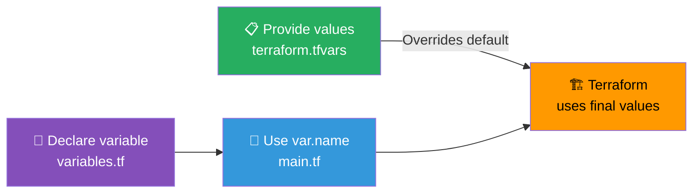

## 📖 Story First

TerraBuilders is now working with the Sharma family on their requirements. The document says:

> *"Build a 3BHK house with a compound wall."*

But Ramesh's cousin, Sameer, who lives in Mysore, also wants to build a house. Sameer's requirements are:

> *"Build a 2BHK house with a garden, no compound wall."*

The two houses are very similar — same design, same materials, same process. The only differences are a few specific options.

If TerraBuilders creates a completely separate requirements document for Sameer, they are duplicating most of the work. Instead, they create a **template** with **blank spaces** — the customer fills in the blanks, and the rest stays the same.

In Terraform, these blank spaces are called **Variables**.

---

## 🎯 Learning Objectives

By the end of this chapter, you will be able to:

- ✅ Declare input variables in Terraform
- ✅ Use variable values in your resources
- ✅ Set variable values from multiple sources
- ✅ Understand variable types and defaults

---

## 🏫 House Analogy

```
┌─────────────────────────────────────────────────────────┐
│     HOUSE  ←→  VARIABLES MAPPING                       │
├──────────────────────────┬──────────────────────────────┤
│    HOUSE CONCEPT         │      TERRAFORM CONCEPT        │
├──────────────────────────┼──────────────────────────────┤
│ "Customer Name: ______"  │ variable "customer_name"     │
│ (blank in the template)  │                              │
│ "Number of bedrooms:     │ variable "bedroom_count"     │
│ [ ] 2BHK  [ ] 3BHK       │ type = number, default = 3   │
│ Pick one:                │                              │
│ "Standard layout for     │ terraform.tfvars — the       │
│ Ramesh: 3BHK"            │ filled-in values             │
│ "Standard layout for     │ Same template, different     │
│ Sameer: 2BHK"            │ variable values              │
│ "Use iron gate"          │ Variable in main config      │
│ (decided at build time)  │                              │
│ "We always build         │ Default value                │
│ brick walls unless       │                              │
│ specified otherwise"      │                              │
└──────────────────────────┴──────────────────────────────┘
```

---

## ☁️ The Actual Concept

Variables make your Terraform configuration reusable, flexible, and environment-agnostic.

### Declaring a Variable

```hcl
# variables.tf — Define the blanks in your template
variable "region" {
  description = "AWS region to deploy resources"
  type        = string
  default     = "ap-south-1"
}

variable "instance_type" {
  description = "EC2 instance type"
  type        = string
  default     = "t2.micro"
}

variable "environment" {
  description = "Environment name (dev/staging/prod)"
  type        = string
  # No default — user MUST provide this
}
```

### Using Variables

Reference them with `var.variable_name`:

```hcl
# main.tf — Use the variables
provider "aws" {
  region = var.region
}

resource "aws_instance" "web" {
  ami           = "ami-0abcdef1234567890"
  instance_type = var.instance_type

  tags = {
    Name        = "Sharma-Web-${var.environment}"
    Environment = var.environment
  }
}
```

### Setting Variable Values

There are multiple ways to set variable values (each overrides the previous):

| Priority | Method | Example |
|----------|--------|---------|
| 1 (lowest) | Default value | `default = "t2.micro"` |
| 2 | `terraform.tfvars` | `instance_type = "t3.small"` |
| 3 | `*.auto.tfvars` | `prod.auto.tfvars` |
| 4 | Environment variable | `export TF_VAR_instance_type=t3.small` |
| 5 (highest) | `-var` flag | `terraform apply -var="instance_type=t3.small"` |

```hcl
# terraform.tfvars — Your filled-in values
region         = "us-west-2"
instance_type  = "t3.small"
environment    = "production"
```

### Variable Types

```hcl
# Simple types
variable "name"        { type = string }
variable "count"       { type = number }
variable "enabled"     { type = bool }
variable "endpoints"   { type = list(string) }
variable "tags"        { type = map(string) }
variable "config"      { type = object({
                           key   = string
                           value = string
                         }) }
```

---

## 🗺️ Variables Flow



---

## 🧪 Hands-On — Add Variables to Your Project

```
STEP 1: Create variables.tf in your project:

         variable "region" {
           description = "AWS region"
           type        = string
           default     = "ap-south-1"
         }

         variable "vpc_cidr" {
           description = "CIDR block for the VPC"
           type        = string
           default     = "10.0.0.0/16"
         }

         variable "subnet_cidr" {
           description = "CIDR block for the subnet"
           type        = string
           default     = "10.0.1.0/24"
         }

         variable "instance_type" {
           description = "EC2 instance type"
           type        = string
           default     = "t2.micro"
         }

         variable "environment" {
           description = "Environment name"
           type        = string
         }

STEP 2: Update main.tf to use variables:

         provider "aws" {
           region = var.region
         }

         resource "aws_vpc" "sharma_vpc" {
           cidr_block = var.vpc_cidr
           tags = {
             Name        = "Sharma-VPC-${var.environment}"
             Environment = var.environment
           }
         }

         resource "aws_subnet" "sharma_subnet" {
           vpc_id     = aws_vpc.sharma_vpc.id
           cidr_block = var.subnet_cidr
           tags = {
             Name        = "Sharma-Subnet-${var.environment}"
             Environment = var.environment
           }
         }

         resource "aws_instance" "web_server" {
           ami           = "ami-0abcdef1234567890"
           instance_type = var.instance_type
           subnet_id     = aws_subnet.sharma_subnet.id
           tags = {
             Name        = "Sharma-Web-${var.environment}"
             Environment = var.environment
           }
         }

STEP 3: Create terraform.tfvars to provide values:

         environment    = "dev"
         region         = "ap-south-1"
         vpc_cidr       = "10.0.0.0/16"
         subnet_cidr    = "10.0.1.0/24"
         instance_type  = "t2.micro"

STEP 4: Run plan to see the variable values applied:
         $ terraform plan

✅ Your configuration is now reusable!
   For Sameer's house in Mysore, just create another .tfvars
   file with different values.
```

---

## 💡 Pro Tips

> 💡 **Tip 1:** Always provide a `description` for every variable. Your future self (and your teammates) will thank you when they need to understand what each variable does.

> 💡 **Tip 2:** Use `sensitive = true` for variables containing secrets (passwords, API keys). Terraform will mask these values in plan output and logs.

> 💡 **Tip 3:** Use `validation` blocks to enforce constraints:
> ```hcl
> variable "instance_type" {
>   type    = string
>   validation {
>     condition     = contains(["t2.micro", "t3.small", "t3.medium"], var.instance_type)
>     error_message = "Instance type must be one of: t2.micro, t3.small, t3.medium."
>   }
> }
> ```

> 💡 **Tip 4:** Use `.tfvars` files for environment-specific values (dev.tfvars, prod.tfvars) and pass them with `-var-file`:
> ```bash
> terraform plan -var-file="dev.tfvars"
> terraform apply -var-file="prod.tfvars"
> ```

---

## ❓ Quick Quiz

import Quiz from '@site/src/components/Quiz';

<Quiz questions={[
    {
        "id": 1,
        "question": "How do you reference a variable named 'region' in a resource block?",
        "options": [
            "${region}",
            "var.region",
            "variable.region",
            "region"
        ],
        "correct": 1,
        "explanation": ""
    },
    {
        "id": 2,
        "question": "What is the priority order for setting variable values?",
        "options": [
            "terraform.tfvars > -var flag > default > environment variable",
            "default > terraform.tfvars > environment variable > -var flag",
            "-var flag > environment variable > terraform.tfvars > default",
            "default > terraform.tfvars > -var flag > environment variable"
        ],
        "correct": 2,
        "explanation": "The -var flag has highest priority, then environment variables, then tfvars files, then defaults."
    },
    {
        "id": 3,
        "question": "What happens if a variable has no default value and you do not provide one?",
        "options": [
            "Terraform uses an empty string",
            "Terraform prompts you for the value",
            "Terraform fails with an error",
            "Terraform uses the value from the last run"
        ],
        "correct": 2,
        "explanation": "Terraform requires all variables without defaults to be provided. It will error if they are missing."
    },
    {
        "id": 4,
        "question": "Which file is used to provide variable values in a key=value format?",
        "options": [
            "variables.tf",
            "outputs.tf",
            "terraform.tfvars",
            "main.tf"
        ],
        "correct": 2,
        "explanation": "terraform.tfvars contains the actual values for your variables."
    }
]} />

---

## 🎤 Interview Questions

**Q: How do you make a Terraform configuration reusable across environments?**

> Use input variables to parameterize environment-specific values (region, instance size, CIDR blocks). Create separate `.tfvars` files for each environment (dev.tfvars, staging.tfvars, prod.tfvars) and apply them with `terraform apply -var-file=env.tfvars`. The main configuration stays the same — only the values change.

**Q: What is the order of precedence for variable values in Terraform?**

> From lowest to highest: (1) default value in the variable declaration, (2) `terraform.tfvars` file, (3) `*.auto.tfvars` files (alphabetically), (4) environment variable `TF_VAR_<name>`, (5) `-var` or `-var-file` command line flag. Higher priority overrides lower.

---

## 📝 Chapter Summary

```
┌─────────────────────────────────────────────────────────┐
│             CHAPTER 6 SUMMARY                           │
├─────────────────────────────────────────────────────────┤
│                                                         │
│  ✅ Variables = blanks in a template                     │
│  ✅ Declared with variable block in variables.tf        │
│  ✅ Referenced as var.variable_name                     │
│  ✅ Types: string, number, bool, list, map, object      │
│  ✅ Values from: default, tfvars, env, -var             │
│  ✅ .tfvars files = environment-specific values         │
│  ✅ Makes config reusable across environments            │
│  ✅ Use validation blocks for constraints               │
│                                                         │
└─────────────────────────────────────────────────────────┘
```
---
---
