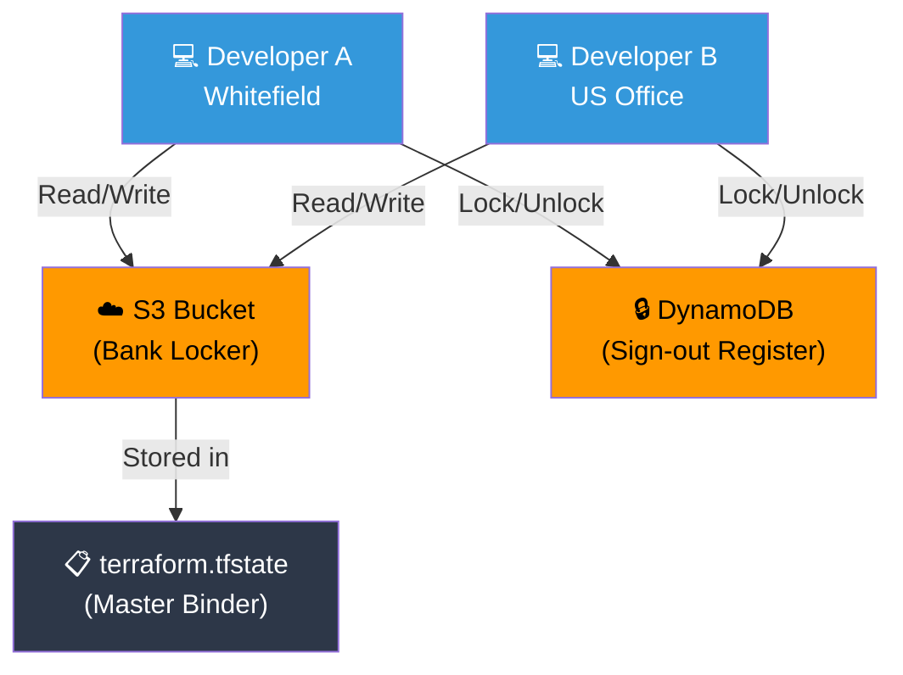

## 📖 Story First

The Sharma family's state file (the binder) sits in the site office at Whitefield.

One day, the TerraBuilders junior engineer accidentally spills tea on the binder. Half the records are destroyed.

Also, what if the Sharma family's son Arun (who lives in the US) wants to review the project? He cannot access the binder sitting in a Whitefield site office.

The as-built record binder has problems:
- It could be lost or damaged
- Only people physically at the site can access it
- If two people update it simultaneously, conflicts arise
- There is no history of changes

The solution: Store the master binder in a **secure, central location** — like a bank locker.

---

## 🎯 Learning Objectives

By the end of this chapter, you will be able to:

- ✅ Explain the purpose of a Terraform backend
- ✅ Configure remote state storage in S3
- ✅ Understand state locking with DynamoDB
- ✅ Know the benefits of remote state over local state

---

## 🏫 House Analogy

```
┌─────────────────────────────────────────────────────────┐
│     HOUSE  ←→  REMOTE BACKEND MAPPING                  │
├──────────────────────────┬──────────────────────────────┤
│    HOUSE CONCEPT         │      TERRAFORM CONCEPT        │
├──────────────────────────┼──────────────────────────────┤
│ Binder in site office   │ Local state file              │
│ (lost to tea spill)     │ (lost to disk failure)        │
│ Bank locker             │ S3 bucket backend             │
│ Sign-out register       │ DynamoDB state locking        │
│ Only one person checks  │ Only one terraform apply      │
│ out the binder at once  │ at a time                     │
│ Branch bank locker      │ Terraform Cloud /             │
│ (nationally accessible) │ Enterprise backends           │
└──────────────────────────┴──────────────────────────────┘
```

---

## ☁️ The Actual Concept

A **Backend** tells Terraform where to store the state file. The default is your local machine. A better option is a remote location.

### Configuring S3 Backend

```hcl
# Store state file in AWS S3 bucket (bank locker)
terraform {
  backend "s3" {
    bucket         = "sharma-terraform-state"    # The bank locker
    key            = "house/terraform.tfstate"   # Section of the locker
    region         = "ap-south-1"
    encrypt        = true                        # Binder is locked
    dynamodb_table = "terraform-state-lock"      # Only one person at a time
  }
}
```

### State Locking

When one person is running `terraform apply`, the state file is **locked**:

```
Engineer A runs terraform apply → State file LOCKED
Engineer B tries to run terraform apply →
ERROR: "state file is locked by Engineer A. Try again later."
```

### Common Backends

| Backend | Analogy | Use Case |
|---------|---------|----------|
| Local | Binder in site office | Dev only |
| S3 + DynamoDB | Bank locker + sign-out register | AWS projects |
| GCS | Google Drive with access controls | GCP projects |
| Terraform Cloud | Professional records management | Enterprise teams |

---

## 🗺️ Remote Backend Architecture



---

## 🧪 Hands-On — Configure a Remote Backend

```
STEP 1: Create the S3 bucket and DynamoDB table
         (Use AWS Console or AWS CLI)

         aws s3api create-bucket \
           --bucket sharma-terraform-state \
           --region ap-south-1 \
           --create-bucket-configuration LocationConstraint=ap-south-1

         aws dynamodb create-table \
           --table-name terraform-state-lock \
           --attribute-definitions AttributeName=LockID,AttributeType=S \
           --key-schema AttributeName=LockID,KeyType=HASH \
           --billing-mode PAY_PER_REQUEST

STEP 2: Add backend configuration to your terraform block:

         terraform {
           backend "s3" {
             bucket         = "sharma-terraform-state"
             key            = "sharma-house/terraform.tfstate"
             region         = "ap-south-1"
             encrypt        = true
             dynamodb_table = "terraform-state-lock"
           }
         }

STEP 3: Re-run terraform init to migrate state:

         $ terraform init

         Terraform will ask: Do you want to copy existing state
         to the new backend? Type "yes".

✅ Your state is now in a bank locker (S3)!
   Safe from tea spills, accessible from anywhere,
   protected by locking.
```

---

## 💡 Pro Tips

> 💡 **Tip 1:** The S3 bucket must be created before Terraform can use it. Terraform cannot create the backend bucket itself — chicken and egg problem.

> 💡 **Tip 2:** Enable S3 bucket versioning for state file backup. If state gets corrupted, you can restore a previous version from S3.

> 💡 **Tip 3:** Never use local state for team projects. Without remote state and locking, two people running `terraform apply` simultaneously can corrupt the state file.

---

## ❓ Quick Quiz

import Quiz from '@site/src/components/Quiz';

<Quiz questions={[
    {
        "id": 1,
        "question": "What problem does a remote backend solve?",
        "options": [
            "It makes Terraform run faster",
            "It stores state centrally for team access and prevents data loss",
            "It eliminates the need for provider plugins",
            "It automatically formats your code"
        ],
        "correct": 1,
        "explanation": ""
    },
    {
        "id": 2,
        "question": "What is state locking?",
        "options": [
            "Encrypting the state file with a password",
            "Preventing concurrent terraform apply operations",
            "Saving the state file to a locked folder",
            "Deleting the old state before creating new"
        ],
        "correct": 1,
        "explanation": "State locking prevents two people from running terraform apply at the same time."
    },
    {
        "id": 3,
        "question": "In the S3 backend, what does the dynamodb_table parameter do?",
        "options": [
            "Stores the actual state file content",
            "Enables state locking to prevent concurrent writes",
            "Encrypts the state file",
            "Creates a backup of the state"
        ],
        "correct": 1,
        "explanation": "DynamoDB provides the state locking mechanism so only one apply runs at a time."
    }
]} />

---

## 🎤 Interview Questions

**Q: What is a Terraform backend and why would you use a remote backend?**

> A backend tells Terraform where to store the state file. Remote backends (like S3, Azure Storage, or Terraform Cloud) provide centralized access for teams, prevent data loss, enable state locking to prevent concurrent modifications, and often support versioning for rollback.

---

## 📝 Chapter Summary

```
┌─────────────────────────────────────────────────────────┐
│             CHAPTER 7 SUMMARY                           │
├─────────────────────────────────────────────────────────┤
│                                                         │
│  ✅ Backend = Where Terraform stores state              │
│  ✅ Remote backend = Centralized storage (S3, etc.)     │
│  ✅ State locking = Prevents concurrent applies         │
│  ✅ S3 + DynamoDB = Common AWS backend pattern          │
│  ✅ Run terraform init again after changing backend     │
│  ✅ Always use remote state for team projects           │
│  ✅ Enable bucket versioning for backup                 │
│                                                         │
└─────────────────────────────────────────────────────────┘
```
---
---
