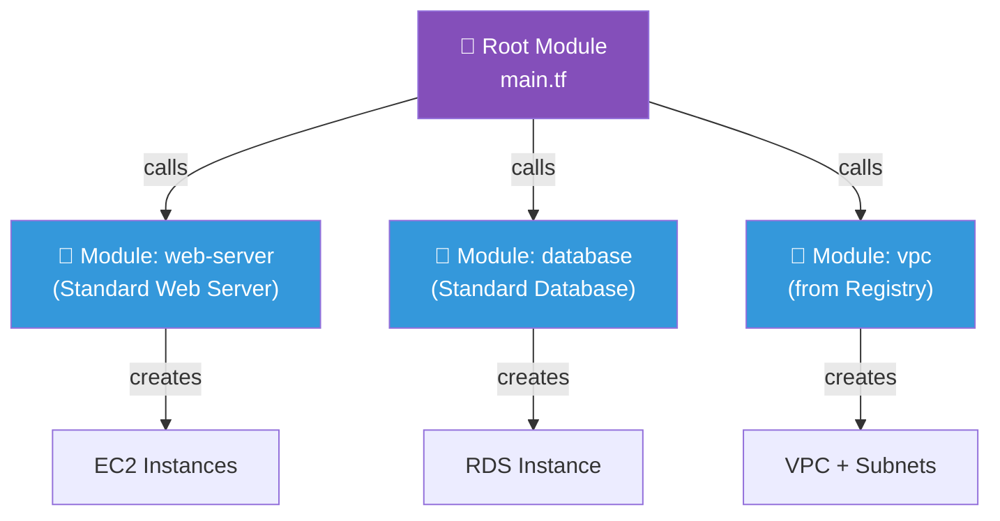

## 📖 Story First

TerraBuilders works on dozens of projects simultaneously. They notice a pattern — every house needs:
- A standard bathroom (toilet, sink, shower, exhaust fan, tiles)
- A standard kitchen (platform, sink, chimney point, exhaust)
- A standard bedroom (fan point, 2 electrical points, window, door)

Every time they build a new house, do they redesign the bathroom from scratch?

No. They have a **Standard Bathroom Design** — tested, refined, and proven. When any project needs a bathroom, they use the standard design and customize only what differs (size, tile color).

---

## 🎯 Learning Objectives

By the end of this chapter, you will be able to:

- ✅ Explain what Terraform modules are
- ✅ Create and call local modules
- ✅ Use modules from the public registry
- ✅ Understand module inputs, outputs, and reuse

---

## 🏫 House Analogy

```
┌─────────────────────────────────────────────────────────┐
│       HOUSE  ←→  MODULES MAPPING                      │
├──────────────────────────┬──────────────────────────────┤
│    HOUSE CONCEPT         │      TERRAFORM CONCEPT        │
├──────────────────────────┼──────────────────────────────┤
│ Standard bathroom design │ Module (reusable config)     │
│ Customizable: tile color │ Variable inputs              │
│ Built-in specifications  │ Resources inside module      │
│ Dimensions/outputs       │ Module outputs               │
│ Published design catalog │ Terraform Registry           │
└──────────────────────────┴──────────────────────────────┘
```

---

## ☁️ The Actual Concept

A **Module** is a reusable package of Terraform code that encapsulates a common pattern.

### Module Structure

```
modules/
├── web-server/
│   ├── main.tf        ← Resources (the standard design)
│   ├── variables.tf   ← Customizable options
│   └── outputs.tf     ← What the module produces
├── database/
│   ├── main.tf
│   ├── variables.tf
│   └── outputs.tf
└── networking/
    ├── main.tf
    ├── variables.tf
    └── outputs.tf
```

### Using a Module

```hcl
# main.tf — Using the standard designs
module "web_server" {
  source = "./modules/web-server"

  instance_type  = "t3.medium"
  instance_count = 3
  environment    = "production"
}
```

### Inside a Module

```hcl
# modules/web-server/main.tf
variable "instance_type" {
  default = "t2.micro"
}

variable "instance_count" {
  default = 1
}

resource "aws_instance" "server" {
  count         = var.instance_count
  ami           = "ami-0abcdef1234567890"
  instance_type = var.instance_type
}

output "server_ips" {
  value = aws_instance.server[*].public_ip
}
```

### Public Module Registry

```hcl
# Using a module from the public registry
module "vpc" {
  source  = "terraform-aws-modules/vpc/aws"
  version = "5.0.0"

  name = "sharma-network"
  cidr = "10.0.0.0/16"
  azs  = ["ap-south-1a", "ap-south-1b"]
}
```

---

## 🗺️ Module Architecture



---

## 🧪 Hands-On — Create a Module

```
STEP 1: Create module structure:

         modules/web-server/
         ├── main.tf
         ├── variables.tf
         └── outputs.tf

STEP 2: modules/web-server/variables.tf:

         variable "instance_type" {
           default = "t2.micro"
         }
         variable "subnet_id" {
           type = string
         }

STEP 3: modules/web-server/main.tf:

         resource "aws_instance" "server" {
           ami           = "ami-0abcdef1234567890"
           instance_type = var.instance_type
           subnet_id     = var.subnet_id
           tags = { Name = "Sharma-Module-Server" }
         }

STEP 4: modules/web-server/outputs.tf:

         output "instance_id" {
           value = aws_instance.server.id
         }

STEP 5: Call the module from main.tf:

         module "web" {
           source        = "./modules/web-server"
           instance_type = "t3.small"
           subnet_id     = aws_subnet.sharma_subnet.id
         }

✅ You have created and used your first module!
   The standard web server design can now be reused
   in any project with just 3 lines of code.
```

---

## 💡 Pro Tips

> 💡 **Tip 1:** Every Terraform configuration has a root module (the current directory). Even if you never create sub-modules, you are already using modules!

> 💡 **Tip 2:** Use `source` to point to local paths (`./modules/foo`), the Terraform Registry (`terraform-aws-modules/vpc/aws`), or Git URLs (`github.com/org/repo`).

> 💡 **Tip 3:** Pin module versions when using the registry (`version = "5.0.0"`) to prevent unexpected changes.

---

## ❓ Quick Quiz

import Quiz from '@site/src/components/Quiz';

<Quiz questions={[
    {
        "id": 1,
        "question": "What is a Terraform module?",
        "options": [
            "A single Terraform resource",
            "A reusable package of Terraform configuration",
            "A type of variable",
            "The terraform command-line tool"
        ],
        "correct": 1,
        "explanation": ""
    },
    {
        "id": 2,
        "question": "How do you pass configuration to a module?",
        "options": [
            "Through environment variables",
            "Through the module's input variables",
            "By editing the module's source code directly",
            "Through command-line flags"
        ],
        "correct": 1,
        "explanation": "Modules accept configuration through input variables defined in their variables.tf."
    },
    {
        "id": 3,
        "question": "What is the Terraform Registry?",
        "options": [
            "A database of Terraform users",
            "A public repository of pre-built Terraform modules",
            "A backup service for state files",
            "A Terraform documentation site"
        ],
        "correct": 1,
        "explanation": "The Terraform Registry at registry.terraform.io hosts community and official modules."
    }
]} />

---

## 📝 Chapter Summary

```
┌─────────────────────────────────────────────────────────┐
│             CHAPTER 10 SUMMARY                          │
├─────────────────────────────────────────────────────────┤
│                                                         │
│  ✅ Module = Reusable Terraform configuration package   │
│  ✅ Like a standard room design (bathroom, kitchen)     │
│  ✅ Has its own variables.tf and outputs.tf             │
│  ✅ Called with module block and source path            │
│  ✅ Terraform Registry = public module library          │
│  ✅ Pin module versions for stability                   │
│  ✅ Every config is already a root module               │
│                                                         │
└─────────────────────────────────────────────────────────┘
```
---
---
