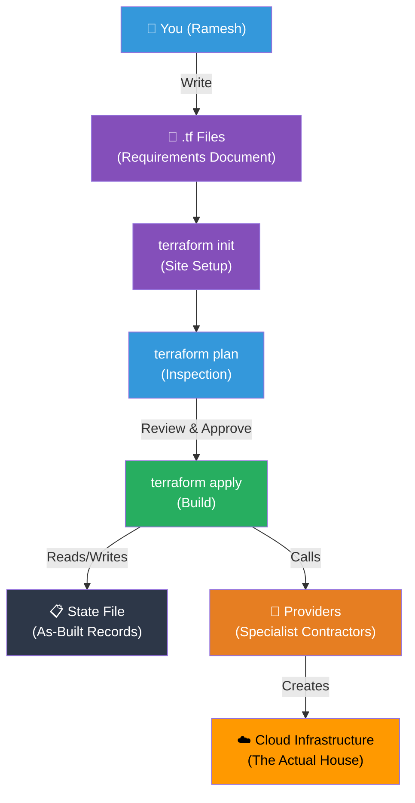

## 📖 Story First

Let us trace the complete Terraform workflow using the Sharma house story from beginning to end.

---

## 🎯 Learning Objectives

By the end of this chapter, you will be able to:

- ✅ Run the complete Terraform workflow end to end
- ✅ Understand how all concepts fit together
- ✅ Follow best practices for each step

---

## ☁️ The Complete Workflow

```
DAY 1: FIRST MEETING
─────────────────────
Ramesh meets TerraBuilders → Explains vision: 3BHK house
↓ In Terraform:
Create a new directory for the project

DAY 2: WRITE REQUIREMENTS
──────────────────────────
Ramesh fills out requirements:
- House type: 3BHK
- Location: Whitefield
- Budget: Standard
↓ In Terraform:
Write main.tf, variables.tf, outputs.tf

DAY 3: TERRABUILDERS SETUP
────────────────────────────
TerraBuilders sets up site office, contacts contractors
↓ In Terraform:
$ terraform init
Downloads providers, sets up backend

DAY 4: INSPECTION
──────────────────
TerraBuilders does site survey
Shows Ramesh exactly what will be built
↓ In Terraform:
$ terraform plan
Review output carefully
Make changes → plan again → repeat

DAY 5: CONSTRUCTION BEGINS
────────────────────────────
Ramesh gives final approval
Construction starts
↓ In Terraform:
$ terraform apply
Type "yes"
Watch resources being created

WEEK 1-6: CONSTRUCTION ONGOING
────────────────────────────────
Foundation, walls, roof, interior
↓ In Terraform:
State file is continuously updated
Each resource gets real IDs, IPs, metadata

MONTH 3: CHANGE REQUEST
─────────────────────────
Ramesh wants to add a home office
↓ In Terraform:
Update main.tf (add new resource)
$ terraform plan  (shows only new additions)
$ terraform apply (creates only the new room)

MONTH 6: COMPLETION
────────────────────
House complete. Completion report handed over.
↓ In Terraform:
Apply complete — outputs displayed

YEAR 5: DEMOLITION
────────────────────
Sharmas sell the property
↓ In Terraform:
$ terraform destroy
Type "yes"
All resources removed in correct reverse order
```

---

## 🗺️ Mental Model — The Complete Picture



### The Workflow Checklist

```
EVERY TIME YOU MAKE CHANGES:
─────────────────────────────
□ 1. Write or update .tf files
□ 2. terraform fmt          (fix formatting)
□ 3. terraform validate     (check logic)
□ 4. terraform plan         (review what will change)
□ 5. Read plan carefully    (any surprises?)
□ 6. terraform apply        (execute)
□ 7. Verify outputs         (expected results?)

BEFORE TERRAFORM DESTROY:
──────────────────────────
□ Are you absolutely sure?
□ Have you backed up any important data?
□ Are there other systems that depend on this?
□ This cannot be undone.
```

---

## 📝 Chapter Summary

```
┌─────────────────────────────────────────────────────────┐
│           CHAPTER 21 SUMMARY                            │
├─────────────────────────────────────────────────────────┤
│                                                         │
│  Full journey: Write → Init → Plan → Apply → Destroy   │
│                                                         │
│  1. Write .tf files (requirements document)             │
│  2. terraform init (site setup + contractor contacts)   │
│  3. terraform plan (inspection + change preview)        │
│  4. terraform apply (construction begins)               │
│  5. Modify → Repeat the cycle                           │
│  6. terraform destroy (demolition)                      │
│                                                         │
│  Always: fmt → validate → plan → apply                 │
│  Always: Review the plan before applying                │
│                                                         │
└─────────────────────────────────────────────────────────┘
```
---
---
